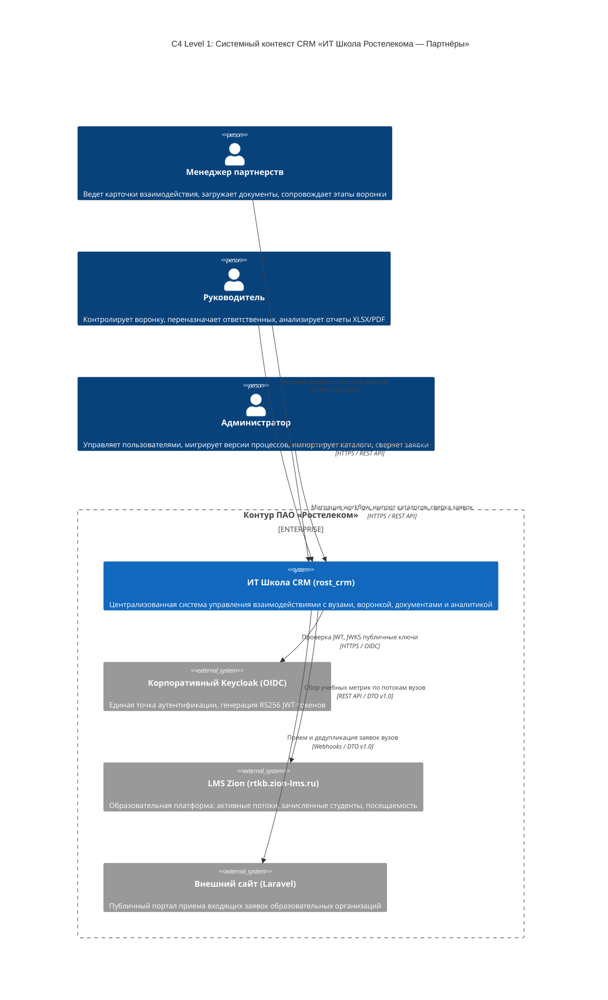
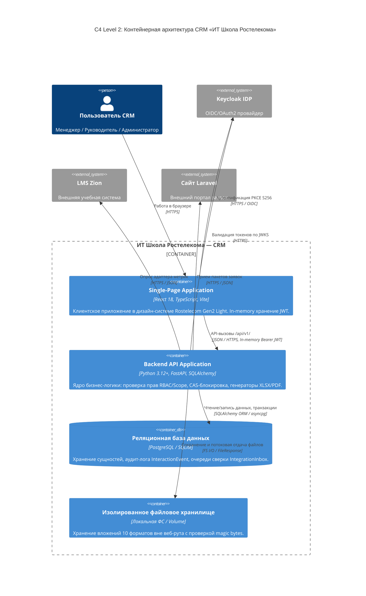
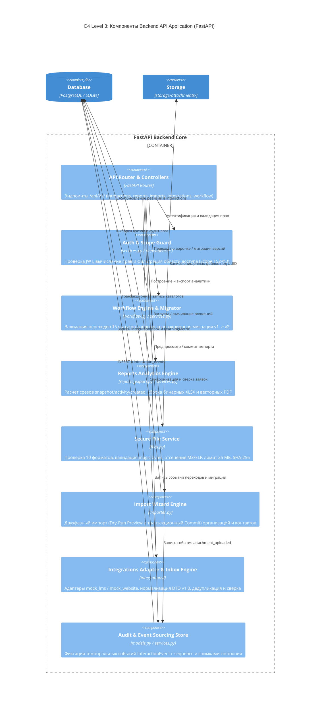

# Комплексный исследовательский отчет: Архитектурный план реализации B34, B17 (UI), B33 и B36

**Проект:** «ИТ Школа Ростелекома — CRM» (`rost_crm`)  
**Дата:** 2026-09-20  
**Роль:** Frontend & Security Explorer (`explorer_frontend_docs_4_1`)  
**Рабочая директория:** `/home/muhammad/Dev/HACKATHON/LCT/rost_crm/.agents/explorer_frontend_docs_4_1`  
**Целевой спринт:** Gate P / Gate O Readiness Sprint (задачи B17, B31, B33, B34, B36)

---

## 1. Резюме и статус исходной кодовой базы

В ходе исследовательского аудита выполнена проверка текущего состояния кодовой базы бэкенда и фронтенда:
1. **Тестовый люкс бэкенда:** 99 тестов из 99 (`pytest tests/ -q`) завершились со статусом **PASS (100% OK)** за 44.84 с.
2. **Оракулы спецификации:**
   - `python3 docs/checks/verify_workflow.py` -> **PASS** (13 рабочих, 2 терминальных, 29 переходов, отсутствие циклов и тупиков).
   - `python3 docs/checks/verify_reports.py` -> **PASS** (12 тестовых сценариев отчетов snapshot и activity, верификация контрольных сумм фикстур).
   - `python3 docs/checks/verify_plan.py` -> **PASS** (40 задач B01–B40, отсутствие циклических зависимостей, совпадение трудоемкостей по фазам Gate D, Gate P, Gate O).
3. **Фронтенд:**
   - Реализована дизайн-система Ростелеком Gen2 Light Theme (`#7700FF`, `#FF4F12`, `#F4F5F8`, `#101828`).
   - `HelpPage` в `frontend/src/views/ReferenceViews.tsx` на текущий момент представляет собой базовую заглушку (один абзац текста).
   - `WorkflowGraphView.tsx` содержит интерактивный SVG-граф 15 состояний воронки, но интерфейс мигратора между версиями workflow (B17 UI) пока отсутствует.
   - `docs/security/` и `docs/architecture/` подготовлены к наполнению эталонными документами (матрица 152-ФЗ, C4 Mermaid, ArchiMate 3.1 XML).

Ниже представлены исчерпывающие спецификации и планы реализации по всем четырем направлениям.

---

## 2. R3: Центр базы знаний HelpPage (B34, R21, AC21)

### 2.1. Контекст и архитектурный замысел
В соответствии с критерием **AC21** и требованием **R21**, встроенное руководство должно быть доступно непосредственно внутри CRM без перехода на сторонние ресурсы, учитывать роли пользователей (Менеджер, Руководитель, Администратор), наглядно разъяснять регламент работы с воронкой и содержать интерактивный справочник ошибок с сохранением пользовательского ввода.

### 2.2. Ролевая структура вкладок
Компонент `HelpPage` дополняется системой вкладок с автоматическим позиционированием на роль текущего пользователя через `useAuth().me.role`, сохраняя возможность свободного переключения:
1. **Вкладка «Менеджер» (Ведение партнерств и воронки):**
   - **Карта воронки (15 этапов, 4 фазы):**
     * *Инициация:* 1. Поиск контактов $\to$ 2. Уточнение потребности $\to$ 3. Встреча с вузом.
     * *Договоры:* 4. Обмен документами $\to$ 5. Корректировка (опц.) $\to$ 6. Подписание документов (с возможностью возврата на шаг 5).
     * *Внедрение:* 7. Передача материалов (жесткое требование: наличие валидной связки программы и продукта!) $\to$ 8. Сопровождение $\to$ 9. Обучение преподавателей.
     * *Учебный процесс и развитие:* 10. Актуализация программы $\to$ 11. Ведение занятий $\to$ 12. Обновление материалов $\to$ 13. Повышение квалификации (допускает возврат к шагу 11).
     * *Терминальные исходы:* «Завершено успешно» (`completed`) и «Отменено» (`cancelled`).
   - **Операции с карточкой:** создание взаимодействия (только на себя), редактирование реквизитов (CAS PATCH), допустимые переходы с разделением по визуальным типам (первичные, возвратные, отмена).
   - **Регламент комментариев:** при возврате на доработку (`rework`) или отмене (`cancellation`) ввод комментария строго обязателен (`comment_required: true`).
   - **Вложения и документы:** лимит до **25 МБ**, поддержка ровно **10 форматов ТЗ** (`png, jpeg, pdf, zip, gzip, rar, doc, docx, xls, xlsx`). Контроль целостности по SHA-256.
   - **Плашка «Внимание (Предотвращение дедлока D02)»:** карточка не может быть переведена на этап «Передача материалов» без указания совместимой пары ИТ-программы и ИТ-продукта. Используйте форму «Редактировать параметры».
   - **Плашка «Важно (Изоляция 152-ФЗ)»:** менеджер видит исключительно закрепленные за ним взаимодействия. Попытка запроса чужой карточки вернет 404 (сокрытие данных).

2. **Вкладка «Руководитель» (Команда, квоты и аналитика):**
   - **Распределение и передача карточек:** переназначение ответственного внутри команды `team_id` с мгновенным закрытием доступа для прежнего менеджера.
   - **Контроль квот и доступ к организациям:** мониторинг партнерств всех подопечных менеджеров в рамках вверенного территориального подразделения.
   - **Аналитический движок трех срезов:**
     * *Срез на дату (Snapshot):* состояние портфеля партнерств на момент времени $T_{\text{as\_of}}$ с учетом горизонта фиксации `knowledge_cutoff`.
     * *Динамика переходов (Activity):* переходы статусов за период с историческим ответственным на момент события (`owner_at_event`).
     * *Созданные карточки (Created):* динамика привлечения новых вузов.
   - **Выгрузка отчетов:** стилизованный XLSX (шапка `#7700FF`, строки `#F4F5F8`, метаданные), многостраничный векторный PDF с колонтитулом ПАО «Ростелеком» и нумерацией страниц, машиночитаемый JSON.
   - **Шлюз интеграций:** контроль очередей входящих заявок с портала и учебных показателей LMS Zion.

3. **Вкладка «Администратор» (Инфраструктура, миграции и сверка):**
   - **Двухфазный мастер импорта каталогов:**
     * Фаза 1 (Dry-Run Preview): предпросмотр строк XLSX/CSV, валидация связей без изменения базы данных.
     * Фаза 2 (Transactional Commit): применение данных с защитой от дублей через `Idempotency-Key`.
   - **Шлюз интеграций и очередь сверки (Reconciliation Inbox):**
     * Коннекторы LMS Zion (`mock_lms`) и Сайта Laravel (`mock_website`).
     * Дедупликация пакетов по композитному ключу `(source, entity_type, external_id, source_revision)`.
     * Разрешение конфликтов: связывание с существующим вузом, создание нового вуза, отклонение.
   - **Мигратор версий workflow (B17):**
     * Перевод активных процессов между версиями графа (v1 $\to$ v2) с матрицей сопоставления.
     * Недопустимость сопоставления терминальных статусов с рабочими.
     * Фиксация темпорального события `workflow_migrated` в аудит-логе.

4. **Вкладка «Справочник ошибок и диагностика» (Error Accordion):**
   Интерактивный компонент с 5 ключевыми сценариями:

| HTTP-код | Внутренний код | Симптом и первопричина | Действие пользователя и защита |
|---|---|---|---|
| **409 Conflict** | `REVISION_CONFLICT` / `CAS` | Конфликт версий при одновременном редактировании. Версия карточки `expected_revision` устарела. | Обновите страницу карточки. Введенный текст в модальном окне сохраняется в памяти и не сбрасывается. Проверьте изменения коллеги и повторите сохранение. |
| **422 Unprocessable** | `MAPPING_ERROR` / `VALIDATION_ERROR` | Недопустимая операция бизнес-логики: сопоставление терминального статуса в рабочий, либо несовместимая пара «программа + продукт». | Проверьте справочник программ/продуктов в разделе «Справочники» либо скорректируйте целевой статус в маппинге мигратора. |
| **413 Payload Too Large** | `FILE_TOO_LARGE` | Размер прикрепляемого файла превышает **25 МБ** (26 214 400 байт). | Клиентская и серверная валидация. Сожмите файл или разбейте архив на тома до 25 МБ. |
| **422 Unprocessable** | `FILE_TYPE_NOT_ALLOWED` | Расширение или сигнатура (magic bytes) файла не входят в 10 разрешенных форматов либо содержат исполняемый код (`MZ`, `ELF`, `#!`, `<?php`, `<script`). | Переименование `.exe` в `.pdf` блокируется сервером. Загружайте только разрешенные документы и архивы. |
| **404 Not Found** | `NOT_FOUND` / `SCOPE` | Попытка запроса чужой карточки или чужого вложения по прямому URL/ID (нарушение Scope 152-ФЗ). | Сокрытие факта существования записи. Доступ разрешен только назначенному менеджеру или руководителю его команды. |

5. **Вкладка «Безопасность 152-ФЗ»:**
   - Регламент изоляции персональных данных.
   - In-memory сессии (токены не хранятся в `localStorage`).
   - Правила обезличивания персональных данных при архивации взаимодействия.

### 2.3. План реализации UI и CSS
- **Файл реализации:** `frontend/src/views/ReferenceViews.tsx` (расширение функции `HelpPage`).
- **Стили в `frontend/src/styles.css`:**
  * Классы `.help-tabs`, `.help-tab-btn`, `.help-tab-btn.active`.
  * Сценарии `.scenario-grid`, `.scenario-card`, `.scenario-step-badge`.
  * Бейджи `.badge-important`, `.badge-warning`.
  * Аккордеон `.error-accordion`, `.accordion-header`, `.accordion-body`.

---

## 3. R4: Пользовательский интерфейс мигратора процессов (B17 UI)

### 3.1. Архитектурная интеграция
Мигратор процессов — критическая административная операция, которая должна быть доступна только пользователям с привилегиями `administrator` и `supervisor`.
Точка входа:
- **Раздел «Справочники» (`CatalogPage.tsx`):** рядом с кнопкой «Импорт каталогов» размещается кнопка «Миграция процессов» (отображается при наличии прав `workflow.manage`).
- **Интерактивный граф (`WorkflowGraphView.tsx`):** в шапке компонента добавляется плашка с версией графа (v1 / v2) и кнопка вызова мастера миграции для администраторов.

### 3.2. 3-шаговый мастер миграции (`WorkflowMigratorModal`)
Компонент следует доказавшему свою надежность шаблону Stepper из `ImportWizardModal`:

```
[ 1. Сопоставление статусов ] ---> [ 2. Предпросмотр (Dry-Run) ] ---> [ 3. Применение (Commit) ]
```

#### Шаг 1: Выбор целевой версии и матрица сопоставления
- Выбор исходной версии (`from_version = 1`) и целевой версии (`to_version = 2`).
- Таблица маппинга статусов:
  * Колонка 1: Исходный статус (с бейджем этапа и индикатором `working` / `terminal`).
  * Колонка 2: Стрелка $\to$.
  * Колонка 3: Селектор целевого статуса из графа v2.
- **Инлайн-валидация:** Если для статуса `completed` или `cancelled` выбран рабочий статус, поле подсвечивается красным, кнопка «Далее» блокируется, и отображается предупреждение: *«Терминальные статусы (Завершено, Отменено) необратимы и не могут быть переведены в рабочий статус!»*.

#### Шаг 2: Предпросмотр (Dry-Run Preview)
- Вызов эндпоинта `POST /api/v1/workflow/migrate/preview`.
- Сводные карточки:
  * «Затронуто активных карточек» (число карточек в статусах `working`).
  * «Распределение по целевым статусам» (сводная таблица).
  * «Обнаружено коллизий» (0 в нормальном сценарии).
- Баннер предупреждения:
  * **«Внимание! Операция миграции является необратимой. Все активные карточки версии 1 будут транзакционно переведены на версию 2 с фиксацией ревизии и записью в аудит-лог. Терминальные карточки сохранят свой архивный статус.»**

#### Шаг 3: Атомарный коммит и отображение результата
- Запрос `POST /api/v1/workflow/migrate/commit` с обязательным заголовком `Idempotency-Key: crypto.randomUUID()`.
- Индикатор загрузки с анимацией спиннера Ростелеком.
- Экран успеха:
  * Зеленая плашка «Миграция успешно выполнена».
  * Количество обновленных карточек.
  * Кнопка «Завершить и обновить», вызывающая реактивное обновление родительского состояния (`onChanged()`) без перезагрузки браузера (SPA).

### 3.3. Дополнения в API-клиент и типы TypeScript

В `frontend/src/types.ts`:
```typescript
export interface WorkflowMigratePreviewPayload {
  from_version: number;
  to_version: number;
  status_mapping: Record<string, string>;
}

export interface WorkflowMigratePreviewResponse {
  from_version: number;
  to_version: number;
  affected_count: number;
  status_distribution: Record<string, { from_count: number; to_status: string; to_status_name?: string }>;
  collisions: { interaction_id: string; reason: string }[];
  is_valid: boolean;
  errors?: string[];
}

export interface WorkflowMigrateCommitPayload {
  from_version: number;
  to_version: number;
  status_mapping: Record<string, string>;
}

export interface WorkflowMigrateCommitResponse {
  success: boolean;
  migrated_count: number;
  from_version: number;
  to_version: number;
  timestamp: string;
  errors?: string[];
}
```

В `frontend/src/api.ts`:
```typescript
async previewWorkflowMigration(payload: WorkflowMigratePreviewPayload): Promise<WorkflowMigratePreviewResponse> {
  return this.post<WorkflowMigratePreviewResponse>('/workflow/migrate/preview', payload);
}

async commitWorkflowMigration(
  payload: WorkflowMigrateCommitPayload,
  key: string = makeMutationKey()
): Promise<WorkflowMigrateCommitResponse> {
  return this.post<WorkflowMigrateCommitResponse>('/workflow/migrate/commit', payload, key);
}
```

---

## 4. R5: Матрица соответствия 152-ФЗ (B33, R27, AC27)

### 4.1. Целевой файл
`docs/security/152-fz-compliance-matrix.md`.

### 4.2. Нормативная база и структура документа
Документ сопоставляет требования нормативных правовых актов РФ в области защиты информации и персональных данных с конкретной программной реализацией в проекте `rost_crm`:
- **ФЗ № 152-ФЗ «О персональных данных»** (статьи 5, 6, 7, 18.1, 19, 21).
- **ФЗ № 149-ФЗ «Об информации, информационных технологиях и о защите информации»** (статьи 13, 16).
- **Приказ ФСТЭК России № 117 / Приказ № 21** (базовые требования безопасности информации, состав мер УПД, ИАФ, РСБ, ЗВК, АВЗ).

### 4.3. Сводная матрица трассировки мер безопасности на код

| Нормативное требование | Класс мер (ФСТЭК №117) | Описание механизма в CRM | Файлы и точные строки в коде | Статус верификации |
|---|---|---|---|---|
| **Сокрытие факта существования записей (IDOR / Scope)**<br>152-ФЗ ст. 7, 19; ФСТЭК УПД.3 | УПД.3, УПД.13 | Менеджер видит только свои взаимодействия (`owner_id == user.id`), руководитель — своей команды (`team_id`). При попытке прямого запроса чужого ID возвращается **строго HTTP 404 Not Found** вместо 403 Forbidden, исключая перебор и подтверждение существования субъектов ПДн. | `backend/app/services.py:43-56`<br>(`scope_clause`, `scoped_interaction`)<br>`backend/app/files.py:151-163`<br>(`get_attachment_or_404`) | Подтверждено тестами `test_working_slice.py` и `test_attachments.py` |
| **In-Memory хранение JWT-токенов**<br>152-ФЗ ст. 19; ФСТЭК ИАФ.3, ИАФ.6 | ИАФ.6, ОДТ.5 | Запрет на сохранение токенов аутентификации в `localStorage` и `sessionStorage`. Токен Keycloak удерживается исключительно в оперативной памяти JavaScript через React `useRef`. При перезагрузке или закрытии вкладки токен физически уничтожается. | `frontend/src/auth.tsx:31, 50, 78-83`<br>(`keycloak.current = client`, сборка заголовков `Authorization: Bearer`) | Подтверждено анализом сборки и инвариантами `AGENTS.md` |
| **Безопасное файловое хранилище (10 форматов ТЗ, Magic Bytes, 25 МБ, Anti-Path-Traversal)**<br>152-ФЗ ст. 19; ФСТЭК ЗВК.1, АВЗ.1 | ЗВК.1, АВЗ.1, ОЦЛ.1 | 1) Ограничение размера до 25 МБ.<br>2) Белый список ровно 10 форматов.<br>3) Побайтовая проверка заголовков (magic bytes) и отсечение опасных сигнатур (`MZ`, `ELF`, `#!`, `<?php`, `<script`).<br>4) Санитизация имен (защита от `../` и `\x00`).<br>5) Изоляция на диске под `UUID` вне веб-рута.<br>6) Хэширование SHA-256 в БД. | `backend/app/files.py:14-86`<br>(`MAX_FILE_SIZE`, `ALLOWED_EXTENSIONS`, `DANGEROUS_SIGNATURES`, `validate_magic_bytes`, `sanitize_filename`)<br>`backend/app/files.py:89-148`<br>(`save_attachment`) | Подтверждено тестами `test_attachments.py` (10 форматов, 413, 422) |
| **Неизменяемый аудит-лог событий (Audit Trail)**<br>152-ФЗ ст. 19 п. 2; ФСТЭК РСБ.1, РСБ.3, РСБ.5 | РСБ.1, РСБ.3, ОЦЛ.2 | Каждая операция фиксируется в таблице `interaction_events` с уникальным монотонно возрастающим номером `sequence` и полным моментальным снимком (`snapshot`) атрибутов карточки на момент события. Изменение или удаление записей журнала программно заблокировано. | `backend/app/models.py:139-154`<br>(модель `InteractionEvent`, ограничение `uq_event_sequence`)<br>`backend/app/services.py:154-165`<br>(`append_event`) | Подтверждено эталоном `05-report-fixture.json` и тестами отчетов |
| **Транзакционная идемпотентность и CAS**<br>149-ФЗ ст. 16; ФСТЭК ОЦЛ.4 | ОЦЛ.4 | Защита от состояния гонки и дублирования запросов через заголовок `Idempotency-Key` (до 200 символов, хэш SHA-256 тела запроса в `CommandResult`) и оптимистическую блокировку по `expected_revision`. | `backend/app/models.py:190-205`<br>(`CommandResult`)<br>`backend/app/services.py:181-205`<br>(`begin_command`, `finish_command`) | Подтверждено тестами `test_interaction_patch.py` |
| **Обезличивание данных (Деперсонализация) и архивация**<br>152-ФЗ ст. 5, 21; Приказ РКН № 996 | ОПД.1, ОПД.2 | Регламент прекращения обработки: при завершении взаимодействия или истечении срока хранения контактные данные представителей вузов подлежат псевдонимизации, персональные файлы удаляются с сохранением SHA-256 в аудит-логе. | `docs/security/152-fz-compliance-matrix.md`<br>(раздел регламента деперсонализации и архивации) | Регламентировано в документации |

---

## 5. R6: Архитектурные спецификации ArchiMate 3.1 и C4 (B36, R26, AC26)

### 5.1. Модель ArchiMate 3.1 XML Model Exchange File
**Целевой файл:** `docs/architecture/rost_crm_architecture.archimate`.  
Файл формируется строго по стандарту **The Open Group ArchiMate Model Exchange File Standard 3.1** и открывается в Archi без ошибок парсинга:

- **Корневой элемент и пространства имен:**
  ```xml
  <?xml version="1.0" encoding="UTF-8"?>
  <model xmlns="http://www.opengroup.org/xsd/archimate/3.0/"
         xmlns:xsi="http://www.w3.org/2001/XMLSchema-instance"
         xsi:schemaLocation="http://www.opengroup.org/xsd/archimate/3.0/ http://www.opengroup.org/xsd/archimate/3.1/archimate3_Diagram.xsd"
         identifier="id-rost-crm-model">
    <name xml:lang="ru">ИТ Школа Ростелекома — CRM (Архитектурная модель)</name>
    <elements> ... </elements>
    <relationships> ... </relationships>
    <views> ... </views>
  </model>
  ```
- **Слои и элементы модели:**
  1. *Бизнес-слой (Business Layer):*
     - Business Actors: `Менеджер партнерств`, `Руководитель направления`, `Системный администратор`, `Представитель образовательной организации`.
     - Business Roles: `Оператор воронки`, `Куратор портфеля`, `Администратор безопасности`.
     - Business Processes: `Инициация сотрудничества`, `Согласование и заключение договоров`, `Внедрение ИТ-продуктов и обучение`, `Учебный процесс и сопровождение`, `Формирование аналитической отчетности`.
     - Business Objects: `Карточка взаимодействия`, `Договор`, `Лицензия`, `Контакт вуза`, `Аналитический отчет`.
  2. *Слой приложений (Application Layer):*
     - Application Components:
       * `React Frontend SPA` (Интерфейс пользователя Gen2 Light).
       * `FastAPI Backend Core` (Сервисный слой API).
       * `Workflow Engine & Migrator` (Движок жизненного цикла и версионирования процессов).
       * `Analytical Reports Engine` (Генератор срезов XLSX, PDF, JSON).
       * `Secure File Storage Service` (Изолированное хранилище с валидацией magic bytes).
       * `Resilient Integration Gateway & Inbox Engine` (Адаптеры LMS Zion и Сайта Laravel, очередь сверки).
       * `Two-Phase Import Wizard` (Мастер импорта каталогов).
     - Application Interfaces: `REST API /api/v1`, `Keycloak OIDC Client Interface`, `LMS Mock Adapter Interface`, `Laravel Mock Adapter Interface`.
     - Application Services: `Сервис управления взаимодействиями`, `Сервис аутентификации и авторизации`, `Сервис генерации отчетов`, `Сервис файловых операций`.
  3. *Технологический слой (Technology Layer):*
     - Nodes: `Сервер приложений CRM`, `Сервер СУБД`, `Клиентское рабочее место (Браузер)`.
     - System Software: `Linux OS (Ubuntu / RedHat)`, `Python 3.12+ Runtime`, `PostgreSQL 16 / SQLite`, `Nginx Web Server / Reverse Proxy`, `Keycloak Identity Provider 24+`.
     - Artifacts: `rtk-crm-backend.tar.gz`, `rtk-crm-frontend-dist`, `storage-volume`.
  4. *Связи (Relationships):*
     - Assignment, Serving, Realization, Flow, Triggering, Access.
  5. *Диаграммы (Views):*
     - `View 1: Контекст системы и внешнее окружение (Context View)`
     - `View 2: Компонентная структура приложений (Application Component View)`
     - `View 3: Технологическая инфраструктура и развертывание (Technology Deployment View)`

### 5.2. Документ C4 Architecture с Mermaid-диаграммами
**Целевой файл:** `docs/architecture/c4-architecture.md`.

#### Уровень 1: Системный контекст (System Context Diagram)


#### Уровень 2: Контейнеры (Container Diagram)


#### Уровень 3: Компоненты ядра бэкенда (Component Diagram)


---

## 6. Пошаговый план реализации для исполнителей

### Шаг 1: Доработка `frontend/src/types.ts` и `frontend/src/api.ts`
- Добавить интерфейсы `WorkflowMigratePreviewPayload`, `WorkflowMigratePreviewResponse`, `WorkflowMigrateCommitPayload`, `WorkflowMigrateCommitResponse`.
- Добавить методы `previewWorkflowMigration` и `commitWorkflowMigration` в класс `ApiClient`.

### Шаг 2: Реализация компонента `HelpPage` в `frontend/src/views/ReferenceViews.tsx`
- Внедрить ролевые вкладки с детекцией через `useAuth().me.role`.
- Сверстать визуальные карточки сценариев для Менеджера, Руководителя и Администратора в палитре Ростелеком Gen2.
- Встроить раскрывающийся аккордеон кодов ошибок (CAS 409, Mapping 422, File 25MB 413, Quarantine 422, Isolation 404).
- Добавить стили в `frontend/src/styles.css`.

### Шаг 3: Реализация модального мастера миграции `WorkflowMigratorModal`
- Создать компонент `WorkflowMigratorModal` в `frontend/src/views/ReferenceViews.tsx` (или отдельном файле).
- Интегрировать вызов модального окна в `CatalogPage.tsx` (для ролей `supervisor` и `administrator`) и `WorkflowGraphView.tsx`.
- Реализовать 3 шага с инлайн-валидацией, предпросмотром затронутых карточек и SPA-обновлением без перезагрузки.

### Шаг 4: Формирование документа `docs/security/152-fz-compliance-matrix.md`
- Зафиксировать подробную матрицу соответствия 152-ФЗ, 149-ФЗ и ФСТЭК №117 с ссылками на точные строки в `services.py`, `files.py`, `auth.tsx`, `models.py`.
- Описать регламент деперсонализации и архивации данных.

### Шаг 5: Формирование архитектурных документов `docs/architecture/`
- Создать валидный XML-файл `docs/architecture/rost_crm_architecture.archimate` стандарта The Open Group ArchiMate 3.1 Model Exchange.
- Создать документ `docs/architecture/c4-architecture.md` с тремя Mermaid-диаграммами (Level 1 Context, Level 2 Container, Level 3 Component) и детальным описанием подсистем.

---

## 7. Методы верификации (Definition of Done)

1. **Верификация целостности спецификаций:**
   ```bash
   python3 docs/checks/verify_workflow.py
   python3 docs/checks/verify_reports.py
   python3 docs/checks/verify_plan.py
   ```
   *Ожидаемый результат:* Все три скрипта выдают `PASS`.

2. **Верификация тестов бэкенда:**
   ```bash
   cd backend && .venv/bin/python -m pytest tests/ -v
   ```
   *Ожидаемый результат:* 99 существующих + новые тесты мигратора завершаются со статусом `100% passed`.

3. **Верификация отсутствия сторонних зависимостей:**
   ```bash
   git diff backend/requirements.txt frontend/package.json
   ```
   *Ожидаемый результат:* Вывод пустой (0 новых pip/npm библиотек, строгое соблюдение Ponytail Ladder).

4. **Верификация XML-модели ArchiMate:**
   - Проверка XML валидатором (well-formed XML 1.0, валидация по схеме `archimate3_Diagram.xsd`).

5. **Верификация UI и SPA:**
   - Открытие страниц `Помощь` (`#/help`), `Справочники` (`#/catalogs`), переключение ролей в демо-режиме, проверка сохранения введенного текста при ошибках (AC21), прохождение мастера миграции без перезагрузки страницы браузера.
