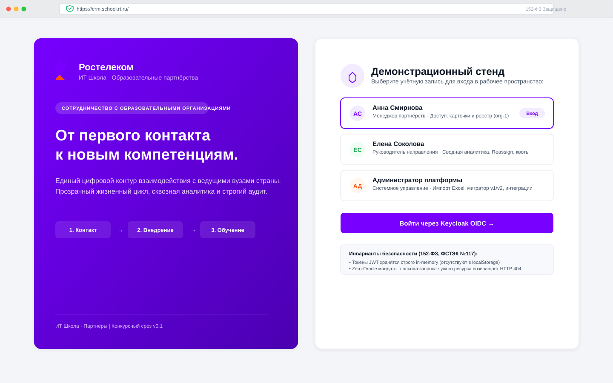
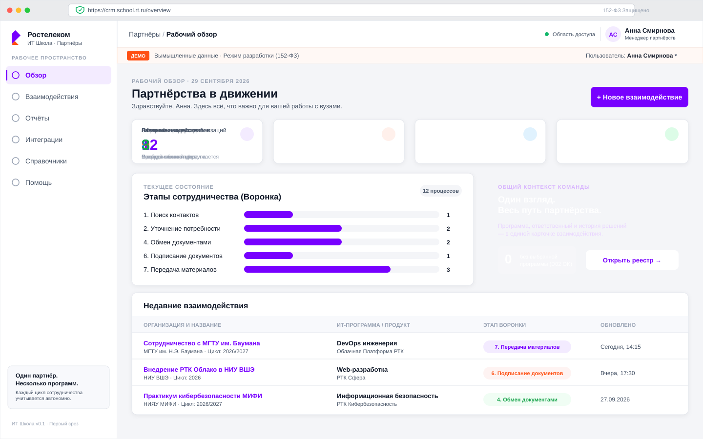
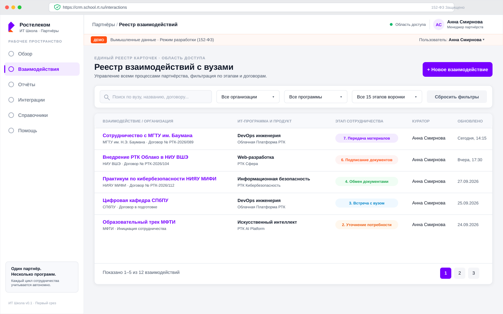
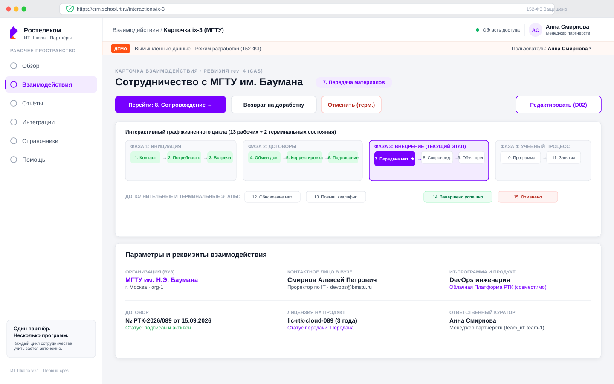
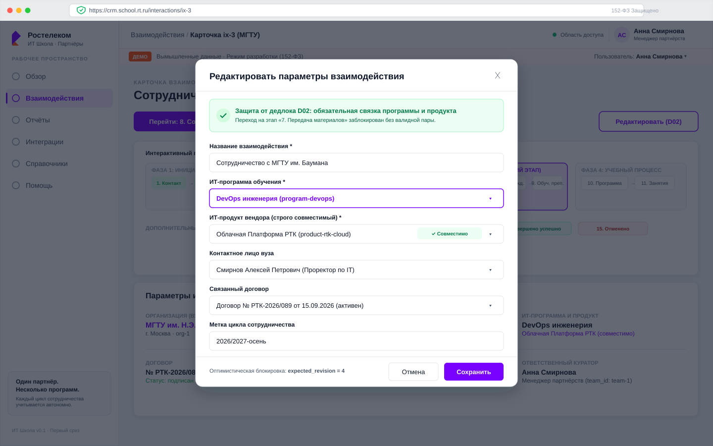
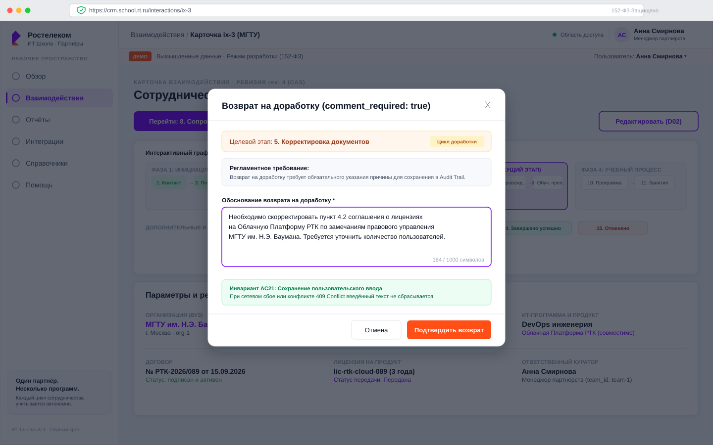
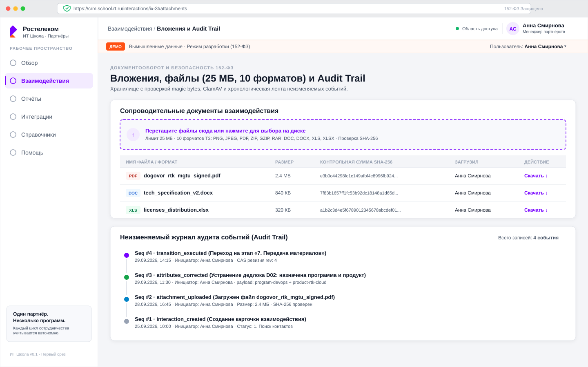
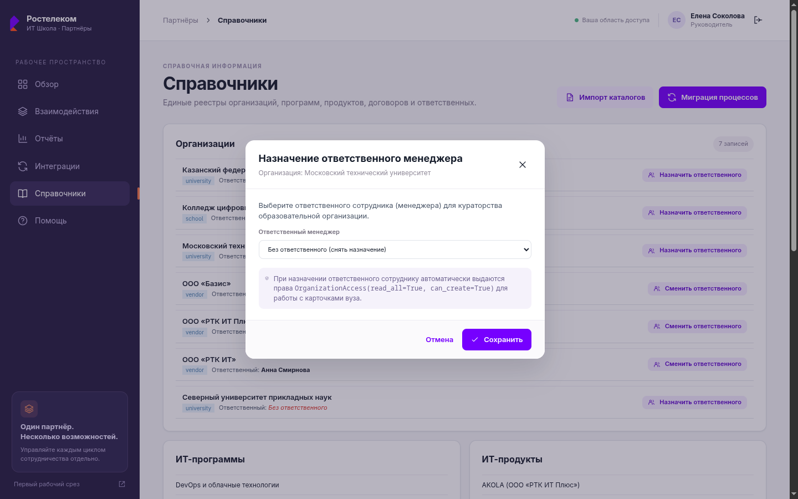
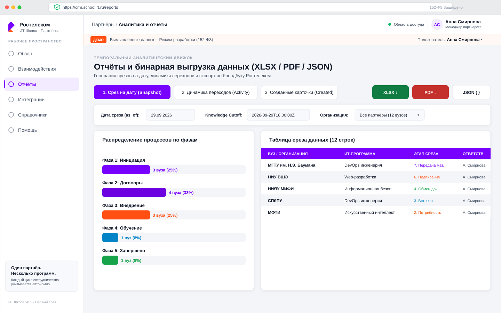

# Руководство пользователя — CRM «ИТ Школа Ростелекома»

**Версия документа:** 2.0  
**Гриф:** Для служебного пользования  
**Стандарты:** ТЗ заказчика (п. 5), ГОСТ Р 59853-2021, 152-ФЗ, 149-ФЗ, Приказ ФСТЭК России № 117  
**Дизайн-система:** Ростелеком Gen2 Light Theme (Atomaro)

---

## Содержание

1. [Введение и общие сведения о системе](#введение-и-общие-сведения-о-системе)
2. [Раздел 1. Авторизация и ролевая модель](#раздел-1-авторизация-и-ролевая-модель)
   - [1.1. Вход в систему и выбор контекста](#11-вход-в-систему-и-выбор-контекста)
   - [1.2. Ролевая модель и границы доступа (152-ФЗ Zero-Oracle)](#12-ролевая-модель-и-границы-доступа-152-фз-zero-oracle)
   - [1.3. Политика безопасности сессий и In-Memory JWT](#13-политика-безопасности-сессий-и-in-memory-jwt)
3. [Раздел 2. Рабочее место КАМ-менеджера](#раздел-2-рабочее-место-кам-менеджера)
   - [2.1. Воронка 15 этапов жизненного цикла и KPI дашборда](#21-воронка-15-этапов-жизненного-цикла-и-kpi-дашборда)
   - [2.2. Реестр взаимодействий, поиск и многокритериальная фильтрация](#22-реестр-взаимодействий-поиск-и-многокритериальная-фильтрация)
   - [2.3. Карточка взаимодействия и интерактивный граф процесса](#23-карточка-взаимодействия-и-интерактивный-граф-процесса)
   - [2.4. Редактирование параметров и предотвращение дедлока D02](#24-редактирование-параметров-и-предотвращение-дедлока-d02)
   - [2.5. Переходы по жизненному циклу и обязательный комментарий доработки](#25-переходы-по-жизненному-циклу-и-обязательный-комментарий-доработки)
   - [2.6. Управление документами и файловыми вложениями (25 МБ, 10 форматов)](#26-управление-документами-и-файловыми-вложениями-25-мб-10-форматов)
   - [2.7. Неизменяемый хронологический аудит-лог (Audit Trail)](#27-неизменяемый-хронологический-аудит-лог-audit-trail)
4. [Раздел 3. Рабочее место руководителя](#раздел-3-рабочее-место-руководителя)
   - [3.1. Обзор работы подразделения и контроль квот](#31-обзор-работы-подразделения-и-контроль-квот)
   - [3.2. Регламент переназначения куратора (Reassign) и безопасность](#32-регламент-переназначения-куратора-reassign-и-безопасность)
   - [3.3. Аналитический модуль формирования отчётов (Snapshot, Activity, Created)](#33-аналитический-модуль-формирования-отчётов-snapshot-activity-created)
   - [3.4. Экспорт аналитических данных в XLSX, PDF и JSON](#34-экспорт-аналитических-данных-в-xlsx-pdf-и-json)
5. [Раздел 4. Диагностика ошибок и регламент сохранения ввода AC21](#раздел-4-диагностика-ошибок-и-регламент-сохранения-ввода-ac21)
   - [4.1. Канонический формат сообщений об ошибках платформы](#41-канонический-формат-сообщений-об-ошибках-платформы)
   - [4.2. Справочник типовых кодов ошибок и регламент действий](#42-справочник-типовых-кодов-ошибок-и-регламент-действий)
   - [4.3. Регламент сохранения пользовательского ввода AC21](#43-регламент-сохранения-пользовательского-ввода-ac21)
   - [4.4. Интерактивный симулятор диагностики ошибок](#44-интерактивный-симулятор-диагностики-ошибок)

---

## Введение и общие сведения о системе

Автоматизированная система **«ИТ Школа Ростелекома — CRM» (`rost_crm`)** предназначена для комплексного управления взаимодействиями с высшими учебными заведениями, колледжами и региональными образовательными центрами Российской Федерации в рамках образовательных инициатив и программ внедрения отечественного программного обеспечения ПАО «Ростелеком».

### Назначение и ключевые функции
- Сквозной мониторинг и управление партнерствами по регламентированному 15-этапному циклу (13 рабочих + 2 терминальных состояния).
- Ведение реестра вузов, контактных лиц, соглашений, договоров и лицензий ПО.
- Исключение дедлоков и тупиковых состояний процессов благодаря автоматизированному контролю бизнес-правил (включая устранение дедлока D02).
- Формирование трех темпоральных аналитических срезов (Snapshot на дату, Activity по переходам, Created по динамике открытий) с экспортом в стандартизированные форматы XLSX и векторный PDF.
- Гарантированная защита персональных данных и коммерческой тайны в соответствии со ст. 7 Федерального закона № 152-ФЗ и требованиями ФСТЭК России № 117.

Интерфейс платформы спроектирован по стандарту дизайн-системы **Ростелеком Gen2 Light Theme (Atomaro)**:
- Фирменный фиолетовый бренд-цвет: `#7700FF` (активные элементы, акценты первого порядка, шапки отчетов).
- Фирменный оранжевый акцент: `#FF4F12` (индикаторы статусов, внимание, важные действия).
- Нейтральный контрастный фон: `#F4F5F8` и карточки `#FFFFFF` с мягкими тенями.
- Высококонтрастный текст `#101828` (коэффициент контрастности превышает 16:1 при нормативе WCAG AAA 7:1).

---

## Раздел 1. Авторизация и ролевая модель

### 1.1. Вход в систему и выбор контекста

Вход в систему осуществляется через единый корпоративный центр аутентификации Keycloak по протоколу OpenID Connect (OIDC) с защитой Authorization Code Flow with PKCE.

На демонстрационном стенде на стартовом экране доступна панель быстрого переключения демонстрационных учетных записей, позволяющая мгновенно оценить возможности платформы под каждой из предусмотренных ролей без ручного ввода паролей.



#### Ключевые элементы экрана авторизации:
1. **Выбор роли:** Быстрое переключение между предустановленными профилями — Менеджер партнерств (`manager-a`, `manager-b`), Руководитель направления (`supervisor`), Администратор платформы (`admin`).
2. **Брендинг Gen2:** Фирменный двухцветный векторный знак Ростелекома (лента `#FF4F12` и `#7700FF`), заголовок «Ростелеком / ИТ Школа · Партнёры».
3. **Zero-Oracle защита:** Серверная валидация прав доступа и ролевых контекстов с момента создания сессии.

### 1.2. Ролевая модель и границы доступа (152-ФЗ Zero-Oracle)

В платформе строго разграничены полномочия пользователей на уровне СУБД и сервисного слоя API:

| Роль | Системный идентификатор | Область видимости (Scope) | Полномочия в системе |
|---|---|---|---|
| **КАМ-менеджер** | `manager` | Строго **только свои взаимодействия** (`owner_id == user.id`) | Ведение карточек, проведение переходов, прикрепление файлов, добавление комментариев, заполнение параметров. |
| **Руководитель** | `supervisor` | Карточки **своего подразделения** (`team_id == user.team_id`) | Контроль нагрузки кураторов, переназначение ответственных (Reassign), аналитические отчеты, экспорт XLSX/PDF. |
| **Администратор** | `administrator` / `admin` | Системные каталоги, телеметрия интеграций, аудит | Двухфазный импорт каталогов (Dry-Run / Commit), миграция версий процессов, настройка интеграционных контуров LMS и Сайта. Не имеет доступа к коммерческим воронкам (152-ФЗ). |

> **Инвариант 152-ФЗ Zero-Oracle (Сокрытие факта существования записи):**  
> Если менеджер попытается открыть карточку или скачать файл, закрепленный за другим менеджером (по прямому URL вида `#/interactions/{other_id}`), сервер возвращает строгий ответ `404 Not Found`, а не `403 Forbidden`. Это исключает возможность зондирования идентификаторов и раскрытия факта взаимодействия компании с конкретной организацией.

### 1.3. Политика безопасности сессий и In-Memory JWT

Для предотвращения хищения сессионных токенов через атаки класса XSS (Cross-Site Scripting) в соответствии с требованиями безопасности ФСТЭК России № 117:
- Токены доступа JWT хранятся **исключительно в оперативной памяти** работающей вкладки браузера (in-memory state).
- Категорически запрещено и технически заблокировано сохранение JWT в хранилищах `localStorage`, `sessionStorage` или незащищенных `Cookie`.
- При закрытии вкладки или завершении сессии токен мгновенно стирается из памяти.

---

## Раздел 2. Рабочее место КАМ-менеджера

### 2.1. Воронка 15 этапов жизненного цикла и KPI дашборда

После авторизации под ролью КАМ-менеджера (`manager-a`) открывается рабочий стол «Обзор», содержащий сводные KPI-показатели, карту воронки партнерств и перечень карточек в фокусе внимания.



#### Ключевые элементы экрана «Обзор»:
1. **KPI-счетчики:** Оперативные счетчики активных партнерств в работе, карточек на этапе согласования документов, закрытых договоров и конверсии.
2. **Воронка 15 этапов:** Наглядное отображение распределения карточек по 4 макрофазам:
   - *Фаза I. Инициация:* Поиск контактов (1), Коммуникация и актуальность (2), Организация встречи (3).
   - *Фаза II. Согласование:* Обмен документами (4), Доработка документов (5), Подписание (6).
   - *Фаза III. Реализация:* Передача материалов и лицензий (7), Сопровождение внедрения (8), Обучение преподавателей (9), Актуализация программы (10), Ведение занятий (11), Актуализация документации (12), Повышение квалификации (13).
   - *Фаза IV. Фиксация:* Успешно завершено (`completed`, 14), Отменено (`cancelled`, 15).
3. **Оперативный фокус:** Список приоритетных взаимодействий с приближающимися сроками контроля или ожидающими действий куратора.

### 2.2. Реестр взаимодействий, поиск и многокритериальная фильтрация

Раздел «Взаимодействия» (`#/interactions`) представляет собой интерактивный табличный реестр всех карточек, закрепленных за текущим менеджером.



#### Ключевые элементы реестра:
1. **Панель фильтров:** Фильтрация по текущему этапу воронки (выпадающий список всех 15 состояний), типу взаимодействия и интервалу дат.
2. **Быстрый поиск:** Полнотекстовый поиск по наименованию образовательного учреждения, городу, ФИО контактного лица и номеру договора.
3. **Статусные бейджи:** Цветовая маркировка текущего состояния карточки с указанием версии процесса и ревизии CAS.
4. **Кнопка создания:** «+ Новое взаимодействие» — открывает диалог быстрого заведения партнерства с образовательной организацией.

### 2.3. Карточка взаимодействия и интерактивный граф процесса

Карточка взаимодействия (`#/interactions/{id}`) — центральный рабочий инструмент куратора. В верхней части карточки расположен интерактивный SVG-граф жизненного цикла, отображающий текущее положение взаимодействия в общем процессе.



#### Ключевые элементы карточки:
1. **Интерактивный граф процесса:** Визуализация графа состояний. Текущий этап подсвечен фирменным фиолетовым цветом `#7700FF`, пройденные этапы отмечены зеленым, альтернативные пути подсвечены тонкими связями. На мобильных устройствах поддерживается горизонтальная прокрутка со специальной подсказкой.
2. **Кнопки переходов жизненного цикла:**
   - Кнопка прямого шага (`variant="primary"`, фиолетовая): продвижение вперед по воронке.
   - Кнопка возврата на доработку (`variant="secondary"`, контурная): перевод на предыдущую стадию с фиксацией замечаний.
   - Кнопка отмены (`variant="danger"`, красная): досрочное прекращение взаимодействия с указанием причины.
3. **Блок реквизитов:** Полная информация об организации, привязанном контактном лице вуза, номере договора и статусе лицензии ПО.
4. **Кнопка «Параметры»:** Вызов модального окна корректировки параметров карточки (D02).

### 2.4. Редактирование параметров и предотвращение дедлока D02

Дедлок D02 — классическая проблема workflow-систем, когда карточка создается на раннем этапе (например, «Поиск контактов») без указания учебной программы и продукта, а при достижении этапа «Передача материалов» (шаг 7) процесс блокируется, так как передавать нечего.

В CRM «ИТ Школа Ростелекома» реализован специальный механизм: менеджер в любой момент до шага 7 может нажать кнопку «Параметры» и привязать программу и совместимый продукт.



#### Регламент работы с модальным окном параметров:
1. **Проверка совместимости:** Выпадающий список продуктов динамически фильтруется на основе выбранной образовательной программы (валидация через матрицу совместимости программ и продуктов).
2. **Оптимистический контроль версий (CAS):** Форма отправляет текущую ревизию карточки `expected_revision`. Если другой сотрудник параллельно обновил карточку, сервер вернет `409 Conflict`, сохранив все введенные вами данные без потерь.
3. **Защита от сброса:** Начиная с этапа передачи материалов, обнуление ранее выбранной программы и продукта категорически блокируется бизнес-правилом платформы.

### 2.5. Переходы по жизненному циклу и обязательный комментарий доработки

При выполнении переходов, требующих фиксации причин (например, возврат на доработку с этапа «Подписание документов» на этап «Корректировка документов» или перевод в статус «Отменено»), система открывает модальное окно перехода с проверкой обязательного комментария.



#### Правила заполнения:
1. **Обязательность обоснования:** Кнопка подтверждения перехода заблокирована (`disabled`) до тех пор, пока пользователь не введет содержательный текст комментария (длина не менее 5 символов).
2. **Гарантия сохранения ввода (AC21):** Если при отправке запроса произойдет обрыв сети или конфликт ревизий, окно не закрывается, а введенный текст не сбрасывается.
3. **Фиксация в аудит-логе:** Комментарий навечно заносится в историю взаимодействий с указанием автора, должности и точной метки времени UTC.

### 2.6. Управление документами и файловыми вложениями (25 МБ, 10 форматов)

В нижней части карточки расположена секция «Вложения и документы» с поддержкой Drag-and-Drop загрузки файлов.



#### Технические требования и регламент работы с файлами:
- **Белый список форматов (ровно 10 форматов ТЗ):** `png`, `jpeg`, `pdf`, `zip`, `gzip`, `rar`, `doc`, `docx`, `xls`, `xlsx`.
- **Проверка сигнатур (Magic Bytes):** Система проверяет не только расширение имени файла, но и его бинарный заголовок. Загрузка исполняемых файлов (`exe`, `sh`, `bat`, `php`), замаскированных под документы, блокируется со статусом `422 Unprocessable Entity`.
- **Предельный размер:** До **25 МБ** на один файл (клиентская валидация до старта загрузки + серверный лимит `413 Payload Too Large`).
- **Антивирусный контроль:** Все файлы на лету проверяются потоковым антивирусным демоном ClamAV (TCP 3310). При обнаружении подозрительных сигнатур файл немедленно помещается в карантин.
- **Хэширование:** Для каждого принятого документа рассчитывается контрольная сумма SHA-256, исключающая подмену содержимого.
- **Безопасное скачивание:** Скачивание выполняется через авторизованный эндпоинт с проверкой прав. Прямые публичные ссылки на файлы отсутствуют.

### 2.7. Неизменяемый хронологический аудит-лог (Audit Trail)

Каждое значимое действие по карточке автоматически регистрируется в блоке «История изменений и аудит»:
- Создание взаимодействия;
- Переходы по этапам воронки с ревизией и комментариями;
- Изменение параметров карточки (программа, продукт, контакт);
- Прикрепление и удаление файлов;
- Переназначение ответственного куратора.

Записи аудит-лога имеют монотонно возрастающий номер события `sequence`, защищены от модификации или удаления и служат юридически значимым подтверждением хронологии взаимодействия с вузом.

---

## Раздел 3. Рабочее место руководителя

### 3.1. Обзор работы подразделения и контроль квот

Руководитель направления (`supervisor`) обладает расширенным обзором: он видит работу всех менеджеров своего подразделения (`team_id`).

В консоли руководителя отображаются сводные показатели выполнения плана, распределение нагрузки между кураторами и воронка взаимодействия в масштабе всей команды.



### 3.2. Регламент переназначения куратора (Reassign) и безопасность

В случаях отпуска куратора, перераспределения нагрузки или увольнения сотрудника руководитель может передать карточку взаимодействия другому менеджеру команды.

#### Порядок переназначения ответственного:
1. В карточке взаимодействия или в реестре руководитель нажимает действие «Переназначить куратора».
2. В диалоговом окне выбирается новый ответственный сотрудник из числа членов команды.
3. Указывается обязательное основание ротации (например: «Перераспределение нагрузки в связи с открытием филиала»).
4. Система выполняет атомарный перевод карточки:
   - В модели `Interaction` обновляется поле `owner_id`.
   - В аудит-лог записывается событие `owner_changed` с указанием старого и нового владельца.
   - **Мгновенный отзыв доступа (152-ФЗ Zero-Oracle):** Прежний менеджер немедленно теряет доступ к карточке. Любая его попытка открыть карточку или скачать файл возвращает `404 Not Found`.

### 3.3. Аналитический модуль формирования отчётов (Snapshot, Activity, Created)

Раздел «Отчёты» (`#/reports`) предоставляет руководителю доступ к аналитическому движку с поддержкой трех видов темпоральных срезов:



#### 1. Срез на дату (Snapshot Report)
- **Назначение:** Реконструкция точного состояния базы партнерств на произвольный исторический момент времени `as_of`.
- **Особенность:** Вычисляет исторического куратора карточки на указанную дату (даже если впоследствии карточка была переназначена), что обеспечивает абсолютную точность исторической отчетности.

#### 2. Динамика переходов (Activity Report)
- **Назначение:** Анализ активности и продуктивности сотрудников за выбранный временной интервал `[from_date, to_date)`.
- **Особенность:** Фиксирует все совершенные переходы по воронке, смену статусов и передачу лицензионных пакетов.

#### 3. Созданные карточки (Created Report)
- **Назначение:** Анализ притока новых образовательных организаций и первичных обращений за отчетный период.

### 3.4. Экспорт аналитических данных в XLSX, PDF и JSON

Платформа обеспечивает экспорт сформированных отчетов в трех форматах без привлечения тяжелых сторонних утилит:

- **Табличный формат XLSX (Office Open XML):**
  - Оформление в брендбуке Ростелекома: фирменная фиолетовая шапка таблицы `#7700FF` с белым шрифтом, контрастная сетка, чередующиеся строки `#F4F5F8`.
  - Автоматический подбор ширины столбцов под содержимое.
  - Специальный информационный лист «Параметры отчёта» с указанием инициатора, времени выгрузки, фильтров и хэша выборки.
  - Защита от CSV/Formula Injection (CWE-1236): формульные префиксы экранируются.

- **Векторный формат PDF:**
  - Корпоративный титульный колонтитул с официальным логотипом ПАО «Ростелеком».
  - Сквозная нумерация страниц вида «Страница X из Y».
  - Гриф конфиденциальности и параметры фильтрации.
  - Четкая векторная типографика с гарантией читаемости таблиц при печати на формате А4.

- **Машиночитаемый JSON:**
  - Полная выгрузка нормализованных данных для интеграции с внешними BI-системами и корпоративными хранилищами данных.

---

## Раздел 4. Диагностика ошибок и регламент сохранения ввода AC21

### 4.1. Канонический формат сообщений об ошибках платформы

Все ошибки API возвращаются в строгом каноническом формате JSON Envelope:

```json
{
  "error": {
    "code": "CONCURRENT_MODIFICATION",
    "message": "Карточка была изменена другим пользователем. Обновите страницу для получения свежих данных.",
    "request_id": "req-9b81cf72-4e89-4ab2",
    "details": {
      "current_revision": 4,
      "expected_revision": 3
    }
  }
}
```

- `code` — машиночитаемый строковый код ошибки;
- `message` — понятное пользователю сообщение на русском языке с рекомендацией действий;
- `request_id` — сквозной идентификатор запроса для обращения в службу технической поддержки;
- `details` — контекстные параметры коллизии.

### 4.2. Справочник типовых кодов ошибок и регламент действий

В разделе помощи `#/help` (вкладка «Справочник ошибок») доступен подробный интерактивный каталог кодов:


| Код HTTP | Системный код | Причина возникновения | Регламент действий пользователя |
|---|---|---|---|
| **400** | `VALIDATION_ERROR` | Не заполнены обязательные поля формы или нарушен формат | Проверьте подсвеченные красным поля формы и скорректируйте данные. |
| **401** | `UNAUTHORIZED` | Истек срок действия сессионного токена | Нажмите «Войти заново» на стартовом экране. Введенный текст в открытых формах будет сохранен. |
| **403** | `FORBIDDEN` | Попытка выполнить действие, выходящее за рамки роли | Обратитесь к руководителю для расширения полномочий или передачи задачи. |
| **404** | `NOT_FOUND` | Карточка не существует либо принадлежит другому куратору (152-ФЗ) | Проверьте правильность ссылки. Если карточка была переназначена, обратитесь к руководителю. |
| **409** | `CONFLICT` / `CAS_MISMATCH` | Параллельное редактирование карточки коллегой (несовпадение ревизий) | Данные формы не теряются! Скопируйте введенные замечания, обновите карточку и примените правки. |
| **413** | `PAYLOAD_TOO_LARGE` | Размер прикрепляемого файла превышает 25 МБ | Сожмите файл через архиватор (ZIP/RAR) или разделите документ на части до 25 МБ. |
| **422** | `FILE_TYPE_NOT_ALLOWED` | Формат файла не входит в перечень 10 допустимых форматов ТЗ | Преобразуйте документ в один из разрешенных форматов: PDF, DOCX, XLSX, PNG, JPG, ZIP, RAR. |
| **422** | `FILE_QUARANTINED` | Сработала антивирусная защита ClamAV | Файл заблокирован из соображений безопасности. Проверьте рабочую станцию антивирусом. |
| **500–504** | `GATEWAY_ERROR` | Временная недоступность внешних сервисов (LMS Zion, Сайт) | Запрос сохранен во внутренней очереди сверки. Повторите попытку через 2–3 минуты. |

### 4.3. Регламент сохранения пользовательского ввода AC21

Критический критерий надежности платформы (сценарий приёмки **AC21**):
> **Инвариант AC21:** При возникновении любой ошибки сервера (включая 409 Conflict, 422 Validation Error, 500 Server Error или обрыв связи) ни один символ, введенный пользователем в форму или комментарий, не должен быть утерян, а форма не должна сбрасываться.

#### Поведение интерфейса при возникновении сбоя:
1. Поле ввода текста блокируется от случайного стирания.
2. В верхней части модального окна отображается информационная плашка с расшифровкой ошибки и системным `request_id`.
3. Пользователю предоставляются кнопки:
   - **«Повторить отправку»** — повторный запрос с сохранением всех введенных данных.
   - **«Скопировать текст в буфер»** — резервное сохранение текста для вставки в другое окно.
   - **«Закрыть»** — закрытие окна только по явному решению пользователя.

### 4.4. Интерактивный симулятор диагностики ошибок

В центре документации на странице `#/help` встроен живой симулятор ошибок, позволяющий пользователям и администраторам протестировать поведение платформы при различных типах сбоев:
- Выбор кода ошибки из выпадающего списка (409, 422, 413, quarantine, 503 и др.);
- Ввод тестового заголовка и комментария;
- Нажатие кнопки «Эмулировать ошибку сервера»;
- Наглядное подтверждение сохранения введенного текста в полях с отображением канонического JSON Envelope и инструкцией по разрешению инцидента.
