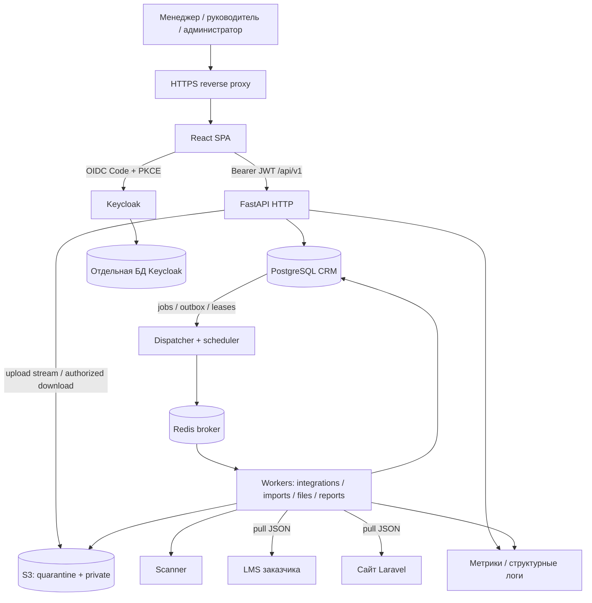

# Целевая архитектура CRM ИТ Школы

Дата: 19.09.2026. Статус: проектное решение для начала разработки, не подтверждение готовности приложения к внедрению.

## 1. Границы и основания

Основания: PDF «6. ИТ Школа Ростелекома», текущий исходный код, документы `docs/planning`. Номера страниц далее — физические страницы PDF, включая обложку. Исходный документ задаёт требования; предлагаемые ниже технические решения и дополнительные правила не выдаются за согласованные требования заказчика.

Система ведёт взаимодействия с вузами **и школами**, контакты и назначения, договоры и лицензии, передачу материалов, процессы внедрения/обучения и учебную статистику. Внешние LMS и сайт остаются владельцами своих первичных данных. CRM принимает согласованные данные, ведёт собственный процесс и формирует проверяемую отчётность.

**Решение: модульный монолит FastAPI + PostgreSQL, React, Keycloak; отдельные фоновые worker-процессы из того же backend; Redis как транспорт заданий; S3-совместимое файловое хранилище.** Два разработчика делят владение модулями. Между модулями — типизированные вызовы application-сервисов и события в транзакционном outbox, а не внутренние HTTP-запросы.

В объём входят все форматы и оба внешних источника из ТЗ. ИИ, BPMN-движок общего назначения, отдельный сервис на каждый модуль, Kubernetes и публичный кабинет учащегося не нужны для выполнения исходных требований. Их нет в критическом пути.

## 2. Что действительно есть в репозитории

Аудит выполнен по локальному срезу `d90b1ba` до добавления этого пакета. Ранее этот срез был загружен в GitHub через web-интерфейс; локальная и удалённая история коммитов различаются. Это не основание переписывать удалённую историю. Новую разработку начинать из актуального clone репозитория и обычных feature-веток.

| Область | Реализовано | Разрыв до целевой системы |
|---|---|---|
| Backend | FastAPI, синхронный SQLAlchemy, JSON API, Pydantic, request ID, live/ready | Большая часть логики в `services.py`; нет модульных границ и управляемых миграций |
| Данные | 12 ORM-моделей: пользователь/доступ, базовые справочники, взаимодействие, событие, комментарий, результат команды | Нет контактов, реальных команд, назначений организации, договора/лицензии/передачи, учебных фактов, файлов, заданий и интеграционных идентификаторов |
| CRUD | Создание взаимодействия, переход, комментарий, смена владельца; чтение справочников | Нельзя называть это полным CRUD каталогов. Схема `OrganizationCreate` ещё не означает наличие маршрута создания |
| Workflow | Один граф из `app/data/base-workflow.json`, проверка переходов, optimistic revision | Версия — число без FK; статус и visit ID — строки; нет редактора, публикации, таблиц посещений и переноса активных карточек |
| Доступ | Явный demo mode; проверка JWT; scope по владельцу/команде/гранту; проверка прав команды | Команда хранится строкой; нет полноценного управления назначениями организации, service-principal интеграции и сквозной модели доступа к новым ресурсам |
| История | `effective_at`, `received_at`, sequence и snapshot в событии | Нужны типизированные исторические факты и корректная обработка поздних данных. Произвольный поздний комментарий не должен возвращать старый статус карточки |
| Отчёты | Snapshot на дату, текущие права, JSON; ограничение 5 000 доступных карточек | Нет фонового расчёта, отчётов за период/длительностей, выбранных колонок, XLS/XLSX/PDF, PNG, учебных показателей |
| Frontend | React TS, карточки, реестр, помощь, PKCE; сохранение mutation key при повторе | Нет полноценных редакторов каталогов/workflow, импортов, файлов, jobs, внешних источников, единого query-cache и встроенных двух руководств |
| Эксплуатация | Docker Compose: PostgreSQL, Keycloak, API, nginx/frontend | `start-dev`, инициализация через `create_all`, нет production TLS, worker/Redis/storage/scanner, восстановления и наблюдаемости |
| Проверки | 17 backend-сценариев в `tests/test_working_slice.py`, статические проверки workflow/отчётного эталона | Наличие тестов не доказывает их прохождение на PostgreSQL, работу OIDC, нагрузку и реальные интеграции |

Точки расширения: `backend/app/models.py`, `services.py`, `workflow.py`, `main.py`; `frontend/src/api.ts`, `hooks.ts`, `views/*`; `compose.yaml`. Код полезно сохранить и разделить по ответственности. Полная перепись стека не требуется.

Конкретные ограничения производительности: `interaction_dict()` обращается к связанным объектам через отдельные `db.get`; `dashboard()` загружает все доступные взаимодействия в Python; `snapshot()` читает историю и выбирает последние снимки в Python. Identity map SQLAlchemy частично уменьшает число запросов, но не заменяет batch-select/join и серверную агрегацию. Эти участки нужно измерить и переработать до нагрузочной приёмки.

## 3. Системные компоненты



| Компонент | Ответственность | Данные и отказ |
|---|---|---|
| Reverse proxy | TLS, SPA, API, размер/таймаут загрузки, защитные заголовки | Единственная публичная входная точка приложения |
| FastAPI HTTP | Auth, короткие команды/чтения, валидация, постановка jobs | Не строит тяжёлый PDF и не ходит к LMS внутри пользовательской транзакции |
| PostgreSQL | Бизнес-состояние, версии, история, доступ, jobs, outbox/inbox, frozen rows | Источник истины. CRM и Keycloak используют разные БД/учётные записи |
| Dispatcher/scheduler | Публикация outbox, поиск due jobs, восстановление просроченных lease, расписания интеграций | Несколько экземпляров возможны только с DB-lock/lease; job не теряется при падении брокера |
| Redis | Доставка сигналов worker-процессам | Очередь восстанавливается из PostgreSQL; результат задания не хранится только в Redis |
| Workers | CPU/IO работа с progress, retry, deadline, cancel | Раздельные очереди/лимиты для отчётов, импортов, файлов и интеграций |
| S3 StoragePort | Потоки байт и закрытые объекты | Метаданные и ACL в PostgreSQL; случайный storage key не является правом доступа |
| Scanner | Проверка загруженного содержимого в изолированном процессе | Недоступность/ошибка проверки сохраняет quarantine, а не автоматически допускает файл |
| Keycloak | Вход, сессии, MFA при принятой политике, realm/client roles | Бизнес-области доступа и назначения принадлежат CRM |
| Observability/backup | Метрики очередей/HTTP/DB, audit, резервные копии и восстановление | Не отдельная бизнес-подсистема; входят в эксплуатационный контур |

Для тяжёлых фоновых операций FastAPI рекомендует отдельные инструменты вроде Celery; это обоснование разделения HTTP и worker, а не необходимость распределять весь продукт на микросервисы. [FastAPI](https://fastapi.tiangolo.com/tutorial/background-tasks/)

**Выбор S3-провайдера:** бизнес-код зависит только от `StoragePort`. Community-репозиторий MinIO архивирован и прямо сообщает о прекращении поддержки; прежний совет «MinIO по умолчанию для production» пересмотрен. Для внедрения требуется поддерживаемое S3 заказчика либо выбранный после совместимости/ИБ-spike поддерживаемый продукт. Для разработки допустим изолированный фиксированный эмулятор; его использование не доказывает готовность production. [Официальный репозиторий MinIO](https://github.com/minio/minio)

## 4. Модульные границы и слой приложения

| Модуль | Владелец | Что владеет и предоставляет | Что не делает |
|---|---|---|---|
| `identity` | A | Пользователи, команды, grants, назначения организации, `AccessPolicy` | Не меняет workflow и отчётные строки |
| `catalogs` | A | Организации/контакты, направления/программы/вендоры/продукты, договоры/лицензии/передачи | Не выбирает автоматически кандидата по похожему ФИО |
| `interactions` | A | Aggregate карточки, CAS, события, комментарии, посещения, команды перехода/назначения | Не делает сетевых вызовов и экспорта |
| `workflow` | A | Draft/published/retired versions, граф, условия, планы миграции | Не исполняет произвольный Python/JS из JSON |
| `integrations` | A | Два adapter-порта, polling/checkpoint, inbox, external identity, reconciliation | Не пишет напрямую в чужие таблицы |
| `files` | A | Attachment, link, StoragePort, сканирование, безопасная выдача | Не содержит бизнес-правил Excel-импорта |
| `imports` | B | Маппинг и preview, планы строк, commit/cancel, ошибки | Применяет данные только через сервисы A и educational commands B |
| `reports` | B | Report request/run/rows/artifacts, рендереры и загрузка | Не использует произвольный SQL/формулы из клиента |
| `learning` | A | Заявки, потоки, регистрации/агрегированные учебные наблюдения, provenance и команды записи | Не выводит число учеников из количества CRM-карточек |
| `analytics` | B | Определения метрик, read-проекции, сравнение программ | Не изобретает формулу рейтинга и персональные данные учеников |
| `platform` | A | UnitOfWork, DB/session, jobs/outbox, auth plumbing, ошибки, clock, config | Не становится общим `services.py` для бизнес-логики |
| React features + help | B | Все экраны, доступные действия, cache, generated API types, пользовательские сценарии | Не является источником авторизации или расчёта официальных отчётных итогов |

Договоры/лицензии остаются в `catalogs` на первом этапе ради одного владельца связанных данных; при росте их можно выделить в `agreements` без изменения внешних команд.

Предлагаемая структура, создаваемая по мере выполнения roadmap:

```text
backend/app/
  main.py                         # composition root: routers + providers
  platform/{db,uow,auth,errors,config,clock,observability}/
  platform/jobs/{service,dispatcher,worker,scheduler}.py
  contracts/                     # типы портов и версии event payload
  modules/
    identity/                    # каждый модуль:
    catalogs/                    # api.py, schemas.py, service.py,
    interactions/                # domain.py, repository.py, models.py
    workflow/
    integrations/adapters/{lms,laravel}.py
    files/
    imports/
    reports/renderers/
    learning/
    analytics/
backend/alembic/versions/
backend/tests/{unit,integration,contract,e2e}/
frontend/src/
  app/                           # auth, routing, shell, providers
  shared/{api,ui,errors}/
  features/{catalogs,interactions,workflows,files,imports,reports,analytics,integrations,admin,help}/
contracts/                       # в будущем: OpenAPI snapshot, TS generation config, fixtures
deploy/{dev,pilot,production}/
```

Не требуется механически создавать пять файлов на любой маленький модуль. Обязательны границы: HTTP/worker adapter → application command/query → domain policy + repository → PostgreSQL/StoragePort. ORM не уходит в React, Celery payload или публичный контракт.

Между модулями: импорт только из публичных `contracts`/facade; прямое изменение чужих таблиц запрещено. Reports получает согласованные read-model/query interfaces и может делать оптимизированные SQL-read через документированные проекции. Запись остаётся у владельца. Dependency direction: platform ← доменные модули ← adapters/composition root. `reports` не импортируется обратно в `interactions`.

## 5. Транзакционные границы

### Команда пользователя

1. Проверить JWT, активность локального пользователя, permission и текущий scope ресурса.
2. В одной DB-транзакции зарезервировать `(principal, operation, idempotency_key)` и hash нормализованного тела. Повтор с иным телом → `IDEMPOTENCY_CONFLICT`.
3. Проверить `expected_revision`; изменить aggregate посредством CAS или блокировки с проверкой revision. Изменения зависимых сущностей выполняются той же UnitOfWork.
4. Записать новую историю/посещение/комментарий, audit, outbox и результат команды. Commit один раз на уровне application command.
5. Вернуть сохранённый результат. После таймаута тот же ключ позволяет узнать уже совершённый результат. Повтор всегда заново проверяет доступ; отозванный доступ не восстанавливается из command cache.

SQL-транзакция не включает антивирус, S3 или HTTP-вызов внешней системы. Импорт применяет весь явно подтверждённый bounded batch атомарно; начальный проектный лимит — 1 000 выбранных строк, уточняется нагрузочным spike. Максимум разбора файла 50 000 строк не является обещанием атомарного commit такого объёма: для больших файлов пользователь явно формирует отдельные пакеты с независимыми preview/результатами. Скрытый частичный успех исключён. Конкретные инварианты и таблицы — в [02](02-data-and-workflow.md), повторная доставка — в [03](03-jobs-files-integrations-reports.md).

### Workflow

Опубликованная версия неизменяема. Карточка закреплена за версией; переход использует ID/code из неё. Переименование создаёт draft новой версии. Перенос действующих карточек — отдельный preview → утверждённый план → job с CAS на каждой карточке. Терминальные истории не переписываются; циклы создают новые `state_visit`. Контроль всех этапов — сквозные история, due dates и отчёты; пункт 14 исходного пути не обязан становиться четырнадцатым рабочим статусом.

### История и отчёт

Текущее состояние хранится явно для быстрых экранов. Исторические факты append-only и разделены по смыслу: смена состояния, владельца, атрибутов, учебное наблюдение. Комментарий не является новой версией всех атрибутов. Исправление факта — новая запись с причиной и ссылкой на исправляемую запись.

`effective_at` означает бизнес-время; `received_at` — время поступления в CRM. `knowledge_cutoff` ограничивает известные данные, а не подменяет MVCC snapshot. Материализация отчёта в одной согласованной транзакции сохраняет rows/scope/labels/definitions, затем рендереры работают с этими строками. Повторный расчёт на изменённой БД — новый report run; несколько форматов одного run должны совпадать по данным.

`REPEATABLE READ` обеспечивает согласованный snapshot между запросами внутри транзакции. Нельзя считать MAX(id) или timestamp гарантированной границей commit всех параллельных транзакций. Это учитывается в materialization/retry. [PostgreSQL 16](https://www.postgresql.org/docs/16/transaction-iso.html)

## 6. Идентификация, доступ и границы данных

Основное правило: **permission на действие AND scope ресурса**. Не путать ответственное лицо учреждения, закреплённого сотрудника CRM и владельца конкретного взаимодействия. Удаление назначения организации не удаляет пользователя или историю; владелец карточки может быть снят отдельной командой, карточка попадает в очередь неназначенных своей команды.

Команда карточки хранится явно в `owning_team_id`. Область руководителя определяется его текущим членством supervisor в этой команде. Перевод сотрудника между командами сам по себе не переносит карточки; preview показывает необходимые переназначения. Владелец может быть `null`; неназначенная карточка остаётся доступна руководителю owning team. Это согласованное внутри архитектуры проектное правило, которое заказчик может скорректировать до пилота.

| Субъект | Базовые возможности | Ограничение |
|---|---|---|
| Менеджер | Работа с разрешёнными карточками, комментарии, вложения, отчёты | Собственный/явно предоставленный scope; отсутствие прав на произвольное назначение коллег |
| Руководитель | Возможности менеджера + назначения учреждений и карточек | Своя команда/предоставленные организации, снятие назначения с reason |
| Администратор | Права, настройки, процессы, справочники | Техническая роль сама по себе не открывает все бизнес-данные |
| Интеграционный principal | Согласованные операции в заданном источнике/scope | Нет интерактивной сессии и полномочий обхода workflow |
| Worker | Выполнение типа задания | Для пользовательской работы хранит инициатора и перепроверяет действующие права, не превращает task ID в обход ACL |

Keycloak: Authorization Code + PKCE S256, public SPA client, точные redirect URI/origins, access/refresh token в памяти, контролируемое обновление сессии. API проверяет signature/issuer/audience/expiry; realm roles сопоставляются с локальными permission. Локальная блокировка пользователя и актуальный scope проверяются на каждой операции. Официальный JS adapter хранит токены в памяти; не переносить их в localStorage/IndexedDB. [Keycloak](https://www.keycloak.org/securing-apps/javascript-adapter)

Одна организация-заказчик является начальной границей развёртывания. Поле `organization_id` обозначает образовательное учреждение, **не tenant SaaS**. Мультиарендность не заявлена; её позднее добавление потребовало бы отдельного проектирования изоляции всех ключей/очередей/объектов.

Приложение использует единую AccessPolicy для list/detail/search/count/файлов/импортов/отчётов/jobs. Недоступный ID возвращает 404, без раскрытия существования. Для администратора технический экран статистики jobs не раскрывает payload/названия закрытых учреждений. PostgreSQL RLS можно добавить как второй слой после стабилизации scope; это не условие первого вертикального среза и не замена тестам авторизации.

Audit выделяется из пользовательской истории: кто, какое действие, ресурс, результат, request/correlation ID, время, изменение прав/версий/настроек, импорт/экспорт, отклонённая попытка. В логах нет токенов, паролей, полного файла и контактных данных. Доступ к audit отдельный, изменение записей обычной ролью приложения запрещено. Срок хранения, анонимизация и legal hold задаются согласованной политикой; «append-only» не означает хранить персональные данные бессрочно.

ТЗ ссылается на 152-ФЗ, 149-ФЗ и приказ ФСТЭК №117. Архитектура предусматривает минимизацию ПДн, разграничение, аудит, резервирование, управление секретами и обновлениями. Классификация системы, модель угроз, расположение данных/резервных копий, требуемые средства защиты и порядок подтверждения определяются с заказчиком до реальных данных. ФСТЭК №117 от 11.04.2025 относится к указанным в нём государственным системам/организациям; нельзя смешивать его с одноимённым приказом ФСБ или объявлять соответствие по одному наличию Docker/Keycloak. [Официальное опубликование ФСТЭК №117](https://publication.pravo.gov.ru/document/0001202506170011), [152-ФЗ, официальный текст](https://ips.pravo.gov.ru/api/ips/legislation/document?baseid=None&hash=98490812b3409e2a8d78a11ca9010f434ea3d9250a11dbbdb78690cd5551bdd6)

## 7. Frontend, кэш и UX

Frontend владеет представлением и незавершённым вводом, сервер — бизнес-правилами и официальными итогами. Query-cache ключ включает subject/authz epoch, фильтры и ресурс; на logout/смену субъекта/отзыв доступа данные очищаются. URL сохраняет безопасные фильтры/страницу/активную вкладку. Серверная пагинация и lazy-loaded feature routes ограничивают объём данных.

Переход статуса и назначение не считаются успешными до server commit. До ответа показывается pending; при 409 — свежая revision и понятное предложение повторить действие. После сетевого таймаута повтор той же команды использует прежний ключ. Новое намерение пользователя получает новый ключ. Комментарий сохраняется в форме до подтверждения; полный reload не нужен.

Рабочая трактовка «кэш работы действий»: сохранение контекста экрана и черновика в памяти вкладки, безопасный повтор команд, восстановление несекретных UI preferences. Постоянное хранение ПДн/комментариев в браузере и offline mutation queue не включаются молча: срок/состав черновиков и offline-режим — открытый вопрос заказчику. До ответа допустим cache в памяти, warning при уходе с незавершённой формы, несекретные настройки в sessionStorage.

Все API ошибки нормализуются в код/сообщение/request_id/field_errors. На узком экране карточка и основные операции доступны без обязательного drag-and-drop; workflow имеет текстовое представление переходов, не только схему. Числа/диаграммы снабжены определением метрики, датами и доступной таблицей. Помощь — встроенные разделы для пользователя и администратора с версиями и скриншотами, доступ по роли.

## 8. Производительность и нагрузочная приёмка

Исходное требование — **не более 1 секунды** для перехода, комментария и изменения выборки, **50 одновременных пользователей** и **не менее 10 одновременно строящихся отчётов**. Это нельзя заменить одним p95 или очередью из десяти заданий.

Проектный начальный профиль теста (должен быть подтверждён заказчиком): 10 000 учреждений, 100 000 взаимодействий, 5 млн событий, 50 активных сессий разных ролей; смесь действий 60% чтение/фильтры, 25% карточки, 10% комментарии, 5% переходы/назначения. Отдельно 10 разных report runs одновременно выполняют materialization/render, в том числе большие/малые выгрузки и PDF. Масштаб профиля — инженерное предположение, не цифры из ТЗ.

Отсчёт интерфейсной секунды — от действия пользователя до подтверждённого результата/обновлённой выборки; фиксируются browser end-to-end и server duration. В протоколе max, p95, p99, ошибки, warm/cold, сеть/железо/данные. Если max превышает 1 с в согласованном сценарии, требование не пройдено. Начальный внутренний бюджет: network+proxy ≤150 мс, API+DB ≤550 мс, render ≤200 мс, запас 100 мс — ориентир профилирования, не гарантия.

Полная генерация тяжёлого отчёта — async; за секунду принимается запрос и возвращается job, а UI показывает статус. Время завершения различных объёмов отчёта и допустимый предел row count согласуются отдельно. Это не позволяет заменить быстрый preview фильтров постановкой в очередь: выборка/счётчики для обычного экрана должны соответствовать времени UI.

Начальная конфигурация для измерений, а не обещание capacity:

- API: 2 процесса, ограниченный DB pool на процесс, eager/batch loads; bounded page sizes.
- Reports: отдельная группа с `concurrency=10` и отдельным DB pool/budget; prefetch 1. Десять execution slots проверяются по пересекающимся `started_at`/`finished_at`, а не только длине очереди.
- Остальные jobs: отдельные workers с меньшими лимитами, чтобы scanner/import не заняли все report slots.
- Сумма connection pools API/workers/Keycloak/admin не превышает доступных PostgreSQL connections; резерв для операций восстановления.
- SQL projections, индексы из модели, EXPLAIN ANALYZE на тестовых данных. Report rows читаются/рендерятся порциями. HTTP не ждёт свободного worker.
- Тестовый стенд начать с разделения API/Keycloak, PostgreSQL и report workers; ресурсы CPU/RAM/storage подобрать по фактическому RSS/IO/CPU десяти отчётов. Один ноутбук и Docker limits из первого среза не доказывают нагрузочное требование.

Чтение replica и partitioning событий — последующие оптимизации при измеренной необходимости. До них: правильные запросы, индексы, короткие транзакции, разумный retention. Cache не участвует в принятии решения о доступе без версии authz и правил инвалидирования.

## 9. Развёртывание, наблюдаемость, восстановление

Dev: Compose + синтетические seed; отдельные profiles для тяжёлых сервисов. CI/integration tests обязательно с PostgreSQL, чтобы проверять partial unique, JSONB, locks, concurrency и реальные миграции. SQLite остаётся ограниченным демонстрационным путём, не эталоном поведения БД.

Pilot/production: Linux, immutable image tags/digests, non-root процессы, закрытые DB/Redis/S3/scanner, TLS на входе и на необходимых межузловых соединениях, секреты вне Git, отдельные runtime/migration/backup credentials. Keycloak запускается production-командой с hostname/proxy policy; `start-dev`, demo users и `create_all` не используются для обновления базы. Миграции выполняет один отдельный release job до переключения приложения.

Health: API live — процесс; API ready — совместимость DB schema и обязательные зависимости HTTP. Недоступный broker отражается как деградация async: DB job можно принять, если dispatcher восстановит доставку; UI видит задержку. Для upload/download состояние storage проверяется отдельно. Worker ready/heartbeat и dispatcher lag отдельны от HTTP readiness.

Метрики: HTTP latency по route без ID, status/error_code, SQL duration/pool wait, oldest due job/outbox age, running/failed/retry/cancel jobs, inbox conflicts, integration lag/cursor, scanner backlog, report materialization/render duration, объектные ошибки. Трейс связывает request_id → job_id → event_id → attempt. Алерты привязаны к задержке/ошибкам, без персональных данных в labels.

Backup: PostgreSQL + WAL/PITR по согласованному RPO, S3 versioning/backup по принятой политике, Keycloak DB и конфигурация, шифрование/доступ/сроки резервных копий. Предлагаемые ориентиры пилота RPO ≤24 ч, RTO ≤4 ч требуют согласования; для меньшего RPO — WAL и более частые объектные копии. Проверка восстановления на чистом стенде обязательна, включая сопоставление attachment metadata/object keys и отсутствие выдачи quarantine-файлов. Backup «успешно загрузился» не равен восстановлению.

При аварийном восстановлении остановить dispatcher/worker, восстановить БД и объекты до согласованной точки, сверить отсутствующие/осиротевшие объекты, сбросить старые leases с fencing, возобновить outbox и reconcile источников. Систему нельзя объявить готовой до проверки прав и контрольного отчёта. Rollback приложения разрешён только при совместимой schema; после разрушительной миграции — forward fix либо документированное восстановление.

## 10. Решения и критерии пересмотра

| ADR | Решение | Причина / когда пересмотреть |
|---|---|---|
| ADR-01 | Модульный монолит, одна CRM DB | Два разработчика, транзакционная согласованность; выделять сервис только при измеренной независимой нагрузке/команде/границе безопасности |
| ADR-02 | SQLAlchemy sync сохраняется | Не смешивать обязательную декомпозицию с async-переписью; отчёты вынесены из HTTP |
| ADR-03 | Celery + Redis + PG jobs/outbox | Знакомая модель worker, устойчивость задаётся БД; RabbitMQ возможен при уже поддерживаемой инфраструктуре заказчика |
| ADR-04 | Доменный workflow engine, declarative guards | Требуется редактируемый граф и контролируемые миграции; BPMN/scripting не заявлены |
| ADR-05 | Текущие aggregates + типизированные исторические факты | Быстрые экраны и воспроизводимые отчёты; полный event sourcing приложения не требуется |
| ADR-06 | S3 StoragePort, закрытая выдача через API | Независимость от поставщика, единая ACL, quarantine; прямые signed URLs только после явного решения о сроке отзыва |
| ADR-07 | Source inbox + external identities + ручной reconciliation | API ещё не предоставлены; доменная логика не привязывается к вымышленному LMS-контракту |
| ADR-08 | Frozen report rows + несколько artifacts | Таблица, XLS/XLSX/PDF/JSON и графики одного run не расходятся при изменении live DB |
| ADR-09 | OpenAPI и mock fixtures до реализации экрана | B начинает frontend независимо от готовности backend A; новые поля additive в v1 |
| ADR-10 | Один владелец migration graph, короткий handoff | Нет двух несовместимых Alembic heads; B может разрабатывать по fixture и спецификации схемы |

## 11. Порядок перехода без потери рабочего среза

1. Зафиксировать contracts и эталон текущего поведения; создать CI с PostgreSQL и настоящим migration baseline. На существующей базе `stamp` допустим только после проверки соответствия schema, на чистой — полный upgrade.
2. Перенести работающие функции в модули небольшими PR без смены публичных URL/response shape. Composition root подключает новые routers постепенно.
3. Добавить новые таблицы/nullable FK, загрузить базовый workflow как version 1, восстановить `state_visit` из событий, выделить legacy snapshots. Неполную историю пометить, не выдумывать неизвестные даты.
4. Выполнить backfill и проверку количества/ссылок/канонического отчёта. Включить новые FK/NOT NULL только после проверки всех записей. Демо ID сохраняются: массовая замена ключей не нужна.
5. Включить новые команды с единственной записью через module owner, затем новый reader. Для переходного периода нужен явный compat adapter; бесконтрольный dual-write не вводится.
6. Подключить durable jobs, files, imports/integrations и report pipeline. Старые snapshot endpoints остаются совместимой ограниченной функцией до перевода UI на report runs.
7. Выполнить миграцию на копии реальных данных после разрешения заказчика; сравнить эталон, выполнить restore drill, нагрузку и права. После этих gates — пилот и эксплуатационный выпуск.

Подробный план данных: [02](02-data-and-workflow.md); фоновый контур: [03](03-jobs-files-integrations-reports.md); задачи двух разработчиков: [04](04-two-developer-roadmap.md); контракты: [05](05-contracts-and-parallel-development.md); полное покрытие ТЗ: [06](06-requirements-traceability.md).
