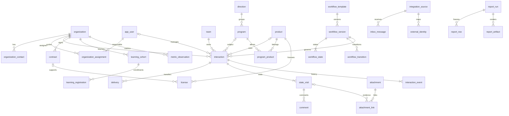

# Данные, доступ, история и гибкий workflow

Дата: 19.09.2026. Статус: целевой проект для реализации, а не описание уже существующих возможностей. Первичный источник — PDF «6. ИТ Школа Ростелекома», физические страницы 2–7; извлечённый текст находится в `work/source_text.txt` относительно рабочего каталога. Дополнительные проектные правила взяты из [спецификации](../planning/01-technical-specification.md) и [сценариев приёмки](../planning/03-acceptance-scenarios.md). Внешние API, действительные форматы исходных таблиц, определения учебных метрик и условия допуска реальных данных пока не подтверждены.

## 1. Что имеется и что необходимо изменить

Ссылки далее относятся к корню `rtk-crm`; номера строк зафиксированы при анализе. Под «таблицей» ниже понимается логическая сущность. Для уже существующих таблиц физические имена `users`, `interactions`, `interaction_events` и прочие можно сохранить в ORM; переименовывать их ради единственного числа не требуется. Новые миграции должны явно фиксировать соответствие логических и физических имён.

| Наблюдение в коде | Следствие для целевого решения |
|---|---|
| `backend/app/models.py:18` — одна роль, строковый team_id, permissions в JSON | Добавить команды, историю членства, нормализованные права и явные grants; определить единый источник ролей |
| `backend/app/models.py:29` — у организации только имя и тип; `:57` — vendor строкой | Нужны контакты, идентификаторы, вендоры, архивирование, revision и история переименований |
| `backend/app/models.py:70` — state строкой, workflow_version целым числом | Отсутствуют FK на опубликованную версию и состояние конкретной версии |
| `backend/app/models.py:83`, `:113` — visit_id без таблицы посещений | Нельзя доказать существование посещения, его границы и принадлежность карточке; нужны `state_visit` и составные FK |
| `backend/app/workflow.py:5` — один граф загружается из JSON при импорте модуля | Создание новых процессов, публикация версий и работа нескольких версий одновременно не реализованы |
| `backend/app/workflow.py:9` — обязательность программы/продукта привязана к именам этапов | Проверку нужно выразить через инварианты состояния, сохранив предметные ограничения при переносе, импорте и PATCH |
| `backend/app/services.py:122` — каждый event содержит полный текущий snapshot, включая комментарии | При позднем факте более поздний комментарий может восстановить устаревшее состояние/владельца; произвольный последний snapshot не подходит для общей временной модели |
| `backend/app/services.py:127` — sequence вычисляется через max+1 | Нужна гарантированная сериализация записи событий одной карточки; уникальный индекс полезен, но сам не заменяет выделение номера под блокировкой |
| `backend/app/services.py:39` — область руководителя определяется строковым `Interaction.team_id` | Заменить строку явным FK `owning_team_id`; область руководителя определяется его текущим supervisor-членством в закреплённой команде карточки |
| `backend/app/services.py:215` — переход сохраняет комментарий внутри event payload | Требуется единая запись `comment`, связанная с событием перехода и исходным посещением; отдельный список comments сейчас эту запись не содержит |
| `backend/app/services.py:342` — только синхронный snapshot, лимит 5000 карточек, события читаются в Python | Нужны activity/created, серверный query layer и фиксированный набор строк для всех экспортов; лимит первой версии нельзя считать реализацией 10 параллельных отчётов |
| `backend/app/schemas.py:42` — snapshot без направления, статуса, версии workflow и выбранных колонок | Расширить общий контракт параметров отчёта, сохранив inclusive/exclusive границы |
| `backend/app/db.py` — `Base.metadata.create_all` | Добавить последовательные Alembic-миграции; create_all не является миграционным механизмом существующей БД |

Полезный фундамент сохраняется: контроль revision/CAS (`services.py:181`), ключи идемпотентности (`:147`), разделение разрешения и области, повторная проверка области при replay (`:168`), effective_at/received_at и независимый sequence (`models.py:89`). Тесты `backend/tests/test_working_slice.py:185`, `:203`, `:218` закрепляют текущие права, replay и временные границы; их нужно переносить, а не заменять только новыми тестами.

## 2. Базовые решения и ограничения модели

1. Одна установка обслуживает одну ИТ Школу; мультитенантность не добавляется без требования. Образовательная организация имеет тип university/school/other. Это не tenant.
2. Одно взаимодействие — один цикл, одна организация, одна программа и один основной продукт; программа и продукт допускают отсутствие на раннем этапе. Независимые продуктовые пути — отдельные карточки. Междисциплинарная программа пока имеет одно основное направление. Это проектные решения D01–D04, требующие проверки на примерах заказчика.
3. PostgreSQL хранит предметные транзакции, историю, метаданные файлов и служебные задания. Двоичные файлы находятся в закрытом объектном хранилище; очереди/исполнители не становятся источником предметной истины.
4. Новые таблицы получают UUID PK; существующие 12 таблиц сохраняют текущие ключи: одиночные ID `varchar(64)` либо имеющиеся составные PK связей, включая demo-ID. Новые строки в этих существующих таблицах могут получать UUID в строковом представлении; это не меняет SQL-тип PK. FK всегда имеет **тот же тип, что PK цели**. Внешний ID и номер договора не заменяют PK; UUID не даёт права доступа. Массовое переименование существующих ID не входит в baseline-миграцию.
5. Все моменты — `timestamptz`, запись в UTC; календарные факты — `date`. Часовой пояс отчёта фиксируется отдельно. `revision bigint NOT NULL DEFAULT 1 CHECK (revision > 0)` используется у изменяемых агрегатов.
6. FK обязательны для предметных связей. Использованные справочники архивируются; обычный пользовательский DELETE не каскадно уничтожает историю. Для фактов, опубликованных версий и событий — `ON DELETE RESTRICT`; для чистых связей удаляемого черновика допустим CASCADE. Регламент удаления/обезличивания — отдельное согласованное правило.
7. Имена, ФИО, телефоны, email не считаются глобально уникальными. Исходное значение лицензии «2026» не превращается автоматически в дату окончания 31.12.2026. Номер договора хранится строкой, включая ведущие нули.
8. JSONB используется для декларативных правил, версионированных входных конвертов, настроек колонок и вспомогательного контекста события. Организация, владелец, программа, продукт, статус, даты и права — типизированные поля/связи, а не произвольные JSON-документы.
9. Прикладные команды проходят один application service с Unit of Work. REST, импорт, интеграции и jobs не реализуют собственные обходные правила записи.

Обозначения каталога: `?` — nullable; `FK X` — ссылка на PK X с совпадающим SQL-типом; `UQ` — UNIQUE; `IX` — индекс; `C` — CHECK. Если не оговорено иначе, PK **новой** таблицы — `id uuid`; одиночный PK существующей сущности остаётся `varchar(64)`, составные PK связей сохраняются. Служебные поля изменяемой сущности — `created_at`, `updated_at`, `revision`; архивируемой — также `archived_at?`. Это общий набор, не повторённый в каждой строке. Все FK на активно фильтруемые дочерние коллекции получают B-tree индекс; составной индекс используется вместо дублирующего одиночного только при подходящем левом префиксе. Логические singular-имена ниже не требуют физического переименования существующих plural-таблиц.

### Обзор связей

Диаграмма показывает основные FK и grain. Поля, составные ограничения и nullable-связи уточняются таблицами ниже; она не заменяет полный каталог схемы.

## 3. Каталоги, ответственные, договоры и лицензии

| Таблица | Типизированные поля кроме общего набора | Ограничения и запросы |
|---|---|---|
| `organization` | `name varchar(250)`, `short_name varchar(120)?`, `type varchar(16)`, `normalized_name text` | C type в university/school/other; имя непустое; имя не UQ. IX(type, archived_at); поиск по нормализованному имени — trigram после подтверждения профиля запросов |
| `organization_identifier` | `organization_id FK organization`, `scheme varchar(40)`, `value varchar(180)`, `verified_at?` | UQ(organization_id,scheme,value). UQ(scheme,value) вводится только для схемы, для которой заказчик подтвердил глобальную уникальность, например конкретного реестра |
| `organization_contact` | `organization_id FK organization`, `full_name varchar(250)`, `position varchar(250)?`, `email varchar(320)?`, `phone varchar(80)?`, `notes text?` | IX(organization_id, archived_at). Контакт — не пользователь Keycloak; отсутствие email допустимо; поиск совпадений не означает автослияние |
| `vendor` | `code varchar(80)`, `name varchar(250)` | UQ(code); name не UQ; использованный vendor только архивируется |
| `direction` | `code varchar(80)`, `name varchar(200)`, `description text?` | UQ(code), стабильный code не меняется при переименовании |
| `program` | `code varchar(80)`, `name varchar(250)`, `direction_id FK direction`, `description text?` | UQ(code); IX(direction_id, archived_at) |
| `product` | `vendor_id FK vendor`, `code varchar(80)`, `name varchar(250)`, `description text?` | UQ(vendor_id,code); IX(vendor_id, archived_at) |
| `program_product` | `program_id FK program`, `product_id FK product`, `active boolean` | PK(program_id,product_id). Использованную пару деактивировать, не удалять; новая карточка выбирает активную пару, история сохраняется |
| `organization_assignment` | `organization_id FK organization`, `user_id FK app_user`, `effective_from timestamptz`, `effective_to?`, `assigned_by FK principal`, `reason text`, `audit_event_id` | C to>from. Частичный UQ(organization_id) WHERE effective_to IS NULL. Все назначения сериализуются блокировкой organization; прошлые интервалы не должны пересекаться, это проверяется командой под той же блокировкой |
| `contract` | `organization_id FK organization`, `number varchar(160)`, `status varchar(32)`, `signed_on date?`, `valid_from date?`, `valid_to date?`, `comment text?` | C to>=from. Номер не глобальный UQ; IX(organization_id,number). Статусы draft/review/signed/terminated/expired — проектный справочник, окончательно согласуется |
| `license` | `organization_id FK organization`, `product_id FK product`, `contract_id FK contract?`, `number varchar(160)?`, `signed_on date?`, `valid_from date?`, `valid_to date?`, `term_raw varchar(250)?`, `term_years numeric(8,2)?`, `transfer_status varchar(32)`, `transferred_at timestamptz?` | C term_years>0 при наличии, to>=from. contract должен относиться к той же organization; IX(organization_id,product_id), IX(valid_to) WHERE archived_at IS NULL. Дата подписи/передачи — отдельный факт, не выводится из названия этапа |
| `delivery` | `organization_id FK organization`, `interaction_id FK interaction?`, `status draft/sent/confirmed/cancelled`, `channel varchar(40)`, `sent_at timestamptz?`, `confirmed_at timestamptz?`, `recipient_contact_id FK organization_contact?`, `recorded_by FK principal`, `comment text?` | IX(organization_id,sent_at DESC); составные FK interaction/contact с organization_id. C confirmed_at>=sent_at при наличии; отправка/подтверждение требует соответствующей даты. Фиксирует передачу материалов/лицензии/документов независимо от workflow-перехода |
| `delivery_item` | `delivery_id FK delivery`, `item_kind material/document/license`, `title varchar(250)`, `attachment_id FK attachment?`, `license_id FK license?`, `material_version varchar(120)?` | C license_id обязателен для kind=license и отсутствует для остальных; item document/material имеет описательное название и при наличии сохранённый clean attachment. Лицензия и delivery относятся к одной организации; это проверяет заблокированная application command. Attachment ACL/scan проверяет files port; отправленный набор не переписывается, корректировка — новая запись доставки/аудит |
| `interaction_contact` | `interaction_id FK interaction`, `contact_id FK organization_contact`, `role varchar(40)`, `is_primary boolean` | PK(interaction_id,contact_id,role); не более одного primary на роль; контакт той же организации проверяется составной FK или заблокированной командой |
| `interaction_contract` | `interaction_id`, `contract_id`, `organization_id` | PK(interaction_id,contract_id); составные FK на (interaction.id,organization_id) и (contract.id,organization_id) гарантируют одинаковую организацию |
| `interaction_license` | `interaction_id`, `license_id`, `organization_id` | PK(interaction_id,license_id); аналогичные составные FK. Совместимость product проверяется предметной командой |

Для составных FK целевые таблицы явно получают UQ(id,organization_id); это избыточно для уникальности UUID, но нужно как декларативный ключ принадлежности. Для `license.contract_id` применить составной FK `(contract_id,organization_id)` с обычным MATCH SIMPLE: отсутствие договора разрешено, организация обязательна.

История каталожных наименований: `organization_version`, `direction_version`, `program_version`, `product_version`, `vendor_version`, `user_profile_version`. Это отдельные небольшие таблицы со своим FK на сущность, `version_no bigint`, `effective_at`, `received_at`, `sequence bigint`, изменяемыми отображаемыми полями и `actor_principal_id`; UQ(entity_id,version_no), IX(entity_id,effective_at DESC,sequence DESC). Для program_version сохраняется direction_id; для product_version — vendor_id. Новая версия создаётся атомарно с обновлением текущей строки. В первой реализации имена каталогов меняются только текущим серверным временем; загрузка старого имени не объявляется доказанной ретроспективой. Поздняя коррекция каталога требует отдельной операции и причины. Обычная история имён достаточна для отчёта «как называлось на дату» без массовых событий на каждой карточке.

## 4. Идентичность, команды и область доступа

| Таблица | Поля и ключи | Назначение |
|---|---|---|
| `app_user` (физически `users`, PK сохраняется) | `id varchar(64)`, `issuer varchar(500)`, `keycloak_subject varchar(255)`, `display_name varchar(250)`, `active boolean`, `authorization_revision bigint` | UQ(issuer,keycloak_subject). Паролей/refresh tokens в этой таблице нет. issuer включён, чтобы sub из другого realm не совпал |
| `principal` | `id uuid`, `kind user/service`, `user_id FK app_user?`, `integration_source_id?`, `name varchar(250)`, `active boolean` | CHECK ровно одна ссылка по kind; UQ(user_id), UQ(integration_source_id). Actor предметного события может быть служебной интеграцией, а не фиктивным человеком |
| `permission` | `code varchar(100) PK`, `description text` | Стабильные коды: interactions.read/create/update/transition/comment/assign, files.*, reports.*, catalogs.*, workflows.*, imports.*, integrations.*, users.* |
| `role_permission` | `role_code varchar(32)`, `permission_code FK permission` | PK(role_code,permission_code); разрешённые роли manager/supervisor/administrator |
| `user_role_binding` | `user_id FK app_user`, `role_code varchar(32)`, `active boolean`, `synced_at`, `revision` | PK(user_id,role_code). Локально разрешённый набор для пересечения с проверенными ролями токена; создание/отзыв проходит IAM service с аудитом |
| `user_permission_grant` | `user_id FK app_user`, `permission_code FK permission`, `expires_at?`, `granted_by FK principal` | PK(user_id,permission_code); только расширение действий, область объектов задаётся отдельно |
| `team` | `code varchar(80)`, `name varchar(250)`, `active boolean` | UQ(code) |
| `team_membership` | `team_id FK team`, `user_id FK app_user`, `membership_role manager/supervisor`, `valid_from`, `valid_to?` | UQ(team_id,user_id,membership_role) WHERE valid_to IS NULL; IX(user_id,valid_to). C to>from. Допускается несколько команд, если это разрешит заказчик |
| `organization_access_grant` | `user_id FK app_user?`, `team_id FK team?`, `organization_id FK organization`, `permission_code FK permission`, `expires_at?`, `created_by FK principal` | CHECK ровно один subject: user/team; два отдельных partial UQ для user и team; IX(organization_id). Действие и область представлены явно; «видит название организации» не эквивалентно этому grant |
| `interaction_access_grant` | тот же subject, `interaction_id FK interaction`, permission, expires_at, actor | Аналогичные ключи. Для точечного совместного ведения одной карточки |
| `access_policy_state` | `singleton_id smallint PK CHECK =1`, `epoch bigint NOT NULL CHECK >0` | Это глобальный `authz_epoch` политики. Любое изменение scope/доступа увеличивает epoch **в той же транзакции**: создание/смена/снятие owner, смена owning team, grants, memberships, роль/permission, локальная активность principal/user, видимость организации и назначения, если они влияют на доступ. Комментарий/переход без изменения области epoch не увеличивает. Ключи кэшей используют epoch, выдача защищённого артефакта проверяет права заново |

Источником ролей остаётся Keycloak: в запросе используются только проверенные разрешённые realm/client roles, пересечённые с локально разрешённым набором для пользователя. Локальные grants задают расширения действий и область. Нельзя одновременно разрешить произвольную JSON-роль из БД и отдельную роль из токена без правила согласования. Блокировка `app_user.active=false` действует сразу; изменение ролей в Keycloak должно сопровождаться отзывом сессий/ограниченной жизнью токена в конфигурации авторизации.

Принятое правило команды: `interaction.owning_team_id` — обязательный FK команды, за которой закреплена карточка. Область руководителя определяется его **текущим supervisor-членством в этой команде**, включая карточки без владельца. `owner_id` допускает NULL: такие карточки находятся в очереди назначения своей команды. При назначении активный manager должен принадлежать owning team; исключение требует явного разрешения совместной работы. Перевод сотрудника в другую команду сам по себе не переносит его карточки. Preview изменения членства перечисляет затронутые активные карточки и требует явного решения: сменить их владельца, снять владельца либо отдельной командой перенести owning team с проверкой прав обеих областей. Для завершённых карточек историческое назначение допустимо; текущие права всё равно определяет актуальная политика. Нельзя выводить owning team из текущего членства owner при каждом чтении.

Единый `AccessScope` строит SQL-предикат:

`действие разрешено AND (текущий владелец=user OR owning_team в текущих supervisor-командах user OR действующий grant на карточку/организацию)`.

Ответственный за организацию хранится отдельно в `organization_assignment`: 0 или 1 активный manager. Его назначение используется как проверяемое предложение владельца новой карточки; изменение/снятие не переписывает владельцев существующих карточек. Оно не даёт автоматически доступ ко всем карточкам организации: для такого доступа нужен явно выданный organization grant. Операция массового переназначения имеет отдельный preview, список объектов и проверку revisions.

Технический administrator не получает все предметные строки автоматически. Исторический владелец не даёт текущего права. Проверки применяются к спискам, прямым ссылкам, counts, справочникам контактов, autocomplete, импорту, истории, вложениям, заданиям, отчётам и replay. Для видимого объекта без действия — 403, для недоступного ID — 404. Для кэшей отчётов общий набор нельзя переиспользовать только по фильтру: нужен пользователь/область и epoch.

В первой поставке из двух разработчиков единая SQL-политика и отрицательные тесты — обязательны. PostgreSQL RLS можно добавить как второй рубеж после проверки передачи principal в каждую транзакцию, включая worker; нельзя включить RLS частично и объявить это завершённой авторизацией.

## 5. Версионируемый workflow

| Таблица | Поля | Инварианты и индексы |
|---|---|---|
| `workflow_template` | `code varchar(80)`, `name varchar(250)`, `description text?`, `archived_at?` | UQ(code); устойчивый шаблон объединяет версии |
| `workflow_version` | `template_id FK workflow_template`, `version_no int`, `status draft/published/retired`, `definition_schema_version int`, `created_by`, `published_by?`, `published_at?`, `definition_hash char(64)?`, `is_default_for_new boolean` | UQ(template_id,version_no); partial UQ(template_id) WHERE is_default_for_new. C version_no>0; published/retired требуют hash/published_at; default допустим только published |
| `workflow_state` | PK(`workflow_version_id`,`state_key uuid`); `code varchar(80)`, `name varchar(250)`, `kind work/terminal`, `is_initial boolean`, `terminal_outcome success/cancelled/other?`, `position int`, `analytic_category varchar(80)`, `invariants jsonb`, `sla_seconds bigint?` | UQ(version_id,code); partial UQ(version_id) WHERE is_initial. C sla_seconds>0; terminal не initial. `state_key` сохраняется при копировании семантически того же этапа, но не заменяет version_id |
| `workflow_transition` | `id uuid`, `workflow_version_id`, `code varchar(120)`, `from_state_key`, `to_state_key`, `name varchar(250)`, `required_permission varchar(100)`, `comment_required boolean`, `guard jsonb` | UQ(version_id,code); составные FK обоих концов на workflow_state. IX(version_id,from_state_key). Разные рёбра между одной парой допускаются только с различимым кодом/смыслом |
| `workflow_migration_plan` | `source_version_id`, `target_version_id`, `created_by`, `reason text`, `status draft/validated/applying/completed/partial/expired`, `validated_at?`, `expires_at?`, `definition_hashes jsonb`, `revision` | FK обеих версий; C source<>target; целевая версия published. Права на создание и применение отдельные |
| `workflow_migration_map` | `plan_id`, `source_version_id`, `source_state_key`, `target_version_id`, `target_state_key` | PK(plan_id,source_state_key); составные FK на состояния; версии обязаны совпасть с plan. Частичный mapping допустим только если план явно ограничен выбранными карточками |
| `workflow_migration_item` | `plan_id`, `interaction_id`, `expected_revision bigint`, `expected_state_key`, `target_state_key`, `status pending/applied/conflict/invalid`, `applied_event_id?`, `error_code?` | PK(plan_id,interaction_id); снимок revision/state из preview; индекс(plan_id,status) |

`analytic_category` берётся из управляемого словаря основных этапов либо специального `unmapped`; равные названия не означают равный аналитический смысл. Отчёт по произвольным процессам группирует точную пару version/state; объединение категорий — только явный режим с пометкой unmatched.

Опубликованное содержание не меняется: изменение имени, guard, порядка или связи создаёт draft следующей версии. Retired запрещает новые назначения, но позволяет старым карточкам завершать процесс. Изменение метаданных retirement не является правкой графа. Неизменяемость проверяется application service и ограниченными правами/триггером БД на дочерних таблицах опубликованных версий; обычный API role не получает обходной UPDATE этих строк.

Публикация в одной транзакции блокирует draft и проверяет:

- ровно одно начальное состояние, хотя бы один терминал; уникальные code/key;
- существование всех концов рёбер в этой версии; достижимость всех рабочих состояний из начала;
- путь из каждого рабочего состояния хотя бы к одному терминалу, отсутствие обычных исходящих рёбер терминала;
- валидность декларативных инвариантов и guard; существование permission и аналитической категории;
- ограничение размера/глубины правил; вычисление canonical JSON и SHA-256 опубликованного содержания.

Циклы разрешены. Пункт 14 исходного пути («контроль каждого этапа») реализуется историей, авторством, посещениями, сроками и отчётами; это сквозная функция, а не обязательная четырнадцатая колонка. Базовые 13 рабочих этапов + completed/cancelled импортируются из `backend/app/data/base-workflow.json`; дополнительные возвраты — проектные правила, не дословное требование PDF.

### 5.1. Условия без пользовательского исполняемого кода

Декларативная версия 1 содержит только разрешённые операции `all`, `any`, `not`, `field_present`, `field_equals`, `has_clean_attachment`, `has_contact`, `has_contract_status`, `has_license_status`. Пути полей — enum, значения валидируются по типу; Python/SQL/Jinja/JavaScript из шаблона не исполняются. JSONB выбран потому, что композиция AND/OR — дерево различной формы, а не предметный справочник.

Например, состояние передачи материалов имеет invariant `all(field_present(program_id), field_present(product_id))`; ребро отмены требует комментарий. Обязательность подписанного договора не добавляется всем карточкам автоматически: это отдельное согласованное правило конкретного процесса. Guard ребра отвечает на «можно ли выполнить команду сейчас», invariant состояния — на «разрешено ли объекту находиться здесь после любой команды». PATCH, import, migration и integration проверяют второй набор независимо от ребра.

UI получает с карточкой разрешённые переходы и понятные причины блокировки. Клиентское отображение не является разрешением: сервер повторяет расчёт при команде. Правила не делают сетевых запросов; состояние файла/лицензии уже находится в БД. Задания сканирования и синхронизации не удерживают пользовательскую транзакцию.

### 5.2. Безопасный перенос действующих карточек

1. Создать новую published-версию, выбрать исходную, задать mapping и конкретную область карточек.
2. Preview рассчитывает состояние до/после, проверяет инварианты и доступ, сохраняет revisions, версии и hash графов. Ни одна текущая карточка пока не меняется.
3. Apply с ключом идемпотентности повторно проверяет права, состояние плана, срок preview, версию, revision и инварианты каждой карточки.
4. Одна карточка переносится одной транзакцией: закрыть текущее посещение, создать новое, заменить version/state/current_visit, увеличить revision, добавить `workflow_migrated`, аудит и outbox. Переименование состояния не переписывает прошлые события или названия в старой версии.
5. Для большого плана атомарность гарантируется **на карточку**, не на весь набор. Итог partial содержит applied/conflict/invalid; повтор не мигрирует applied снова. Противоречащие preview карточки требуют повторного preview. Это отличается от атомарного по умолчанию импорта малого пакета.
6. Терминал не становится рабочим состоянием через перенос. Возобновление — отдельный явно согласованный сценарий, по умолчанию создаётся новый цикл со ссылкой previous_interaction_id. Если неизменившиеся карточки завершились после preview, получают conflict.

`workflow_migrated` не считается business state transition в activity. Это административное изменение формы процесса. Исходные версии нельзя удалить до истечения всех применимых сроков хранения ссылок.

## 6. Взаимодействия, посещения и команды

| Таблица | Поля | Инварианты/индексы |
|---|---|---|
| `interaction` | `number bigint` из sequence, `title varchar(250)`, `summary text?`, `organization_id FK`, `program_id FK?`, `product_id FK?`, `interest_direction_id FK?`, `cycle_label varchar(100)`, `owner_id FK app_user?`, `owning_team_id FK team NOT NULL`, `workflow_version_id FK`, `current_state_key uuid`, `current_visit_id uuid`, `previous_interaction_id FK interaction?`, `revision bigint`, `next_event_sequence bigint`, `created_at`, `updated_at`, `closed_at?` | UQ(number); составной FK(version,state); составной FK(current_visit_id,id) на state_visit(id,interaction_id), DEFERRABLE при создании. C revision>0, next_event_sequence>0; предыдущая карточка не self. IX(owner_id,updated_at DESC,id); IX(owning_team_id,updated_at DESC,id); partial IX(owning_team_id,updated_at DESC,id) WHERE owner_id IS NULL; IX(organization_id,updated_at DESC,id); IX(program_id,product_id); IX(version,state). Нет UQ(organization,program,product): повторные циклы допустимы |
| `state_visit` | `interaction_id`, `workflow_version_id`, `state_key`, `entered_at`, `exited_at?`, `opened_by_event_id`, `closed_by_event_id?`, `is_inferred boolean DEFAULT false` | UQ(id,interaction_id); составной FK состояния и событий той же карточки; C exited_at>=entered_at; partial UQ(interaction_id) WHERE exited_at IS NULL AND NOT is_inferred. IX(interaction_id,entered_at,id) |
| `comment` | `interaction_id`, `state_visit_id`, `event_id`, `author_principal_id`, `body text`, `created_at`, `redacted_at?`, `redaction_reason?` | C body непустой/до согласованного лимита, исходный 5000; составные FK принадлежности visit/event. Комментарий перехода связан с исходным посещением и event перехода. История редактирования, если разрешена, отдельными версиями; первоначально комментарии не редактируются, удаление по регламенту — видимая редактирующая операция |
| `command_result` | `principal_id`, `operation varchar(180)`, `key varchar(200)`, `request_hash char(64)`, `status_code int`, `response jsonb?`, `resource_id varchar(64)?`, `created_at`, `expires_at` | UQ(principal_id,operation,key); resource_id для предметных команд ссылается на interaction с сохранённым типом PK либо хранится в специализированном поле результата. IX(expires_at). Срок окна replay документируется; внешняя дедупликация inbox живёт отдельно |

Создание и любая мутация карточки: активный principal → действие → SQL scope → reservation idempotency → блокировка строки карточки → сравнение expected_revision → предметная валидация → запись текущего состояния/typed facts/посещения/comments → audit/outbox/result → один commit. Для новой карточки аналогично, только блокируется организация/назначение, используемое для owner default. Резерв ключа и результат находятся в той же предметной транзакции; после rollback нет «успешного» ключа без эффекта.

После `SELECT ... FOR UPDATE` сравнивается revision; альтернатива CAS допустима, если она также сериализует выделение sequence и связанные факты. `next_event_sequence` увеличивается под этой блокировкой. Уникальный `(interaction_id,sequence)` остаётся последней защитой. Retry после deadlock/конфликта транзакции ограничен и повторяет целую команду с тем же ключом; сеть/сканер/экспорт не выполняются внутри блокировки.

Replay сначала проверяет нынешнее право на ресурс, затем возвращает сохранённый ответ. Изменившийся payload с тем же ключом → `IDEMPOTENCY_CONFLICT`; устаревшая revision при новом ключе → `REVISION_CONFLICT`. Идемпотентный replay ранее успешной команды допускается при старой revision, поскольку он не выполняет команду повторно.

У разных read моделей нет права отдельно изменять текущий owner/state. Глобальный cache не считается источником состояния. События и актуальная строка взаимодействия должны быть согласованы после каждого commit.

### Контроль этапа и следующего действия

`interaction_control_item` — проектное расширение для TD30: `id uuid`, `interaction_id FK`, `state_visit_id?` с проверкой принадлежности, `title varchar(250)`, `assignee_id FK app_user?`, `due_at timestamptz?`, `status open/done/cancelled`, `completed_at?`, `created_by FK principal`, общие revision/timestamps. CHECK: completed_at задан только для done; partial IX(due_at,interaction_id) WHERE status='open'; IX(interaction_id,status). Изменение/завершение — CAS + audit/event в общей транзакции, видимость наследуется от карточки. `overdue=true` использует EXISTS открытого пункта с due_at < server now. Это минимальный контроль, не самостоятельная система проектов; email/push и обязательные SLA не следуют из ТЗ и не требуются для первого выпуска. История и отчёты по длительности этапа работают и без таких пунктов.

## 7. Неизменяемая история и корректные отчёты

### 7.1. Конверт события и типизированные факты

`interaction_event` сохраняет существующие PK/FK `varchar(64)`: `id`, `interaction_id FK`; остальные поля: `sequence bigint`, `event_type varchar(60)`, `schema_version smallint`, `effective_at timestamptz`, `received_at timestamptz`, `actor_principal_id FK principal`, `source_inbox_id?`, `correlation_id uuid`, `causation_event_id?`, `reason text?`, `metadata jsonb`. UQ(interaction_id,sequence), UQ(id,interaction_id), IX(interaction_id,effective_at,sequence), IX(received_at). Поля входящего источника не могут заменить CRM received_at; это время надёжного приёма конверта. Пользовательская команда получает обе даты от сервера; отложенный бизнес-факт получает effective_at из проверенного источника, received_at из inbox. Для envelope/typed факта политика времени должна быть одна, а не независимо задаваемые пользователем даты.

В typed facts вынесены исторические величины, которые меняются независимо. Комментарий не создаёт факта состояния или назначения.

| Таблица | Предметные поля | Когда появляется |
|---|---|---|
| `interaction_state_fact` | `workflow_version_id`, `state_key`, `transition_id?`, `change_kind start/transition/migration`, `state_visit_id?` | Создание, разрешённый переход, перенос версии. Исправление сохраняет исходный change_kind; correction обозначается типом event и fact_revision |
| `interaction_owner_fact` | `owner_id FK app_user?`, `owning_team_id FK team?`, `team_is_known boolean DEFAULT true` | Создание, назначение/снятие владельца и явный перенос команды; хранит обе величины одного назначения, не появляется на каждом переходе. CHECK (team_is_known AND owning_team_id IS NOT NULL) OR (NOT team_is_known AND owning_team_id IS NULL); неизвестная команда допускается только для legacy backfill, новые команды требуют её FK |
| `interaction_attributes_fact` | `organization_id`, `program_id?`, `product_id?`, `interest_direction_id?`, `title`, `cycle_label` | Создание и явная корректировка предметных атрибутов. Исторический closed_at вычисляется по state history, не дублируется здесь |

Общие поля typed fact: `id uuid`, `interaction_id`, `event_id`, `fact_key uuid`, `fact_revision int`, `supersedes_fact_id?`, `retracted boolean`, `effective_at`, `order_sequence bigint`. UQ(fact_key,fact_revision); UQ(supersedes_fact_id) WHERE NOT NULL; составной FK(event_id,interaction_id). FK supersedes указывает на ту же таблицу. CHECK revision>0, order_sequence>0; сервис под блокировкой карточки проверяет тот же fact_key/interaction, строго следующий revision и допустимую цепочку. `order_sequence` первой версии равен event.sequence и сохраняется при исправлении этого логического факта. Поэтому исправление не переупорядочивает без причины два факта с одинаковым effective_at. Полученное время версии берётся из её event.received_at.

При retraction старые значения могут сохраняться для аудита, но resolver игнорирует эту последнюю версию. Новая самостоятельная бизнес-операция получает новый fact_key; correction заменяет конкретный существующий факт с причиной. Предыдущую строку никогда не UPDATE. У одного события создания допустимы по одному факту state/owner/attributes. Это не полное event sourcing всего приложения: текущие таблицы обслуживают интерфейс, а история является специально поддерживаемой моделью для воспроизводимых отчётов.

### 7.2. Resolver времени: порядок действий обязателен

Для `knowledge_cutoff=K` и бизнес-момента `T`:

1. Отобрать версии фактов, чьи события известны по `received_at <= K`.
2. Для каждого `fact_key` выбрать последнюю известную `fact_revision`; отбросить retracted. Сделать это **до** фильтра effective_at: исправление может перенести факт за пределы периода и должно убрать старое значение.
3. Применить границу `effective_at <= T` либо `< T` для exclusive snapshot.
4. Для каждой карточки и каждого вида фактов выбрать последнее по `(effective_at,order_sequence)`.
5. Соединить восстановленные state/owner/attributes; убедиться, что создание карточки известно к K и попадает в T. Имя этапа взять из неизменяемой workflow_version, имена организации/программы/продукта/пользователя — из версий каталогов на соответствующий бизнес-момент, известных к K.

Это уточняет старую формулировку «порядок effective_at,sequence»: для обычных событий sequence неизменен; correction сохраняет логический порядок оригинала. Ответ API может возвращать event.sequence и fact.order_sequence отдельно. Ретроспективный отчёт никогда не собирается из `MAX(snapshot)` всех типов событий.

Режимы:

- **snapshot:** одна строка на interaction; исторический owner/status/subject на T. Исторические фильтры применяются после resolver, текущие права — до него.
- **activity:** одна строка на действующий логический факт `change_kind=transition` в `[from,to)`; идентификатор строки — fact_key, версия/подтверждающий event_id — отдельные поля. Owner/subject восстанавливаются на `(effective_at,order_sequence)` перехода, чтобы назначение с тем же временем, но позже по порядку не действовало задним числом. start/migration/comment/assignment/correction-envelope сами не увеличивают число бизнес-переходов.
- **created:** одна строка на карточку, созданную в `[from,to)` и известную к K; атрибуты и owner на момент создания. Это не snapshot на конец периода.

Счётчики различают `distinct interaction_id`, `distinct organization_id`, число логических переходов. Присоединение контактов/файлов не размножает базовые строки: такие связи используются EXISTS или отдельными агрегатами. Незаполненная программа — «Не определено», отсутствующая учебная метрика — «Нет данных».

Период из дат UI преобразуется в `[00:00 первого дня,00:00 после последнего дня)` в сохранённом часовом поясе. Snapshot «конец дня» использует начало следующего дня и exclusive; без искусственной 23:59:59.999999.

### 7.3. Поздние события и воспроизводимость

Обычная интеграция не получает право менять CRM workflow, владельца или права только потому, что прислала JSON. Владение полями согласуется. Поздний разрешённый факт проходит дедупликацию и проверку идентичности, затем симуляцию затронутой временной последовательности. Если вставка/коррекция делает цепочку переходов невозможной, меняет неизвестную версию workflow, нарушает владение/инварианты или требует догадаться о дате — карантин/сверка, а не скрытая перезапись.

Для принятого позднего факта в одной транзакции фиксируются факт и event, обновляется корректная текущая проекция из canonical history, если она изменилась, и увеличивается revision карточки. Нельзя просто присвоить `interaction.state=incoming.state`: старый факт может не быть последним. `state_visit` хранит идентичность реальных операционных посещений и ссылки файлов; поздняя история не переназначает существующие файлы молча. Восстановленные исторические интервалы рассчитываются по state facts; отдельное inferred visit допустимо с явной маркировкой. Времена текущего открытого посещения корректируются только контролируемой операцией, старое значение остаётся в событии коррекции.

Формирование отчёта должно фиксировать не только K, но и **фактически видимый набор версий** в согласованном снимке PostgreSQL. Один лишь received_at не защищает от транзакции, начавшейся раньше K, но закоммиченной позднее. Worker строит canonical rows и manifest версий в одной read snapshot/транзакции, сохраняет их в `report_row` и затем генерирует форматы вне долгой предметной транзакции. Результат хранит `semantic_version`, параметры, K, manifest/hash и время получения снимка. Существующий report_run не пересчитывается; новая попытка с тем же K может быть другим запуском, если изменился видимый набор. Для строгого «те же данные» повторно используют frozen run, а не одни timestamps.

`report_scope_item` фиксирует все зависимости результата: тип `interaction` с FK interaction_id либо тип `organization` с FK organization_id для учебных агрегатов, у которых карточки может не быть. CHECK требует ровно одну ссылку по типу; partial UNIQUE(run_id,interaction_id) и UNIQUE(run_id,organization_id) исключают повторы. Программы/продукты и provenance учебных фактов сохраняются в manifest для проверки дополнительных ограничений. В scope входят все объекты итогов и нулевых строк, а не только показанная страница. Перед публикацией и выдачей проверяется весь набор текущих прав; при отзыве хотя бы части выдача исходного файла запрещена. Срок хранения результата и срок истории — разные настройки. Детали jobs/rendering/files находятся в документе интеграционного контура.

## 8. Статистика обучения: минимальная расширяемая структура

Слова «заявки», «обучающиеся», «параллельные потоки» есть в обосновании PDF, но определения и контракт источника отсутствуют. Модель ниже позволяет принимать согласованные показатели, не выдавая CRM-переходы за учебную статистику.

| Таблица | Поля | Ключи/правила |
|---|---|---|
| `metric_definition` | `code varchar(80)`, `version int`, `name`, `unit varchar(40)`, `value_kind count/decimal/ratio`, `temporal_kind interval/snapshot`, `aggregation sum/latest/distinct/non_additive`, `definition text`, `source_priority_policy?`, `published_at?` | UQ(code,version). Опубликованная формула неизменяема; новая методика — новая версия |
| `metric_observation` | `definition_id FK`, `organization_id FK`, `program_id FK?`, `product_id FK?`, `source_id FK`, `external_record_id varchar(200)`, `source_revision varchar(120)`, `value numeric(24,6)?`, `period_start?`, `period_end?`, `as_of?`, `received_at`, `completeness complete/partial/missing`, `supersedes_id?`, `source_payload_hash` | UQ(source_id,external_record_id,source_revision). CHECK ровно interval(start<end) или snapshot(as_of); count неотрицательное целое; missing не подменять нулём. IX(definition_id,organization_id,program_id,as_of); IX(received_at) |
| `learning_cohort` | `organization_id FK`, `program_id FK`, `title`, `source_id FK`, `external_id`, `planned_start date?`, `planned_end date?`, `status`, `revision` | UQ(source_id,external_id). Добавлять после подтверждения пообъектного контракта LMS; обучающиеся физлица для этого не нужны |
| `cohort_activity_interval` | `cohort_id FK`, `active_from timestamptz`, `active_to?`, `source_revision`, `received_at` | C to>from; интервалы одной версии не пересекаются. Позволяет учесть паузы/возобновления, если источник их отдаёт; не выдумывать интервалы из названий статусов |
| `learning_request` | `source_id`, `external_id`, `organization_id?`, `program_id?`, `received_at`, `effective_at`, `status unmatched/ready/converted/rejected`, `interaction_id?`, `reconciliation_id?` | UQ(source_id,external_id). Это нормализованное обращение сайта; одно обращение связывается с существующим циклом или создаёт один новый по явному правилу. Персональные сведения заявки не нужны для подсчёта и по умолчанию остаются вне метрики |

Для источника, отдающего только агрегаты, достаточно `metric_definition/metric_observation`; создавать фиктивных людей/потоки ради числа нельзя. Показатель «одновременно активные потоки на T» — distinct cohort с `active_from<=T<active_to`; «максимум одновременно за период» — максимум накопленного количества по границам интервалов с закрытием до открытия на одной границе. Это не сумма месячных snapshot. Уникальных обучающихся нельзя суммировать между пересекающимися программами/периодами без устойчивой идентичности и согласованной методики; показывать ограничение.

Если источник предоставляет детальные учебные записи, TD26 добавляет следующие таблицы. Они заранее имеют структуру для разработки fixtures; их реальное заполнение зависит от согласованных полей API и состава разрешённых данных.

| Таблица | Поля | Ограничения и смысл |
|---|---|---|
| `learning_application` | `source_id FK`, `external_id varchar(200)`, `organization_id FK`, `program_id FK`, `source_learner_key varchar(200)?`, `status submitted/accepted/rejected/withdrawn`, `submitted_at timestamptz`, `current_version_id FK`, общие revision/timestamps | UQ(source_id,external_id). Это заявка **на обучение**, не CRM-карточка и не всякое обращение сайта. Отсутствующий match организации/программы остаётся в inbox/reconciliation до записи факта |
| `learning_registration` | `source_id FK`, `external_id varchar(200)`, `cohort_id FK`, `application_id FK?`, `source_learner_key varchar(200)?`, `status enrolled/active/completed/withdrawn`, `enrolled_at timestamptz?`, `ended_at timestamptz?`, `current_version_id FK`, общие revision/timestamps | UQ(source_id,external_id), C ended_at>=enrolled_at при обеих датах. IX(cohort_id,status); IX(source_id,source_learner_key). Источник/программа/организация связанной заявки должны соответствовать согласованному mapping потока |
| `learning_application_version`, `learning_registration_version`, `learning_cohort_version` | FK родителя, `source_revision`, `effective_at`, `received_at`, `source_inbox_id FK`, typed snapshot изменяемых бизнес-полей соответствующей сущности, `supersedes_id?`, `version_no bigint` | UQ(parent_id,source_revision), UQ(parent_id,version_no); append-only. FK current_version принадлежит своему parent. Corrections/late updates разрешаются по порядку адаптера, не по строковой сортировке revision; прошлые отчёты не читают mutable status |

`source_learner_key` — непрозрачный устойчивый ключ, а не ФИО/email. Его доступ/хранение также регулируются политикой данных; хеширование идентификатора само по себе не доказывает обезличивание. Уникальных людей считаем только в охвате источника, где семантика ключа подтверждена. Без ключа доступны число регистраций и показатели источника; объединение лиц из LMS/сайта требует отдельного подтверждённого crosswalk. Персональный профиль учащегося для выполнения статистики не обязателен.

Детальные строки и агрегаты одного coverage не складываются: definition фиксирует режим `detailed` либо `source_aggregate`, приоритет источника, единицу и фильтры. `learning_request` описывает маршрутизацию обращения в CRM; только явный тип источника связывает его с `learning_application`. Один объект не засчитывается как две заявки. В historical queries используются версии фактов/потоков, известные на cutoff, а не текущее status. Для AC31 достаточно синтетических непрозрачных learner keys, без реальных имён учащихся.

Когда два источника сообщают одну метрику, выбирается приоритет/сверка по определению, а не сумма «потому что два API». source_revision — непрозрачная строка, её порядок определяется адаптером, не лексикографическим сравнением. Нормализованные наблюдения содержат provenance; доступ определяется организацией и программой по той же области. Взвешенный общий рейтинг программ не фиксируется без методики заказчика.

## 9. Связи с файлами, импортом, заданиями и аудитом

Полные состояния и протоколы этих модулей принадлежат отдельному документу; здесь зафиксированы границы связности:

| Сущность | Обязательная связь с предметной моделью |
|---|---|
| `attachment` | Метаданные закрытого объекта: UUID, key/version, checksum, размер, detected MIME, scan state, uploader principal; нет бинарника в interaction JSON |
| `attachment_link` | attachment_id + interaction_id; optional state_visit_id/event_id с составными FK принадлежности. Связь с событием перехода и исходным посещением однозначна; clean state нужен для просмотра/скачивания |
| `contract_attachment`, `license_attachment` | Отдельные FK на договор/лицензию и attachment. Доступ не выводится только из факта загрузки; применяется текущая область организации и разрешения документов |
| `delivery_item.attachment_id` | Дополнительная typed связь переданного материала/документа с файлом; до выдачи проверяются права на delivery.organization_id. Наличие связи учитывается retention/janitor и не даёт права скачивания через чужую delivery |
| `integration_source`, `inbox_message`, `external_identity` | Source → принятое сообщение → устойчивое соответствие `(source,entity_type,external_id)` с локальной сущностью → событие. Полиморфный local_entity_type/local_uuid допускается только с реестром типов и проверкой существования в application service; SQL сам такой FK не гарантирует |
| `import_batch`, `import_row` | Файл, версия маппинга, автор principal, staged rows, ожидаемые revisions целевых объектов. Применение вызывает предметные команды, не произвольный upsert ORM |
| `background_job`, `job_attempt` | Запуск конкретной операции и попытки; payload содержит IDs и version контракта. Операция повторяема по ключу эффекта |
| `outbox_event` | Создаётся в той же БД-транзакции, что event/изменение; ссылается на агрегат/event, содержит разрешённый минимальный payload. Повторная доставка допустима, повторный предметный эффект — нет |
| `report_run`, `report_row`, `report_scope_item`, `report_artifact` | run фиксирует параметры/semantic version/cutoff; row — canonical материализованный результат; scope_item — зависимость прав; artifact — файл формата для этого run |
| `audit_event` | `id`, `occurred_at`, `principal_id?`, `action`, `object_type`, `object_id?`, `outcome`, `request_id`, `reason?`, `changes jsonb` с разрешённым набором полей. Успешная мутация пишет audit в одной транзакции. Отказы, логин, скачивание и действия над правами логируются отдельно от временных бизнес-фактов |
| `user_preference` | PK(user_id,key), `value jsonb`, `schema_version`, `revision`: настройки колонок/фильтров. Не даёт доступ и не хранит токен. Локальные drafts с чувствительными полями требуют отдельной политики очистки/устройства |

Идентичность файла и связь с карточкой разделены: один бинарник может иметь несколько разрешённых ссылок, но одинаковый checksum не даёт пользователю доступа к чужому объекту и не раскрывает его существование. Внешний event/request никогда не может выбрать произвольный owner/principal без разрешения адаптера и проверки области.

## 10. Минимальный договор между модулями и разработчиками

Вместо совместного редактирования одного `services.py` выделить интерфейсы:

- `AccessPolicy.require(principal, action, resource)` и `scope_query(principal, action)` — один поставщик SQL scope; все модули его вызывают.
- `WorkflowService.validate_publish(draft_id, expected_revision)`, `available_transitions(interaction, principal)`, `validate_state_invariants(candidate)` — не зависят от HTTP.
- `InteractionCommands.create/patch_subject/transition/assign/comment/migrate` — DTO с expected_revision/idempotency_key, возвращают типизированный результат и event IDs; сами не запускают файлы/сеть.
- `HistoricalQuery.snapshot/activity/created(parameters, scope)` — возвращает единый canonical row schema + provenance; renderer не вычисляет владельца или статус самостоятельно.
- `CatalogCommands` — версии каталогов, контакты, договоры/лицензии, назначение организации; import/integration используют эти же команды.
- `AttachmentPolicy.require_clean_and_linkable(ids, principal, interaction_id)` — читает БД-метаданные уже проверенных файлов; долгий scan отдельно.

Разработчик A владеет platform/jobs/outbox, identity/catalogs/interactions/workflow/learning, files и integrations, их миграциями и командными портами. `LearningFactCommands` принимает учебные факты; `AttachmentPolicy` и StoragePort принадлежат files. Разработчик B владеет imports/reports/analytics, `HistoricalQuery` и `AnalyticsQueries` для согласованных read-only проекций, их миграциями и всем React. B не меняет исторические факты A напрямую. ORM-модели чужого модуля читаются через согласованные query interfaces/проекции; прямые записи запрещены архитектурным договором. Shared DTO/API schema меняются отдельным согласованным PR с version note; UI B работает на этих fixtures, пока A реализует команды. Общий Alembic head интегрирует A, B резервирует ID своих миграций заранее.

## 11. Последовательность миграции существующего фундамента

1. Зафиксировать SQL schema текущего стенда и перечень реальных/синтетических данных, сделать резервную копию. Добавить Alembic baseline; интеграционные проверки запускать на PostgreSQL, SQLite оставить только для узких unit-тестов без DB-специфики.
2. Добавить таблицы/nullable FK без удаления legacy-полей. Seed базового графа создаёт template/version/state/transition; version=1 и state code текущих карточек однозначно сопоставляются новой опубликованной версии.
3. Зафиксировать типы и набор существующих PK/FK в миграционном manifest; сохранить текущие `varchar(64)` ID и публичные ссылки. Новые UUID-таблицы ссылаются на существующие сущности через `varchar(64)` FK, на новые — UUID FK. Проверить отсутствие orphan и уникальность ключей без их массовой замены; прямой `id::uuid` для `manager-a`/`org-1` запрещён. Возможный будущий rekey — отдельное обоснованное решение с полной картой old→new, проверкой истории и compatibility adapter; это не зависимость TD03.
4. Вендоры создаются из подтверждённых соответствий строк vendor; одинаковое написание не доказывает идентичность. Добавить catalog versions с отметкой `history_available_from`: историю до начала достоверного учёта не выдумывать.
5. Backfill state/owner/attributes facts из существующих created/state_changed/owner_changed событий и snapshot, соблюдая sequence; comment_added не создаёт новый state/owner fact. Состояние текущей таблицы сравнить с итогом replay, расхождения оформить протоколом. Snapshot содержит ограниченный набор сведений; недоступные прошлые факты остаются unknown.
6. Восстановить посещения по `visit_id`, `previous_visit_id`, timestamps переходов, проверить ссылки comments. Комментарий в payload перехода перенести в comment с event ID и исходным visit, без дублирования самостоятельных comment_added. Для неполной цепочки отметить inferred/unknown; не придумывать точные границы.
7. Создать реальные team/team_membership из подтверждённого map legacy team_id→team UUID. Заполнить interaction.owning_team_id по сохранённой команде карточки; неизвестная команда блокирует переключение этой строки до явного решения, не выводится молча из текущего owner. Сохранить legacy team в миграционном протоколе и owner facts, если прежняя история позволяет это установить; неизвестная историческая команда остаётся отмеченной неполнотой. Сделать owner nullable, добавить явную очередь неназначенных и отдельные organization_assignment, не выводя ответственного организации из случайной её карточки. Проверить инварианты: owner активен и принадлежит owning team либо исключение оформлено явно; исторические владельцы могут быть неактивны. Каждая текущая state существует, открыт один visit, program/product совместимы, нет orphan FK и пропущенных sequence. Неактивность исторического owner не удаляет факт и не переписывает прошлое.
8. Переключить reads на новую query модель, команды — на единый Unit of Work. Сверить эталонные 12 отчётных сценариев и старые API-тесты. После доказанной эквивалентности убрать legacy state/workflow_version/team_id как источники истины; API при необходимости возвращает совместимые code поля из новой схемы.
9. Отдельный deploy шаг включает constraints NOT NULL/FK/unique и индексы после успешного backfill. План отката — восстановление проверенного backup/предыдущей совместимой версии, а не удаление новых фактов через необратимый downgrade.

Для двух разработчиков один человек назначается владельцем Alembic head: номера миграций резервируются заранее, каждая ветка проверяет upgrade на чистой БД и baseline→target на fixture. Возникшие параллельные heads соединяются осознанным merge revision после проверки зависимостей; миграции, уже применённые на общем стенде, не переписываются.

## 12. Доказательства, необходимые до признания готовности

| Проверка | Ожидаемый результат |
|---|---|
| Параллельные переходы одной revision | Один commit, один конфликт; нет второго посещения/события, unique sequence сохранён |
| Комментарий и поздний переход | Историческое состояние не возвращается к snapshot комментария |
| Поздняя смена владельца | Snapshot/activity восстанавливают владельца по effective/order, текущая область вычисляется независимо |
| Correction переносит факт за границу периода | Старый факт исчезает из нового run; старый frozen run не меняется; не возникает двойного перехода |
| Равное время назначения и перехода | Побеждает order_sequence, результат детерминирован |
| Переименование workflow | Старые карточки/отчёты сохраняют версию; новые используют новую; неизвестный state из другой версии отклонён FK |
| Перенос после изменения карточки | Конфликтующая карточка не переносится; applied части не выполняются повторно |
| Терминал и отсутствующий program/product | Migration/import/PATCH не обходят инварианты |
| Visit/event другой карточки | Привязка комментария/файла отклонена составным FK и авторизацией |
| Перевод менеджера в другую команду | Область руководителей меняется согласно согласованной политике; старый кэш/артефакт не выдаёт данные |
| Архивирование каталога | Новая карточка не выбирает архивный объект; история и отчёты остаются читаемыми |
| Backfill demo БД | Нет потери комментариев переходов; все текущие значения совпадают с canonical replay либо есть явный протокол unknown/conflict |
| Учебные метрики | NULL и 0 различимы; snapshot не суммируется как поток; повторная ревизия не создаёт новую заявку/метрику |
| 10 отчётов + 50 пользователей | Отдельно доказаны нагрузочным стендом; наличие индексов и очереди не считается измерением соответствия |

Открытые решения с наибольшей ценой изменения: одна или несколько программ/продуктов в цикле; влияние перевода сотрудника на область команды; правила сравнения внешних revisions; право внешних источников менять этапы; семантика учебных метрик; трактовка лицензионного года; точная политика исправления истории и сроки хранения. Разработка схемы, команд и synthetic contract fixtures может идти сейчас; эти вопросы остаются явными gate перед приёмкой реальных данных.
