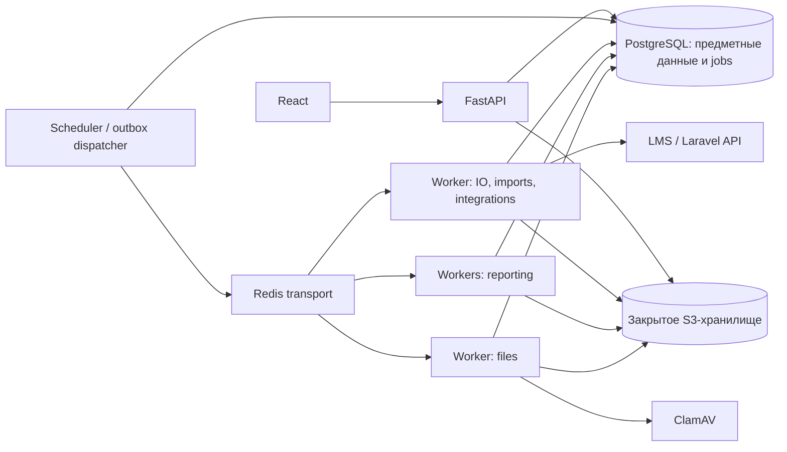

# Фоновые задачи, файлы, интеграции и отчётность

Версия проектного решения: 1.0, 19.09.2026. Статус: целевая архитектура для реализации; перечисленные компоненты ещё не добавлены в приложение. Документ дополняет `02-data-and-workflow.md`, исходное ТЗ, `docs/planning/01-technical-specification.md` и AC02–03, AC10–24, AC28–30. Приведённые лимиты, интервалы повторов и сроки хранения — проектные значения для стенда, которые нужно проверить на согласованном профиле.

## 1. Что уже есть и что требуется добавить

В текущем `compose.yaml` запускаются PostgreSQL, Keycloak, FastAPI и frontend/nginx. Redis, worker, планировщик, файловое хранилище и антивирус отсутствуют. В `backend/app/main.py` реализован синхронный `POST /api/v1/reports/snapshot` и JSON-экспорт. `services.snapshot()` ограничен 5 000 доступных взаимодействий, читает журнал событий и собирает строки в памяти. Он не реализует activity/created, файлы XLS/XLSX/PDF/PNG, импорт или реальные источники. Авторизация в `auth.py` проверяет JWT/локального пользователя, но фонового контекста доступа пока нет.

Существующий snapshot берёт последний полный `payload.snapshot` события. При появлении поздних внешних фактов это нельзя расширять механически: более поздний комментарий может содержать устаревшую копию статуса. Целевая отчётность читает типизированные исторические факты состояния, назначений и атрибутов из `02-data-and-workflow.md`; комментарии не заменяют предметную историю.

| Требование ТЗ | Компонент и результат |
|---|---|
| XLS/XLSX-каталоги, согласованный маппинг | Imports: изолированный разбор, проверка, предпросмотр, атомарное применение |
| Вложения в статусах PNG/JPEG/PDF/ZIP/GZIP/RAR/DOC/DOCX/XLS/XLSX | Documents: закрытое хранилище, карантин, scan, связь с конкретным посещением статуса |
| JSON из LMS и Laravel-сайта, новый/существующий workflow | Два SourceAdapter, inbox, идентичности, правила сопоставления и очередь сверки |
| Таблицы XLS/XLSX/PDF; диаграммы PNG/PDF; результирующий JSON | Один зафиксированный набор строк и независимые renderer-ы |
| Отклик ≤ 1 с, 50 пользователей, ≥ 10 одновременно строящихся отчётов | Разделение API/worker, ограничение ресурсов, измерение реальной конкурентности |
| Ошибки, самостоятельная Linux-поставка, Docker и эксплуатация | Jobs API, повтор/отмена, метрики, backups, runbook, проверяемые миграции |

Почта, SMS, мессенджеры и исходящая переписка с вузом не требуются текстом ТЗ. На первом выпуске достаточно статусов заданий, центра результатов и ошибок в CRM. Если появятся напоминания о сроках или письма, они станут отдельными согласованными функциями на том же outbox; сейчас SMTP и отправку сообщений не добавляем в обязательный контур.

## 2. Компоненты и границы ответственности

Базовое решение — модульный монолит с общей библиотекой бизнес-логики и несколькими процессами одного backend image. Микросервисы, Kubernetes и отдельная аналитическая БД не нужны для исходного масштаба и команды из двух человек.



PostgreSQL хранит факт принятия команды, задание, попытки, результаты и ошибки. Celery + Redis используются как транспорт исполнения; Celery result backend не является источником статуса для UI. Redis недоступен — команды с успешно сохранённым job могут возвращать `202 queued`, диспетчер отправит их после восстановления. Число ожидающих задач ограничено квотой; превышение даёт явный `429 JOB_QUEUE_LIMIT`, а не бесконечное накопление.

Файловый модуль использует `StoragePort` (`put_stream`, `stat`, `get_stream`, `delete_version`, проверка checksum/version), реализация — S3 SDK; `stat` может использовать S3 HEAD внутри adapter. В БД нет двоичных файлов; в ключах объектов нет ФИО/названий вузов. Минимальный переносимый контракт не требует специфичных для одного поставщика операций.

**Уточнение выбора MinIO.** При проверке 19.09.2026 официальный community-репозиторий MinIO оказался архивированным; README сообщает об отсутствии сопровождения и распространении community-варианта исходниками. Поэтому community MinIO не фиксируется как поддерживаемый production-компонент. Для изолированного синтетического стенда допустим воспроизводимо собранный закреплённый образ, а для внедрения нужен поддерживаемый S3-сервис заказчика либо отдельно проверенный поддерживаемый продукт. Бизнес-код от этого выбора не зависит. Источник: [официальный репозиторий MinIO](https://github.com/minio/minio).

Границы модулей для параллельной работы:

| Модуль | Владеет | Вызывает из ядра |
|---|---|---|
| `jobs` | задания, попытки, scheduler, доставка | только зарегистрированный handler по имени |
| `files` | загрузки, scan, файлы и выдача | `AccessPolicy`, проверка `state_visit`, регистрация attachment-факта |
| `imports` | маппинг, preview, протоколы | `CatalogCommands`, `InteractionCommands` в общей UnitOfWork |
| `integrations` | adapter, inbox, external identity, sync | те же команды + `LearningFactCommands` |
| `reports` | исторический запрос, frozen rows, renderer | `AccessPolicy`, `HistoricalQuery`, `AnalyticsQueries` |

Обход правил через непосредственное обновление таблиц interaction/assignment из worker запрещён контрактом модулей. Обработчик получает `ActorContext` с локальным actor/service principal, разрешениями и областью, загруженными заново; пользовательский access token в очередь и БД задания не сохраняется.

## 3. Надёжное исполнение задач

### 3.1. Схема данных

Общие правила: новые таблицы имеют UUID PK, существующие таблицы сохраняют `varchar(64)` PK; тип каждого FK совпадает с PK цели, как определено в 02. UTC `timestamptz`; `jsonb` только для версионированного payload/параметров, не вместо основных FK; ссылки на локального пользователя и предметные сущности — настоящие FK. Строковые статусы ограничены CHECK. Имена таблиц — логические канонические имена целевой схемы.

| Таблица | Поля и ограничения |
|---|---|
| `background_job` | `id`, `kind`, `payload_schema_version`, `payload jsonb`, `requested_by`, `service_principal_id?`, `resource_type`, `resource_id`, `status`, `phase`, `processed_count`, `total_count?`, `attempt_count`, `max_attempts`, `next_attempt_at`, `lease_until?`, `lease_token bigint`, `heartbeat_at?`, `cancel_requested_at?`, `created_at`, `started_at?`, `finished_at?`, `dead_lettered_at?`, `retry_of? FK`, `error_code?`, `safe_error_details?`, `correlation_id`, `revision`; автор/служебный actor обязательны согласно виду задания |
| `job_attempt` | `id`, `job_id FK`, `attempt_no`, `lease_token`, `worker_id`, `started_at`, `finished_at?`, `outcome`, `error_code?`, `safe_diagnostic_ref?`; UNIQUE `(job_id, attempt_no)` |
| `outbox_event` | `id`, `event_type`, `schema_version`, `aggregate_type`, `aggregate_id`, `aggregate_revision?`, `payload jsonb`, `created_at`, `available_at`, `delivery_attempts`, `published_at?`, `lease_until?`, `error_code?`; payload содержит ID, не документы/секреты |
| `scheduled_task` | `id`, `task_kind`, `resource_id`, `schedule_spec`, `timezone`, `next_run_at`, `enabled`, `revision`; UNIQUE `(task_kind, resource_id)`; расписание валидируется разрешённым парсером |
| `job_effect` | `job_id`, `effect_key`, `result_ref`, `created_at`; PK `(job_id, effect_key)` для шагов, которые нельзя повторно применить |

Индексы: `background_job(status,next_attempt_at) WHERE status IN ('queued','retry_wait')`; `background_job(lease_until) WHERE status='running'`; `background_job(requested_by,created_at DESC)`; `outbox_event(available_at) WHERE published_at IS NULL`; `job_attempt(job_id,attempt_no)`.

Состояния: `queued → running → succeeded | failed | cancelled`; временный сбой даёт `running → retry_wait → queued`. Исчерпанный retry budget — `failed` с `dead_lettered_at`/причиной; это долговечная прикладная DLQ в PostgreSQL, а не обещание нативной DLQ Redis. Фазы (`parsing`, `validating`, `materializing`, `rendering`, `uploading`) не заменяют состояния. Неизвестный total показывается как неопределённый progress, не выдуманный процент.

### 3.2. Транзакционная граница и повторная доставка

1. API проверяет запрос/права/квоту. В одной транзакции сохраняет предметный intent, `background_job`, `outbox_event(job.ready)` и результат ключа идемпотентности. После commit возвращает `202`, `job_id`, `Location` и URL статуса.
2. Диспетчер короткой транзакцией захватывает готовые outbox-строки через `FOR UPDATE SKIP LOCKED`, записывает lease, затем публикует сообщения вне транзакции. В сообщении только `{job_id, schema_version, correlation_id}`.
3. Публикация и отметка `published_at` не атомарны: при падении между ними сообщение повторится. Worker атомарно получает lease задания, увеличивает `lease_token`, создаёт попытку. Терминальное задание и повтор с действующим lease не исполняются заново.
4. Перед каждым предметным commit worker проверяет актуальный `lease_token`, состояние и права. Устаревшая попытка не может завершить job или опубликовать результат. Heartbeat продлевает lease; потеря lease останавливает обработку.
5. Результат в S3 пишется в новый ключ с `job_id/attempt_id`. В БД публикуется ссылка только успешной действующей попытки после HEAD/checksum; orphan удалит уборщик. Старый worker не перезаписывает уже опубликованный файл.
6. Scheduler возвращает jobs с истёкшим lease в retry после проверки budget. Также повторно ставит в outbox задания `queued`, которые долго не начинались: это восстанавливает задания даже после потери содержимого Redis. `published_at` не означает, что job выполнен.

Гарантия — доставка с возможными повторами и один зафиксированный бизнес-эффект по устойчивому ключу. Физически две попытки могут кратко работать одновременно после сетевого разделения; fencing/CAS запрещает результат устаревшей попытки. «Exactly once» для сети/брокера не обещается. `SKIP LOCKED` применяется к очереди, не к отчётной выборке: пропуск блокированных строк в отчёте потерял бы данные. Такое назначение механизма описано в [PostgreSQL SELECT](https://www.postgresql.org/docs/16/sql-select.html).

В Celery: JSON serialization/accept list, позднее подтверждение для идемпотентных handlers, `prefetch_multiplier=1` для тяжёлых задач, ограниченный hard/soft timeout. Долгие отсрочки хранятся как `next_attempt_at` в PostgreSQL; не создаём дни ожидающих ETA в Redis. `visibility_timeout` согласуется с максимальной длиной одного запуска; он не является нашей защитой от повторного эффекта. Особенности повторов и worker loss нужно подтвердить fault-injection тестами на закреплённой версии. Официальные основания: [Celery tasks](https://docs.celeryq.dev/en/stable/userguide/tasks.html), [Redis transport и visibility timeout](https://docs.celeryq.dev/en/stable/getting-started/backends-and-brokers/redis.html).

### 3.3. Retry, cancel, progress и API

Retry назначает один механизм — job scheduler. Пример стендовой политики: не более 5 попыток всего, задержки четырёх повторов 5/15/60/180 с jitter, верхняя граница и отдельный общий deadline. HTTP timeout/429/временный 5xx и сетевой сбой повторяются; `Retry-After` учитывается. Ошибка схемы, прав, маппинга, неподдерживаемого формата или конфликт payload не исправляются автоматическим повтором. Технический stack trace доступен по diagnostic ID только операторам.

`POST /api/v1/jobs/{id}/cancel` с `Idempotency-Key` ставит флаг. Обработчик проверяет его между безопасными шагами. Для импорта отмена до предметного commit означает rollback всего пакета; если commit уже произошёл, возвращается успешный результат и `cancel_effective=false`. Отмена никогда не объявляет откат уже применённых изменений. Убийство процесса через Celery revoke/terminate не является обычным бизнес-механизмом отмены.

| Endpoint | Контракт |
|---|---|
| `GET /jobs/{id}` | owner + текущая область; status/phase/counts/times/error/result links; никаких сырьевых payload |
| `GET /jobs?kind=&status=&cursor=` | свои jobs; операторы видят служебные только с отдельным permission |
| `POST /jobs/{id}/cancel` | `202` запрос принят, `200` уже терминален; операция идемпотентна |
| `POST /jobs/{id}/retry` | доступные failed; новый job с `retry_of`, сохранением предметных idempotency keys и аудитом; конфликт preview требует нового preview |

Префикс всех endpoint в документе — `/api/v1`. Frontend опрашивает status с backoff 1–5 с, при скрытой вкладке реже; это стартовое решение проще WebSocket. Позже SSE может уведомлять об изменении ID, но статусы всё равно читаются из БД. Тело `202` означает приём задания, а не готовность файла. Просмотр состояния не показывает чужие счётчики/названия.

## 4. Файлы и документы

### 4.1. Метаданные и связь с workflow

| Таблица | Поля и ограничения |
|---|---|
| `attachment` | `id`, `purpose` (`status_file`,`import_source`,`report_artifact`,`contract_file`,`license_file`,`delivery_file`), `uploader_id`, `original_name`, `declared_content_type`, `detected_content_type`, `size_bytes`, `sha256`, `storage_bucket`, `object_key`, `object_version?`, `status`, `scan_engine_version?`, `scan_definitions_version?`, `scanned_at?`, `scan_result?`, `created_at`, `expires_at?`, `deleted_at?`, `retention_policy_id?`, `legal_hold`, `revision`; UNIQUE NULLS NOT DISTINCT `(storage_bucket,object_key,object_version)` для PostgreSQL 16, чтобы NULL версии не допускал дубль ссылки |
| `attachment_link` | `id`, `attachment_id FK`, `interaction_id FK`, `state_visit_id?`, `event_id?`, `linked_by`, `linked_at`, `unlinked_at?`; composite FK `(state_visit_id,interaction_id)` и `(event_id,interaction_id)` запрещают связь со статусом чужой карточки |
| `contract_attachment` / `license_attachment` | отдельные typed FK к договору/лицензии + attachment; общая проверка области организации |
| `delivery_item.attachment_id` | typed FK переданного материала/документа из catalogs; доступ через delivery.organization_id, ссылка учитывается janitor наравне с другими вложениями |
| `file_scan_attempt` | `id`, `attachment_id`, `job_attempt_id`, `result`, `engine_version`, `definitions_version`, `started_at`, `finished_at`, `safe_error_code?` |

Связь с `state_visit_id` сохраняет контекст повторного входа в тот же статус. ID определения статуса недостаточно. Проверенный файл можно прикрепить при команде перехода; команда атомарно создаёт факт перехода, нужные связи и аудит. Guard обязательного файла принимает только `clean` и корректный тип документа. Файл на проверке не считается выполнением guard.

### 4.2. Протокол загрузки

Базовый вариант для 50 пользователей и файлов до 25 MiB: потоковая загрузка через API в S3, без чтения всего тела в память. Это даёт контроль размера и не требует общего доступа браузера к bucket. Размер файла не входит в обещание интерактивного отклика перехода ≤ 1 с: UI показывает отдельный upload progress.

1. `POST /attachments` multipart (`file`, `purpose`, `interaction_id?`, `state_visit_id?`) с `Idempotency-Key`: ACL, квота и allowlist; создаётся `uploading`, поток идёт в quarantine prefix по случайному ключу.
2. API вычисляет size/hash, проверяет расширение против сигнатуры/фактического типа, сохраняет `pending_scan` и scan job. Возвращает `202 attachment_id, job_id`. При обрыве — `upload_failed`, временный объект удаляется уборщиком.
3. Изолированный scan worker проверяет файл и контейнерные форматы. `clean`, `infected` либо `scan_error`; ошибка/таймаут/невозможность полностью проверить не превращаются в clean. Сканер и парсер имеют CPU/RAM/time/disk limits, файловая система временная, outbound network закрыт.
4. `GET /attachments/{id}` возвращает статус. `POST /interactions/{id}/attachments` связывает clean-файл (`attachment_id`, `state_visit_id`, `expected_revision`); все ссылки проверяются повторно. Непривязанный файл доступен только загрузившему/уполномоченному оператору.
5. `GET /attachments/{id}/download` заново проверяет активность пользователя, текущие права связанного объекта, статус scan и retention, затем стримит bytes. `Content-Disposition: attachment`, безопасное имя, правильный MIME, `X-Content-Type-Options: nosniff`; приватный ответ не попадает в общий CDN/cache.

Поддерживаемые расширения ТЗ: `.png`, `.jpeg` (также `.jpg` как алиас), `.pdf`, `.zip`, `.gzip` (также `.gz`), `.rar`, `.doc`, `.docx`, `.xls`, `.xlsx`. DOC/DOCX не преобразуются на сервере в исполняемый контент. Архивы хранятся как исходные bytes, распаковка нужна только изолированному scan. Для архивов: ограничения суммы распакованных байт, числа элементов, глубины, compression ratio; запрет traversal/symlinks; шифрованные или неподдерживаемые архивы получают явную ошибку `FILE_SCAN_UNSUPPORTED`, а не считаются безопасными. Поддержку реальных RAR/GZIP и ограничений конкретного scanner image подтверждает тестовый корпус. Антивирус снижает риск, но не доказывает абсолютную безопасность; [ClamAV scanning](https://docs.clamav.net/manual/Usage/Scanning.html) описывает его режимы и ограничения.

Не выдаём постоянные S3 URL. Если позже вводится presigned download, повторная проверка CRM возможна только при выдаче URL; уже выданная ссылка остаётся самостоятельным доступом до истечения. Поэтому baseline — proxy download, чтобы отзыв прав прекращал новые скачивания немедленно. Уже переданные пользователю bytes отозвать невозможно. Ограничение подписанных URL следует из [официальной документации S3](https://docs.aws.amazon.com/AmazonS3/latest/userguide/using-presigned-url.html).

### 4.3. Удаление и retention

`DELETE /attachments/{id}/links/{link_id}` удаляет связь логически с аудитом, не переписывая историческое событие. Архивирование карточки не удаляет вложения автоматически. Физическое удаление выполняет отдельный janitor после retention, при отсутствии активных связей/удержания; удаление объекта и отметка БД повторяемы. Технические черновики загрузок можно очищать через 24 ч, отчётные артефакты через 7 дней, исходники импорта через 30 дней — **предлагаемые настройки стенда**, не срок хранения договоров или персональных данных. Политики для рабочих документов/аудита и резервных копий согласуются отдельно.

Незавершённый upload, orphan после worker crash, метаданные без объекта и объект без метаданных обнаруживает сверка. Ошибка `STORAGE_UNAVAILABLE` не приводит к состоянию ready. Backup включает version/checksum manifest, чтобы после восстановления не показать файл, который исчез из S3.

## 5. Импорт XLS/XLSX

### 5.1. Таблицы и контракты

| Таблица | Поля |
|---|---|
| `import_mapping` | `id`, `name`, `target_kind`, `version`, `columns jsonb`, `date_locale`, `empty_policy`, `owner_id`, `active`; published version неизменяема |
| `import_batch` | `id`, `file_id FK attachment`, `parent_batch_id? FK import_batch`, `requested_by`, `target_kind`, `mapping_id`, `mapping_version`, `mapping_hash`, `file_sha256`, `mode`, `status`, `selected_row_count`, `selected_rows_hash`, `preview_revision`, `preview_hash`, `preview_expires_at`, `created_count`, `updated_count`, `unchanged_count`, `error_count`, `job_id`, `confirmed_at?`, `committed_at?`, `created_at`; parent_batch_id связывает явно созданные пользователем поднаборы одного источника |
| `import_row` | `id`, `batch_id FK`, `sheet_name`, `row_number`, `raw_cells jsonb`, `normalized jsonb`, `row_hash`, `proposed_action`, `target_type`, `target_id?`, `expected_target_revision?`, `match_evidence`, `issues jsonb`, `status`, `result_ids jsonb`; UNIQUE `(batch_id,sheet_name,row_number)` |
| `import_application` | `batch_id`, `row_id`, `effect_key`, `result_ref`; UNIQUE `(batch_id,row_id,effect_key)`, создаётся в транзакции применения |

Для строки, затрагивающей несколько объектов (вуз + контакт + договор + лицензия), `import_row` дополняет `import_row_target(row_id, entity_type, entity_id, expected_revision, action)`; один scalar target не заменяет набор зависимых revision. Маппинг разрешает только объявленные трансформации: trim, enum lookup, date parse, boolean, number, explicit reference. Пользовательский Python/SQL/eval не выполняется.

| Endpoint | Ввод → результат |
|---|---|
| `POST /imports` | `file_id`, `target_kind`, `mapping_version`, `mode` → `202 batch_id,job_id` |
| `GET /imports/{id}` | сводка, срок preview, счётчики и этап |
| `GET /imports/{id}/rows?status=&cursor=` | постраничные create/update/unchanged/error/duplicate, старое/новое значение, причины |
| `PUT /imports/{id}/mapping` | новая версия маппинга + `expected_preview_revision` → новая валидация, старый preview invalidated |
| `POST /imports/{id}/selections` | явные source row IDs/диапазоны → новый batch с parent_batch_id, полным перечнем включённых/исключённых строк и отдельным preview/hash; нет предметных изменений |
| `POST /imports/{id}/confirm` | `preview_hash`, `preview_revision`, `Idempotency-Key` → `202 job_id`; слишком большой выбранный пакет → `422 IMPORT_ATOMIC_LIMIT_EXCEEDED` |
| `GET /imports/{id}/result` | итоговые ID/счётчики, ошибки; скачиваемый XLSX/JSON-протокол под тем же ACL |

### 5.2. Правила применения

Источник проходит file scan до разбора. XLS читает `xlrd`, XLSX — `openpyxl` в режиме чтения с ограничением ресурсов и XML-защитой. Это разные форматы; переименование расширения их не преобразует. Внешние связи/макросы не запускаются. Формулы не вычисляются; импорт определяется видимыми сохранёнными значениями с предупреждением о возможном устаревшем cached result. Для XLSX formula-ячейка в обязательном поле без разрешённого подтверждения отмечается ошибкой; библиотека чтения XLS может отдавать только сохранённый результат, это ограничение фиксируется в preview. Основания: [xlrd](https://xlrd.readthedocs.io/en/latest/), [openpyxl и XML-защита](https://openpyxl.readthedocs.io/en/stable/).

Начальные проектные лимиты разбора файла: 10 MiB/50 000 строк. Это не обещание безопасного атомарного commit всех 50 000 строк. Первоначальный предел одного явно выбранного атомарного пакета — **1 000 строк**, уточняемый только по нагрузочному spike с худшим допустимым числом зависимых объектов на строку. Пакет большего размера разбирается и показывается полностью, но confirm отклоняется; пользователь явно формирует меньшие пакеты через selections, видит их границы и подтверждает каждый. Столбцы «Номер договора», лицензия, ФИО, контакты не приводятся безусловно к числу; сохраняются ведущие нули и исходные неоднозначности. Для даты учитывается workbook date system, timezone и явный формат; `01/02/26` без подтверждённого locale не угадывается.

Сопоставление: внешний устойчивый ID/явный локальный ID → согласованный уникальный ключ → подтверждённый пользователем match. Одного похожего имени вуза или ФИО недостаточно для автоматического объединения. Контакт вуза не создаёт учётную запись Keycloak. Пустая ячейка по умолчанию оставляет значение, очистка — отдельный оператор mapping. «Подписание лицензии»/год срока и «Статус передачи» маппятся в отдельные предметные поля, а не в произвольный комментарий.

Состояния: `uploaded → validating → preview_ready | invalid → committing → completed | failed`; истёкший/устаревший preview получает `stale`. Все ошибки и дубли показываются до подтверждения. Полный **явно выбранный batch** в baseline применяется атомарно: одна строка невалидна — предметные изменения не начинаются. Выбор всех строк исходного файла разрешён только в пределах лимита атомарного пакета. В commit worker повторно проверяет текущие права, уникальности и revisions всех target-объектов, блокируя их в стабильном порядке; изменение после preview даёт `IMPORT_PREVIEW_STALE`. Запись каталога, исторических событий, связей, `import_application`, итог batch и outbox происходит в одной транзакции. Внутри неё запрещены сетевые вызовы, S3/антивирус и разбор Excel. `lock_timeout` и `statement_timeout` устанавливаются через SET LOCAL; первоначальные стендовые значения 1 с и 15 с проверяются spike. Statement timeout ограничивает отдельный SQL statement, поэтому дополнительный deadline всего commit-прохода (проектно 15 с) проверяется между шагами и перед commit; при его истечении отменяется текущий запрос и откатывается транзакция. Превышение лимита или deadline откатывает весь batch, а не оставляет частичный успех. Эти защитные максимумы не доказывают интерактивный отклик: если блокировки импорта мешают успешным переходам ≤1 с, до приёмки снижаются размер пакета/время удержания блокировок либо вводится явное окно тяжёлого импорта; ошибки timeout вместо успешных действий не считаются выполнением SLO.

Падение на строке N не оставляет N−1 применённых строк: транзакция откатывается, диагностика сохраняется отдельной транзакцией. Commit потерял HTTP-ответ — повтор confirm с тем же ключом читает прежний job/результат. Одинаковый ключ с другим preview — `IDEMPOTENCY_CONFLICT`. Повтор того же файла новым batch не создаёт дубли благодаря предметным ключам; hash файла — сигнал повторной загрузки, а не универсальный ключ бизнес-идентичности.

Тихого режима «пропустить ошибочные строки» нет. Для исходного файла больше атомарного лимита или сознательного исключения ошибок пользователь явно формирует выбранный набор строк, получает новый preview/hash с перечислением исключений, и этот набор применяется атомарно. Явный выбор — обязательная часть UI для больших файлов, транзакционно частично успешный batch не является baseline. Несколько подтверждённых пользователем batch независимы: ошибка следующего не откатывает уже подтверждённый предыдущий; общий протокол показывает это прямо. Staging/bulk insert уменьшает издержки, но не разрешает скрытое разбиение одного confirm на независимые транзакции.

## 6. LMS и сайт на Laravel

### 6.1. Что известно и чего нельзя предполагать

Из ТЗ известно: два источника, получение JSON через API, согласованные поля, добавление в новый или существующий workflow. Не известны URL, auth flow, pagination, события, delete, rate limits, внешние ID, timestamps и реальные поля учебной статистики. Laravel не является контрактом API. До получения договора реализуются interface + fixtures и contract tests; интеграция с mock не закрывает AC18 реального источника.

`SourceAdapter` имеет методы `check_connection()`, `fetch_page(cursor, watermark, limit) -> SourcePage`, `normalize(raw_record) -> CanonicalEnvelope`, `compare_revision(old,new) -> older/equal/newer/unknown`. Для push/webhook маршрут появляется только если его поддерживает согласованный контракт; обязательная реализация — pull manual + scheduled.

| Таблица | Поля и ограничения |
|---|---|
| `integration_source` | `id`, `code` (`lms`,`website`), `adapter_kind`, `enabled`, `base_url_ref/config`, `secret_ref`, `contract_version`, `mapping_version`, `schedule_id`, `cursor jsonb`, `watermark?`, `last_success_at?`, `last_attempt_at?`, `revision`; секрет не хранится в JSON конфигурации |
| `sync_run` | `id`, `source_id`, `job_id`, `cursor_before`, `cursor_after?`, `status`, `fetched/applied/duplicate/quarantined/failed counts`, `started_at`, `finished_at`, `source_contract_version`; один активный run на источник/stream |
| `inbox_message` | `id`, `source_id`, `entity_type`, `external_id`, `delivery_key`, `source_revision?`, `effective_at?`, `first_received_at`, `last_received_at`, `payload_hash`, `payload_schema_version`, `payload jsonb/private_object_ref`, `status`, `attempt_count`, `error_code?`, `local_result_ref?`, `sync_run_id`; UNIQUE `(source_id,delivery_key)` |
| `inbox_delivery` | `id`, `inbox_id`, `received_at`, `payload_hash`, `sync_run_id`, `transport_request_id?`, `outcome`; сохраняет повтор/конфликт без создания второго канонического сообщения |
| `external_identity` | `id`, `source_id`, `entity_type`, `external_id`, `local_entity_type`, `local_entity_id`, `last_applied_revision?`, `last_payload_hash?`, `created_at`; UNIQUE `(source_id,entity_type,external_id)` |
| `reconciliation_case` | `id`, `inbox_id`, `reason_code`, `candidate_refs`, `status`, `resolution`, `resolved_by?`, `resolved_at?`, `revision`; disputed payload виден только уполномоченным |

`external_identity.local_entity_id` — осознанное полиморфное исключение: допустимый target type перечислен в коде и проверяется application service в общей транзакции, удаление целей контролируется. Если набор типов окончательно фиксирован, предпочтительнее nullable typed FK с CHECK «ровно один target»; смена варианта не меняет API адаптера.

Внутренний конверт, **не JSON заказчика**:

```json
{
  "schema_version": "1.0",
  "source_id": "<uuid>",
  "entity_type": "application",
  "external_id": "source-application-42",
  "delivery_key": "application:source-application-42:revision-3",
  "source_revision": "3",
  "operation": "upsert",
  "effective_at": "2026-09-10T09:00:00Z",
  "payload": {"organization_external_id": "org-10", "program_external_id": "program-2"}
}
```

`received_at` назначает CRM, первое получение неизменно. `source_revision` строковая: порядок определяет adapter, сравнение строк/числовое приведение по догадке запрещены. Если источник даёт event ID, используем его; если только revision — согласованный составной ключ; если ни того ни другого — стабильный business ID + canonical payload hash для дедупликации состояния, с явным ограничением: такой источник не доказывает полноту истории переходов.

### 6.2. Порядок синхронизации

1. Scheduler/manual команда создаёт `sync_run` с lease для конкретного stream. Второй запуск возвращает ID активного, не создаёт конкурирующий cursor writer.
2. Adapter получает страницу с connect/read/deadline, ограничением размера/числа записей. Адреса источников задаёт администратор по allowlist; произвольные пользовательские URL не проксируются. Секреты берутся из secret mount/менеджера; TLS проверяется.
3. Сырые нормализуемые записи, malformed records и cursor страницы долговечно фиксируются в inbox/staging. Для плохой записи есть диагностируемый карантин. До этого checkpoint не продвигается.
4. Применение каждой записи — отдельная транзакция: row lock inbox, проверка dedup/hash/revision, сопоставление identity, вызов предметной команды, событие/метрика, external identity, итог inbox, outbox. Параллельные сообщения одного external entity сериализуются.
5. Cursor страницы продвигается после надёжной фиксации всего пакета и его состояний: applied/duplicate либо долговечная карантинная запись, доступная для replay. Временные ошибки не исчезают вместе с cursor. Run с проблемами показывает `completed_with_errors`, а последний полностью успешный run отдельно.
6. После восстановления источника повторяется последняя незавершённая страница. Если cursor просрочен, согласованный overlap/backfill с dedup; не сбрасываем cursor молча. Full resync не удаляет отсутствующие объекты, пока контракт не определяет полноту snapshot и delete semantics.

Повтор delivery с тем же hash — duplicate без нового предметного эффекта. Тот же key с другим hash — `SOURCE_PAYLOAD_CONFLICT`, manual reconciliation. Новая revision обновляет существующий объект через identity; не создаёт второй цикл. Late event сохраняется с двумя временами, но не перескакивает текущий workflow назад; допустимость его влияния определяет доменный chronology/reconciliation service.

Владение: CRM — назначения, права, пользовательские статусы и комментарии; LMS — согласованная учебная статистика; сайт — первичная заявка. Обновление контакта требует правила приоритета, конфликт идёт в сверку. `delete` источника означает архивирование/исправление в рамках договора, не cascade delete истории. Пользовательские ограничения источника не дают service principal неограниченный доступ к CRM.

Создание workflow по входящей заявке требует `external_application_id`, однозначной организации, программы/продукта по guard выбранного шаблона, опубликованной версии workflow и явного правила owning team/owner. Переиспользование существующего взаимодействия — только по явному identity/правилу цикла; совпадение вуза недостаточно. При известной owning team правило источника может явно разрешать owner=NULL и очередь назначения; без такого правила отсутствие назначения создаёт case `MAPPING_REQUIRED`. Неизвестная организация/команда всегда требует сверки, случайного назначения нет. LMS-число обучающихся само по себе не завершает бизнес-этап без разрешённого правила автоматизации.

| Endpoint | Назначение |
|---|---|
| `GET /integrations` | источник, freshness, последний успешный/неудачный run, counts |
| `POST /integrations/{id}/sync` | `mode: incremental`, `Idempotency-Key` → `202 sync_run_id,job_id` |
| `GET /integrations/{id}/runs/{run_id}` | прогресс, cursor diagnostic без секрета, итоги |
| `GET /integrations/{id}/cases` | доступная очередь сверки |
| `POST /integrations/{id}/cases/{case_id}/resolve` | `expected_revision`, подтверждённые ссылки/действие → audit + replay job |
| `POST /integrations/{id}/replay` | явный список inbox IDs; прежние keys сохраняются, уже applied не применяется дважды |

Исходящая запись обратно в LMS/сайт в ТЗ не заявлена. Если позже понадобится, внешний API должен поддерживать idempotency или сверку результата неизвестного исхода; outbox сам по себе не предотвращает повторный внешний эффект.

## 7. Отчёты и визуализации

### 7.1. Единая семантика и frozen dataset

| Режим | Строка и время |
|---|---|
| `snapshot` | одно взаимодействие, существовавшее на `as_of`; исторические поля на дату; `effective_at <= as_of`, либо `<` при `as_of_inclusive=false` |
| `activity` | один действующий логический state fact с `change_kind=transition`, row key = fact_key; `from <= effective_at < to`; владелец на момент перехода, целевой статус; correction не создаёт вторую строку перехода |
| `created` | одно взаимодействие, созданное в `[from,to)`; значения на момент создания |
| `learning_metrics` | отдельный dataset по утверждённой версии определения метрики; отсутствие данных не равно 0 |

Везде применяется `received_at <= knowledge_cutoff`. Сначала выбирается последняя известная revision каждого логического факта, затем отбрасываются retracted и применяется effective time. При равном времени порядок фактов — `(effective_at, order_sequence)` внутри interaction; correction сохраняет исходный order_sequence, а не получает позицию позднего event.sequence. Назначение с более поздним order_sequence не меняет владельца более раннего перехода. Migration/comment/assignment не входят в число бизнес-переходов. Полный resolver определён в 02 §7 и является единственным источником семантики. Исторические подписи берутся из фактов/версий, не из сегодняшнего переименованного справочника. Даты UI конвертируются сервером в UTC с сохранением timezone и исключающей правой границей.

Фильтры: OR внутри значений, AND между полями; organization/direction/program/product/owner/state/workflow version. Для CRM-отчёта сначала определяется текущий разрешённый набор interaction, затем применяются исторические фильтры; для learning_metrics сначала проверяется scope организаций и учебных фактов. У interaction по одной программе и продукту; canonical columns — `direction_name`, `program_name`, `product_name`. Связь допустимых продуктов программы many-to-many проверяется через EXISTS и не размножает строку interaction. Счётчики distinct interactions, distinct organizations и transition events именуются раздельно.

| Таблица | Поля и ограничения |
|---|---|
| `report_run` | `id`, `requested_by`, `job_id`, `report_type`, `parameters jsonb`, `parameters_hash`, `semantics_version`, `knowledge_cutoff`, `timezone`, `permission_fingerprint`, `request_scope_descriptor jsonb`, `request_authz_epoch bigint`, `captured_acl_revision`, `dataset_status`, `captured_at?`, `row_count`, `dataset_checksum?`, `totals jsonb`, `warnings jsonb`, `created_at`, `expires_at`, `denied_at?` |
| `report_scope_item` | `id uuid PK`, `report_run_id FK`, `resource_kind interaction/organization`, `interaction_id FK?`, `organization_id FK?`, `captured_acl_revision`; CHECK ровно одна ссылка согласно resource_kind; partial UNIQUE `(report_run_id,interaction_id)` и `(report_run_id,organization_id)` WHERE соответствующий FK IS NOT NULL. Все объекты строк/итогов, а не только текущая страница; organization refs покрывают учебные метрики без interaction. Manifest/source_fact_refs сохраняют programme/product ограничения |
| `report_row` | `report_run_id FK`, `ordinal`, `row_key`, `interaction_id?`, `event_id?`, `metric_id?`, `values jsonb`, `source_fact_refs jsonb`; PK `(report_run_id,ordinal)`, UNIQUE `(report_run_id,row_key)` |
| `report_artifact` | `id`, `report_run_id`, `job_id`, `format`, `layout_hash`, `status`, `attachment_id?`, `size_bytes?`, `sha256?`, `row_count`, `renderer_version`, `created_at`, `expires_at`, `error_code?`; UNIQUE `(report_run_id,format,layout_hash)` для канонического готового результата |

`report_run` — идентификатор одного неизменяемого расчёта, используемый и preview, и export; дополнительный `report_dataset` не вводится. Повторный расчёт с новыми сведениями создаёт новый run. Freeze выполняется в согласованном MVCC-снимке: `REPEATABLE READ`, материализация rows/scope/totals/manifest одной транзакцией; только после её commit dataset становится ready. Сетевые запросы и рендеринг не удерживают эту транзакцию. Пакетная запись staging внутри той же транзакции допустима, смешивание разных снимков — нет. Поведение снимка соответствует [PostgreSQL transaction isolation](https://www.postgresql.org/docs/16/transaction-iso.html).

`knowledge_cutoff` фиксируется при принятии запроса, не сдвигается при ожидании в очереди. Cutoff — фильтр по времени получения, а не магическое сохранение PostgreSQL snapshot: транзакция источника может получить timestamp до cutoff и commit позже. Поэтому воспроизводимость конкретного готового результата обеспечивает сохранённый `report_row` и checksum/manifest, а не новый запуск SQL с одной датой. В run также хранится фактический `captured_at`; ещё не закоммиченные на момент freeze факты в этот run не входят. Если нужен юридически/операционно точный глобальный watermark «все сообщения получены и применены», это отдельный барьер ingestion, не подразумеваемая функция timestamp.

При запросе сохраняются `request_authz_epoch` из `access_policy_state.epoch` и нормализованный `request_scope_descriptor` (principal, разрешённые действия, team/grant-границы и ограничения), полученные в согласованной read-транзакции. Это ограниченное описание политики, не синхронная материализация всех доступных ID. Перед freeze worker читает epoch в своём снимке: отличие даёт `REPORT_SCOPE_CHANGED` и требует новый запрос; нельзя молча расширить или урезать область ожидающего run. Все scope-affecting команды обязаны атомарно увеличивать epoch, как перечислено в 02 §4. Глобальный epoch консервативен: чужая смена области может тоже потребовать повторного запроса; это осознанная цена простой первой реализации, подлежащая измерению.

ACL также проверяется перед публикацией и каждым получением rows/chart/download. Для уже frozen run проверяется весь typed manifest зависимостей: если сохранённая область не является подмножеством актуальной, весь результат становится недоступен (`REPORT_SCOPE_CHANGED`), пользователь создаёт новый. Расширение прав не добавляет строки в старый run. Для метрик scope содержит соответствующие организации/предметные ссылки; одна строка interaction не заменяет ACL агрегированной статистики. Пустой результат тоже проверяет активность/permission. Само совпадение fingerprint/epoch не заменяет проверку актуального principal и permission при выдаче.

### 7.2. API и жизненный цикл

```json
{
  "report_type": "snapshot",
  "as_of": "2026-09-18T21:00:00Z",
  "as_of_inclusive": false,
  "timezone": "Europe/Moscow",
  "filters": {"organization_ids": [], "program_ids": [], "product_ids": [], "owner_ids": []},
  "columns": ["organization_name", "direction_name", "program_name", "product_name", "state_name", "owner_name"],
  "group_by": ["state"],
  "sort": [{"field": "organization_name", "direction": "asc"}]
}
```

Разрешённые колонки/group_by/sort перечисляет `GET /report-definitions`; клиент не передаёт SQL/выражения. Неизвестное поле даёт `422 REPORT_PARAMETER_INVALID`. Для activity/created вместо as_of обязательны from/to.

| Endpoint | Контракт |
|---|---|
| `POST /report-query` | read-only параметры HistoricalQuery/AnalyticsQueries + bounded page → `200 rows,total,chart_summary?,query_fingerprint,observed_at,semantics_version,volatile:true`; отдельный быстрый интерактивный запрос, Idempotency-Key не требуется |
| `POST /report-previews` | параметры + `Idempotency-Key` → `202 report_run_id,job_id`; быстрый готовый cache разрешён только при точном совпадении actor/scope/semantic version |
| `GET /reports/{run_id}` | normalized params, cutoff, dataset_status, totals, warnings, available formats |
| `GET /reports/{run_id}/rows?cursor=&limit=` | сохранённые rows, стабильный cursor по ordinal |
| `GET /reports/{run_id}/charts` | серверные series + units/denominator/labels из того же dataset |
| `POST /reports/{run_id}/exports` | `{format, layout}` → `202 artifact_id,job_id`, либо готовый прежний результат |
| `GET /reports/{run_id}/exports/{artifact_id}/download` | актуальные права + готовность → stream файла |

Текущее `/reports/snapshot` остаётся временным совместимым адаптером на один query engine; frontend переводится на новый flow. Изменение фильтра вызывает `/report-query`: единый короткий read snapshot возвращает страницу и точный count, а графический summary только когда он входит в измеренный интерактивный бюджет. В ответе нет экспортируемого run_id; данные могут измениться до следующего запроса, UI показывает время наблюдения. Создание официального воспроизводимого набора запускает `/report-previews`; готовый frozen run становится единственным источником его rows, диаграмм и экспортов. Быстрая интерактивная страница не выдаётся за сохранённый результат: после freeze UI заменяет её данными run и показывает captured_at. Совпадение параметров не гарантирует равенства строк, если между запросами пришли изменения.

Оба пути используют один HistoricalQuery/AnalyticsQueries и одну семантику фильтров; самостоятельной упрощённой формулы для быстрого preview нет. Если точный count/страница не укладываются в 1 с на согласованном приёмочном объёме, требование не выполнено: нужны индексы/проекции/ресурсы и повторное измерение, а не скрытая замена ответа на 202 или приблизительное число. Принятие job за 1 с само по себе не подтверждает обновление выборки. Тяжёлый freeze полного набора и генерация файлов остаются фоновыми, интерактивный запрос и показ страницы проверяются отдельным UX-таймингом.

### 7.3. Форматы без подмены расширения

| Формат | Реализация-кандидат и проверка |
|---|---|
| XLSX | `XlsxWriter` с последовательной записью и constant-memory, explicit string cells; открыть независимым reader и сравнить типы/значения/число строк |
| XLS | BIFF8 writer `xlwt` в изолированном renderer; обязательный ранний spike совместимости с выбранным Python; если несовместим — закреплённый безопасный converter. HTML/CSV с расширением XLS не допускается |
| PDF таблица + диаграммы | WeasyPrint из внутреннего HTML/CSS-шаблона с экранированием, локальными шрифтами кириллицы и разрешёнными локальными assets; внешние URLs/file fetch запрещены |
| PNG / PDF диаграммы | Matplotlib server renderer из сохранённых series, фиксированный DPI/шрифты/оси; PNG не является фотографией таблицы вместо отчёта |
| JSON | UTF-8: `schema_version`, `report_type`, normalized filters/time params, cutoff, semantics_version, columns, rows, totals, warnings, generated_at; контракт валидируется JSON Schema |

Это проектный выбор библиотек, не утверждение, что зависимости уже добавлены или совместимость проверена. Возможности подтверждаются документацией: [XlsxWriter memory](https://xlsxwriter.readthedocs.io/working_with_memory.html), [xlwt XLS](https://xlwt.readthedocs.io/en/latest/), [WeasyPrint security](https://doc.courtbouillon.org/weasyprint/stable/common_use_cases.html#security), [Matplotlib savefig](https://matplotlib.org/stable/api/_as_gen/matplotlib.pyplot.savefig.html). Версии фиксируются lockfile/image digest после smoke/security/license проверки, без `latest` в поставке.

Для XLS максимум листа — 65 536 строк и 256 колонок; при одном заголовке остаётся 65 535 строк данных. Baseline разбивает большой результат на нумерованные листы с общей страницей параметров, не теряя строк. Пределы подтверждены [Microsoft: совместимость листов](https://support.microsoft.com/en-us/excel/worksheet-compatibility-issues). Renderer проверяет ограничения колонок/длины значений до начала записи; невозможный layout даёт `REPORT_FORMAT_LIMIT` с предложением XLSX, а не усечение. Общий технический лимит файла/страниц согласуется и показывается до запуска. XLSX тоже проверяется на пределы формата. Текст `=...`, `+...`, `-...`, `@...` пишется текстовым типом, не формулой или активной ссылкой. Настоящие числовые поля остаются числами.

Запрос визуализации можно сохранить как самостоятельный PNG/PDF и как полный XLS/XLSX/PDF-отчёт. В полном отчёте помещаются таблица исходных агрегатов и диаграмма из тех же series: XLSX поддерживает выбранный image renderer, для XLS нужен проверенный путь встраивания поддерживаемого bitmap либо converter в отдельном процессе. Этот путь включён в ранний XLS spike; файл без запрошенной визуализации не объявляется выполнением запроса. Проверяется открытие итогового BIFF-файла независимым офисным просмотрщиком, а не только наличие расширения.

PDF повторяет заголовки, переносит длинные наименования, сохраняет читаемый масштаб; большие таблицы продолжаются на страницах. Графики имеют названия единиц/периода/знаменателя; «Нет данных» отдельно от 0, обрезание осей не искажает оценку. Файл содержит параметры, cutoff/captured_at, число строк, полноту источников и версию семантики. Визуальная проверка кириллицы/переносов дополняет машинную сверку чисел.

### 7.4. Десять реальных параллельных отчётов

Для приёмочного профиля резервируем не менее 10 report execution slots, например два report worker с concurrency=5. Это начальная топология, не доказательство достаточности CPU/RAM. Worker для imports/integrations/files изолирован от этих очередей. DB connection pool не растёт без контроля: отчёт отпускает соединение после materialization и получает новое для публикации; рендеринг CPU/IO не держит SQL transaction.

Ограничения памяти/времени и backpressure считаются для 10 конкретных смешанных заданий согласованной сложности. Нагрузочный протокол содержит overlapping интервалы реального `materializing/rendering`, максимум отклика пользовательских действий, число ошибок, RSS/CPU/DB waits, равенство выгрузок dataset. Десять queued или только десять HTTP 202 не закрывают AC24. Если ресурсов стенда мало, увеличиваем их/оптимизируем, а не уменьшаем обязательную конкурентность без согласования.

## 8. Эксплуатация и проверка отказов

Начальный runtime: `api`, `dispatcher-scheduler` (один активный scheduler с DB lock), `worker-io`, `worker-files`, масштабируемые `worker-report`, PostgreSQL, Redis, S3-compatible storage, ClamAV, Keycloak, nginx. Общий backend image, разные entrypoint/queues; миграции выполняет отдельная команда release до запуска новых workers. UI не имеет доступа к Redis/S3 console/БД. Redis не публикуется наружу, broker отдельный от вытесняемого UI-cache, persistence и `noeviction` настроены; его восстановление не заменяет job reconciliation.

Readiness API отражает способность выполнять интерактивные команды, а состояние зависимых подсистем отдаётся отдельно: отказ источника не делает весь интерфейс мёртвым. Метрики: возраст старейшего outbox, очередь/время ожидания по kind, running/lease expirations, retries/DLQ, import conflict rate, scan age/definition freshness, object missing, report latency/memory, source freshness и карантин. Логи структурированы с request/job/run/attempt/correlation IDs; содержимое файлов, access tokens, passwords и персональные payload исключены.

| Сбой для обязательного теста | Ожидаемый результат |
|---|---|
| API упал после DB commit до HTTP ответа | повтор Idempotency-Key возвращает тот же job/ресурс |
| Redis недоступен/потерял очередь | durable jobs остаются, outbox/reconciler восстанавливает доставку |
| Worker погиб до/после предметного commit | одна подтверждённая операция, повтор читает effect/result |
| Старый worker ожил после lease expiry | CAS по fencing token запрещает публикацию устаревшего результата |
| S3 write завершён, DB commit упал | файл orphan, не виден как ready, последующая уборка |
| Scanner недоступен/таймаут/архив не проверен полностью | файл в pending/error quarantine, guard/download запрещены |
| Права пользователя отозваны во время отчёта/импорта | публикация/download или commit запрещены; причина сохранена |
| Источник вернул повтор/conflicting payload/429/битую страницу | dedup/карантин/backoff; checkpoint не теряет запись |
| Target изменён между import preview/confirm | stale preview, ни одного частичного изменения |
| Поздний факт, переименование, новая ACL, второй продукт | fixture-семантика, неизменность старого run и отсутствие умножения строк |
| Cancel одновременно с commit | cancelled только при отсутствии commit; иначе честный succeeded |
| Восстановление БД + S3 + Keycloak | сверка checksum/связей и повтор безопасных jobs; ни один файл не становится публичным |

Резервирование охватывает PostgreSQL CRM, БД/конфигурацию Keycloak, объекты, manifests и секреты по отдельной процедуре. Нужна согласованная точка восстановления: immutable object keys, retention/grace больше backup window, сверка после restore. Redis восстанавливается как транспорт из jobs; повтор outbox/inbox безопасен. RPO/RTO, retention рабочих документов и размещение устанавливает заказчик; наличие этих компонентов само по себе не подтверждает нормативное соответствие.

## 9. Готовые границы для двух разработчиков

Разработчик A предоставляет `AccessPolicy`, `CatalogCommands`, `InteractionCommands`, `LearningFactCommands`, UnitOfWork и общий jobs/outbox runtime; он владеет backend-модулями files и integrations, включая adapters/inbox. Разработчик B реализует backend imports/reports/analytics, `HistoricalQuery` и `AnalyticsQueries` на согласованных read-only проекциях A, а также весь React, включая UI файлов и интеграций. Универсального владельца всего async-контура нет: handler принадлежит своему предметному модулю, общий scheduler/lease/retry — A. Оба заранее фиксируют Pydantic DTO/ошибки в shared contracts; UI может работать на fixtures этих DTO, пока реализация соседнего модуля готовится.

Минимальные совместные контракты до начала параллельной работы:

- `ActorContext(principal_id, user_id?, kind, permissions, authz_revision, correlation_id)`; scope вычисляет AccessPolicy, внешние поля не могут расширить его; canonical DTO принадлежит 05 C01.
- `DomainCommand(..., expected_revision, idempotency_key, source_context?)`; transaction управляется вызывающим service, чтобы import/inbox и предметный эффект коммитились вместе.
- `TransitionCommand` принимает только clean attachment IDs с допустимой областью и возвращает event/state_visit IDs для typed link.
- `HistoricalQuery.materialize(actor, report_request, cutoff, uow)` возвращает frozen typed rows + источники фактов; быстрый query использует тот же resolver; renderer не рассчитывает правила заново.
- `JobHandler.run(job_id, lease_token)` и `StoragePort`; attempt_id handler загружает по текущему lease; подписанный URL, токен Keycloak и ORM Session через очередь не передаются.

Первый срез A: UoW/jobs/outbox + тест падения + fake handler, затем ACL/предметные команды/typed history, files и adapters. Параллельный срез B: контрактный React и job UI на fixtures, затем imports/reports/analytics handlers и renderers. LearningFactCommands A и AnalyticsQueries B согласуются до подключения настоящей LMS. Общий Alembic head интегрирует A; B резервирует ID миграций своих модулей заранее. Правки чужих моделей идут через согласованный контракт. Подробный двухпоточный roadmap и порядок задач TD находятся в 04.

Незакрытые внешние решения: контракты LMS/сайта и auth; реальные Excel-примеры/ключи дублей; формулы учебных метрик; объёмы и длительность отчётов; поддерживаемый production S3; сроки хранения и ИБ-режим. Они не мешают реализовать описанные ports, синтетические contract fixtures и надёжность, но реальные интеграции/эксплуатационный допуск остаются отдельными gates.
