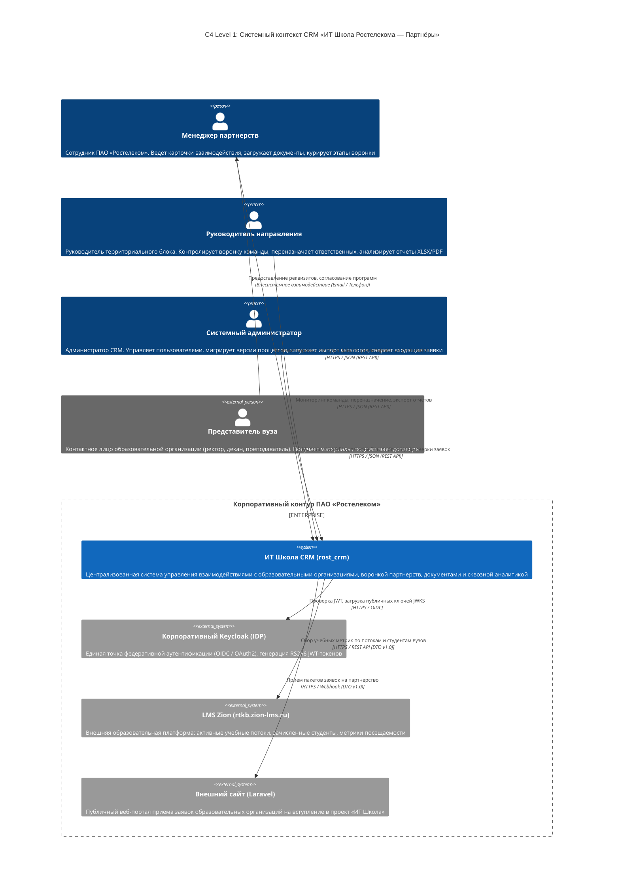
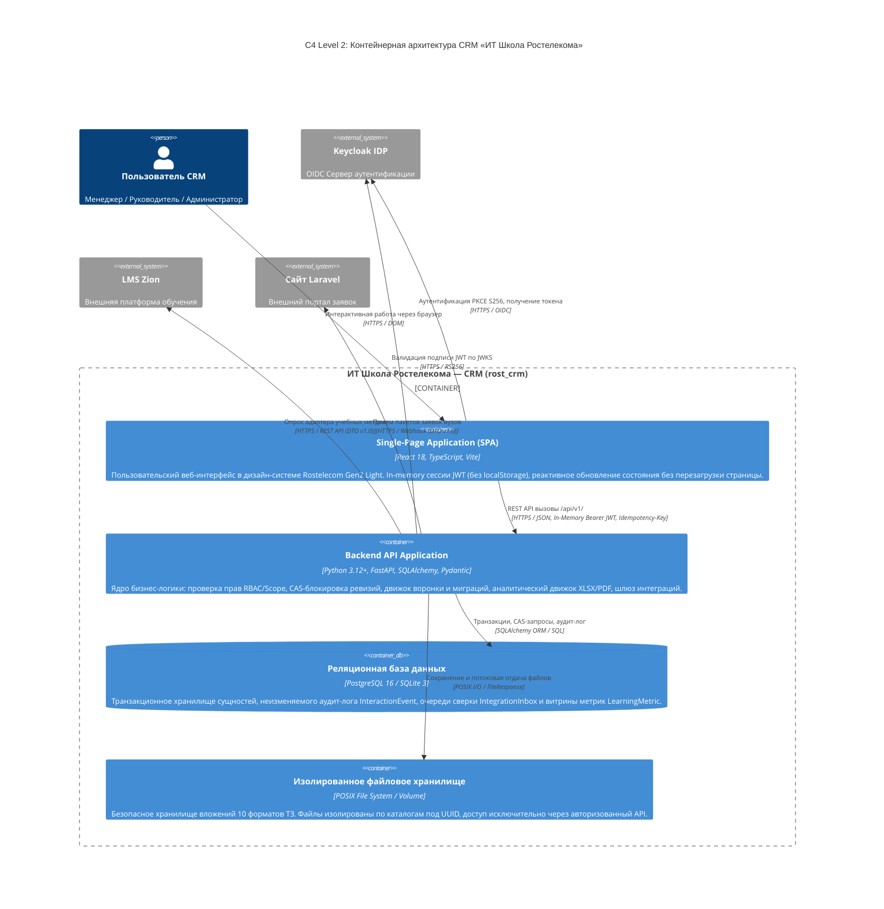
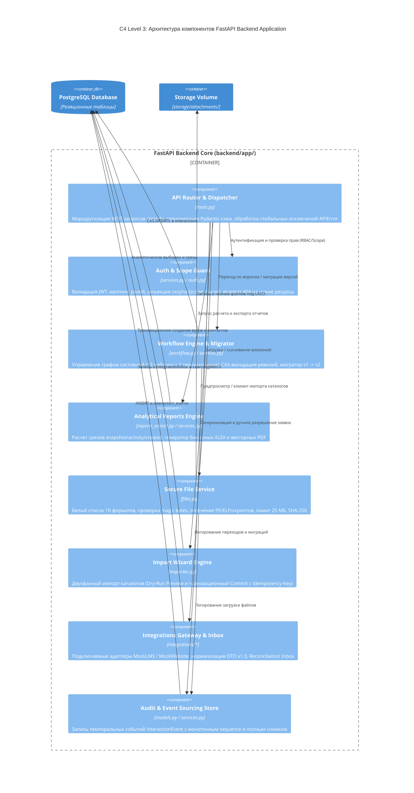

# Архитектурная документация C4: ИТ Школа Ростелекома — CRM (rost_crm)

**Проект:** «ИТ Школа Ростелекома — CRM» (`rost_crm`)  
**Версия документа:** 1.0 (задачи B36, R26, AC26)  
**Дата:** 2026-09-20  
**Автор:** Ведущий архитектор решений и информационной безопасности команды проекта («Ezdel»)

---

## 1. Введение и методология C4

Настоящий документ описывает архитектуру системы «ИТ Школа Ростелекома — CRM» (`rost_crm`) с использованием методологии **C4 (Context, Containers, Components, Code)**, разработанной Саймоном Брауном (Simon Brown). 

Архитектурная модель представлена на трех уровнях детализации с использованием формальных диаграмм Mermaid:
- **Уровень 1 (System Context):** Место системы во внешнем окружении, взаимодействие с пользователями и смежными корпоративными платформами.
- **Уровень 2 (Containers):** Высокоуровневая структура приложений, хранилищ данных и протоколы межконтейнерного взаимодействия.
- **Уровень 3 (Components):** Декомпозиция ядра бэкенда на взаимодействующие функциональные компоненты и сервисы.

Дополнительно приведены матрица ответственности компонентов, спецификация межсистемных интерфейсов и карта контуров безопасности (Trust Boundaries).

---

## 2. C4 Уровень 1: Системный контекст (System Context)

Диаграмма контекста демонстрирует систему `rost_crm` как единый «черный ящик», определяя ключевых пользователей и внешние интеграционные зависимости в контуре ПАО «Ростелеком».



### 2.1. Описание участников и внешних систем
- **Менеджер партнерств (Роль `manager`):** Основной оператор воронки. Ограничен областью видимости своих взаимодействий (`Interaction.owner_id == user.id`).
- **Руководитель направления (Роль `supervisor`):** Куратор команды менеджеров. Обладает правами переназначения карточек и выгрузки сквозной аналитики по подразделению (`team_id`).
- **Системный администратор (Роль `administrator`):** Ответственный за эксплуатацию. Выполняет миграции процессов между версиями графа, пакетный импорт справочников и ручную сверку коллизий входящих заявок.
- **Корпоративный Keycloak (IDP):** Провайдер удостоверений. Поддерживает протокол OpenID Connect (OIDC) с потоком Authorization Code Flow + PKCE S256. В демонстрационном режиме эмулируется встроенным механизмом `demo_users`.
- **LMS Zion (`rtkb.zion-lms.ru`):** Внешняя учебная среда. Источник образовательных метрик (число потоков, зачисленные студенты, завершившие обучение). Подключается через адаптер `MockLMSAdapter` с поддержкой переключения на live-режим.
- **Внешний сайт (Laravel):** Публичный веб-портал. Поставляет входящие заявки от учебных заведений. Подключается через адаптер `MockWebsiteAdapter` с очередью нормализации и разрешения коллизий `Reconciliation Inbox`.

---

## 3. C4 Уровень 2: Контейнеры (Containers)

Контейнерный срез определяет состав развертываемых модулей системы, технологии реализации и протоколы межмодульного взаимодействия.



### 3.1. Характеристики контейнеров

| Контейнер | Технологический стек | Основные обязанности | Требования масштабирования и надежности |
|---|---|---|---|
| **Single-Page Application (SPA)** | React 18, TypeScript 5, Vite, CSS Modules | Рендеринг интерфейса в дизайн-системе Gen2 Light (`#7700FF`, `#FF4F12`), хранение JWT-токена в памяти (`useRef`), управление состоянием форм, предотвращение перезагрузки страницы (SPA). | Статический хостинг (Nginx/CDN), кеширование ассетов по хэшам файлов. Отсутствие состояния на сервере. |
| **Backend API Application** | Python 3.12+, FastAPI, Starlette, AnyIO | Обработка REST API `/api/v1/`, ролевая модель RBAC и Scope-изоляция (152-ФЗ), CAS-блокировка версий, генерация XLSX и векторных PDF, валидация файлов и magic bytes. | Горизонтальное масштабирование (Stateless Uvicorn workers). Асинхронный event loop. Benchmark: 50 конкурентных пользователей, $p95 \le 1.0\text{ с}$. |
| **Реляционная база данных** | PostgreSQL 16 (production) / SQLite 3 (dev/test) | Хранение структурированных данных, поддержка транзакционной целостности ACID, составные уникальные индексы дедупликации, хранение аудит-лога `InteractionEvent`. | Read-репликация для аналитических отчетов, регулярный WAL-архив и бэкап. |
| **Изолированное хранилище файлов** | Локальная ФС / Kubernetes PersistentVolume | Физическое хранение загруженных вложений (`storage/attachments/{id}/`). Размещение вне веб-рута Nginx. Изоляция файлов под UUID. | Квотирование дискового пространства, резервное копирование томов, контроль прав доступа на уровне POSIX (`0750`). |

---

## 4. C4 Уровень 3: Компоненты бэкенда (Components)

Диаграмма компонентов демонстрирует внутреннее устройство контейнера **Backend API Application (FastAPI)**, показывая модули сервисного слоя и потоки управления данными.



---

## 5. Матрица ответственности компонентов ядра

| Компонент | Модуль кодовой базы | Зона ответственности | Входные данные | Выходные данные | Обработка отказов и ошибок |
|---|---|---|---|---|---|
| **API Router & Dispatcher** | `backend/app/main.py` | Входной шлюз REST API, демаршализация JSON, связывание с зависимостями сессии БД. | HTTP-запросы (JSON, multipart), заголовки | HTTP-ответы со стандартизированной структурой `{error: ...}` | Перехват `APIError`, возврат корректного HTTP-кода (400, 401, 403, 404, 409, 413, 422). |
| **Auth & Scope Guard** | `backend/app/services.py:28-65` | Извлечение контекста пользователя, вычисление разрешений, фильтрация Scope по ролям. | Bearer JWT / X-Demo-User | Объект `User`, предикат `scope_clause` | Отказ 401 при отсутствии токена, 403 при нехватке роли, **404 при выходе за Scope**. |
| **Workflow Engine & Migrator** | `backend/app/workflow.py`, `backend/app/services.py:67-150` | Проверка графа переходов, валидация связки «программа + продукт», двухверсионная миграция процессов. | ID карточки, целевой статус, `expected_revision`, маппинг статусов | Обновленная сущность `Interaction`, отчет о миграции | CAS-отказ 409 при конфликте ревизий, 422 при попытке маппинга терминального статуса в рабочий. |
| **Analytical Reports Engine** | `backend/app/reports_export.py`, `backend/app/services.py:220-350` | Расчет срезов портфеля на дату, расчет динамики активности за интервал, генерация XLSX и PDF. | Тип отчета, дата среза / интервал дат, формат (json/xlsx/pdf) | Бинарный поток XLSX (`PK\x03\x04`), PDF (`%PDF-`), JSON DTO | 422 при некорректном диапазоне дат. Fallback на AnyIO threadpool для тяжелых расчетов. |
| **Secure File Service** | `backend/app/files.py` | Валидация 10 расширений, проверка magic bytes, блокировка PE/ELF/скриптов, сохранение под UUID, SHA-256. | Multipart-поток, оригинальное имя файла | Сущность `Attachment`, поток `FileResponse` | 413 при размере > 25 МБ, 422 при несоответствии сигнатур, 404 при попытке скачать чужой файл. |
| **Import Wizard Engine** | `backend/app/importer.py` | Двухфазный импорт таблиц XLSX/CSV: сухой прогон с валидацией строк и транзакционный коммит. | Файл таблицы, заголовок `Idempotency-Key` | DTO предпросмотра (ошибки строк), сводка созданных записей | Ошибки валидации строк не ломают весь файл; возврат детализированного списка дефектов. |
| **Integrations Gateway & Inbox** | `backend/app/integrations/*` | Адаптеры к LMS Zion и Сайту Laravel, конверт DTO v1.0, очередь сверки заявок с защитой от дублей. | Входящие вебхуки, результаты поллинга адаптеров | Записи `IntegrationInbox`, `LearningMetric` | Автоматическая изоляция неизвестных вузов в статус `pending`; дедупликация повторов. |
| **Audit & Event Sourcing Store** | `backend/app/models.py:139-154`, `backend/app/services.py:154-165` | Формирование непрерывной темпоральной хроники изменений, сохранение полных снимков карточки. | Событие, субъект, полезная нагрузка, снимок | Строка таблицы `interaction_events` с уникальным `sequence` | Запрет мутаций на уровне БД. Неизменяемость исторического аудита. |

---

## 6. Спецификация межмодульных интерфейсов и протоколов

### 6.1. Аутентификация и сессия (Keycloak OIDC PKCE S256)
- **Протокол:** OpenID Connect Core 1.0 (Authorization Code Flow with Proof Key for Code Exchange).
- **Формат токена:** RS256 JWT, содержащий клеймы `preferred_username`, `email`, `resource_access.rost-crm.roles`.
- **Хранение токена:** Строго In-Memory в JavaScript (`keycloak.current`). Время жизни access-токена: 5 минут; автоматическое упреждающее обновление за 30 секунд до истечения (`updateToken(30)`).

### 6.2. Внутренний REST API (`/api/v1/`)
- **Формат обмена:** Application/JSON в кодировке UTF-8.
- **Единый конверт ошибок:**
  ```json
  {
    "error": {
      "code": "REVISION_CONFLICT",
      "message": "Карточка была изменена другим пользователем. Обновите данные.",
      "request_id": "req-8f92a1...",
      "details": { "current_revision": 4, "expected_revision": 3 }
    }
  }
  ```
- **Идемпотентность и CAS:** Изменяющие операции (`POST`, `PATCH`) поддерживают заголовок `Idempotency-Key: <UUID>` (до 200 символов) с дедупликацией через таблицу `command_results` и параметром `expected_revision` для оптимистической блокировки.

### 6.3. Интеграционный конверт DTO v1.0 (Внешние источники)
Все входящие пакеты от LMS Zion и Сайта на Laravel приводятся адаптерами к нормализованному конверту:
```json
{
  "schema_version": "1.0",
  "source": "website",
  "entity_type": "application",
  "external_id": "app-2026-09-0012",
  "source_revision": "1",
  "operation": "upsert",
  "effective_at": "2026-09-20T10:00:00Z",
  "received_at": "2026-09-20T10:00:02Z",
  "payload": {
    "organization_name": "Московский государственный технический университет",
    "contact_name": "Смирнов Алексей Викторович",
    "email": "smirnov@mgtu.ru",
    "phone": "+7-495-123-45-67",
    "program_code": "devops",
    "comment": "Заявка на подключение кафедры ИТ"
  }
}
```
Дедупликация выполняется на уровне БД по составному ограничению:
$$\text{Unique}(\text{source}, \text{entity\_type}, \text{external\_id}, \text{source\_revision})$$

---

## 7. Контуры безопасности и границы доверия (Trust Boundaries)

Архитектура системы разграничивает четыре изолированные зоны доверия:

1. **Публичная зона (Internet / Client Zone):**
   - Браузер пользователя.
   - Среда выполнения React SPA.
   - Угрозы: XSS, перехват локальных хранилищ, подмена клиентских скриптов.
   - Защитные меры: In-memory хранение токенов, CSP-заголовки, отсутствие чувствительных бизнес-правил на клиенте.

2. **Демилитаризованная зона и обратный прокси (DMZ / Ingress Zone):**
   - Nginx Reverse Proxy / Ingress Controller.
   - Терминация TLS 1.3, ограничение частоты запросов (Rate Limiting), отсечение аномальных размеров тела запроса (> 25 МБ).

3. **Защищенная зона приложений (Application Zone):**
   - FastAPI Backend Application.
   - Выполнение аутентификации, авторизации, валидации бизнес-логики и прав Scope (152-ФЗ).
   - Выполнение сигнатурного анализа файлов (magic bytes) и отсечение вредоносного кода до записи на диск.

4. **Доверенная зона данных и хранилища (Data & Storage Zone):**
   - СУБД PostgreSQL и файловый том `storage/attachments/`.
   - Доступ разрешен исключительно сервисному пользователю бэкенда по закрытой внутренней сети (Private Docker Network / VPC).
   - Запрещен любой прямой доступ извне. Файлы хранятся под UUID, исключая исполнение веб-сервером.
