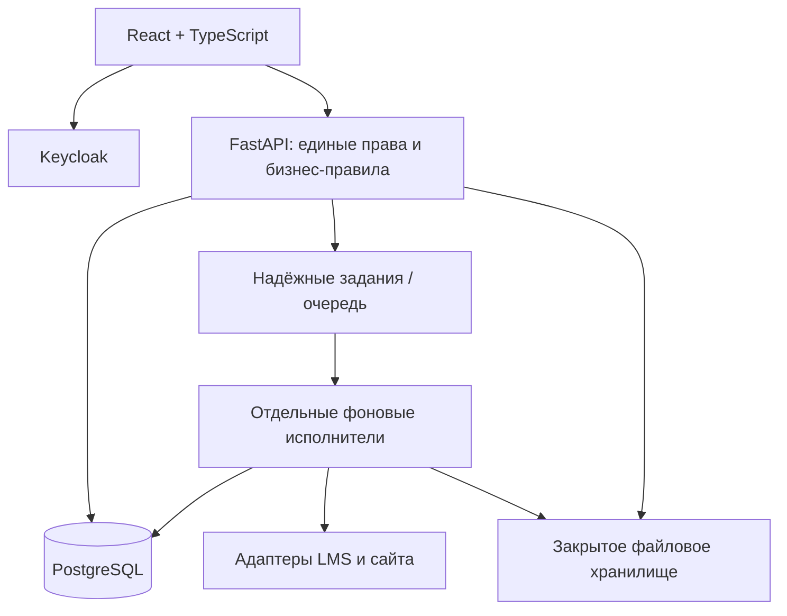

# CRM ИТ Школы РТК: техническая спецификация первой версии

Версия 0.1 • 17.09.2026 • Проект для реализации и обсуждения с заказчиком.

Цель: законченная CRM для конкурсной защиты и последующего внедрения. Основания: исходное ТЗ «6. ИТ Школа Ростелекома.pdf», полный анализ в соседнем файле «Анализ проекта ИТ Школа Ростелекома.md» и подтверждённая пользователем цель. Состав команды пока неизвестен; календарные сроки здесь не назначаются.

Документ переводит анализ в конкретные правила. Он не означает, что заказчик уже утвердил предложенную модель, внешние API или условия эксплуатации. Технологии, бизнес-правила и численные ограничения сверх исходного ТЗ обозначаются как проектные решения. Все ID R01–R29 относятся к матрице предыдущего анализа.

Связанные материалы:

- `02-development-plan.md` — задачи, зависимости, оценки и покрытие R01–R29.
- `03-acceptance-scenarios.md` — сценарии приёмки.
- `04-base-workflow.json` — машиночитаемый проект базового процесса.
- `05-report-fixture.json` — синтетические данные с ожидаемыми результатами отчётов.

## 1. Результат первой версии и критерии готовности

Полная первая версия позволяет сотрудникам авторизоваться через Keycloak, вести каталоги и взаимодействия, импортировать XLS/XLSX, изменять процессы, работать с комментариями и файлами, получать данные из двух источников, строить проверяемые отчёты и управлять доступом. Поддерживаются все форматы и результаты сдачи исходного ТЗ.

Три контрольные точки:

| Уровень | Что должно быть подтверждено |
|---|---|
| Демонстрация | Рабочий сквозной путь, все обязательные сценарии представлены; имитаторы и ограничения явно обозначены; синтетические данные |
| Пилот | Реальные контракты LMS/сайта проверены, область данных и доступы определены, выполнена согласованная нагрузка, среда допущена заказчиком для пилотных данных |
| Эксплуатация | Пилот принят, проверено восстановление, определены мониторинг и сопровождение, завершены применимые мероприятия ИБ и передача решения |

Функции вне обязательного объёма: новая LMS, кабинет вуза, встроенное юридически значимое подписание, отправка писем, видеосвязь, произвольный исполняемый BPMN и автономный ИИ-агент. Их можно включать отдельными решениями после обязательного контура. Интеграции через API не означают необходимость воспроизводить весь функционал источников.

## 2. Реестр проектных решений

Статус всех D-пунктов — «предлагается для реализации» до проверки на примерах заказчика. Эти решения позволяют начинать независимую разработку; внешние условия из раздела 14 остаются открытыми.

| ID | Предлагаемое решение | Основание / что проверять |
|---|---|---|
| D01 | Взаимодействие — отдельный цикл по одной организации, одной программе и одному основному продукту | Несколько продуктов с независимыми статусами дают отдельные взаимодействия |
| D02 | Программа и продукт могут отсутствовать на ранних этапах; обязательны перед передачей материалов | Проверить реальные ранние сценарии |
| D03 | Программа относится к одному основному направлению; продукт может использоваться разными программами | Если программы междисциплинарны, добавить связи до миграции реальных данных |
| D04 | Организация имеет тип university/school/other; обязательный пилотный охват школ уточняется | Заголовок ТЗ шире подробных сценариев |
| D05 | Ответственный за организацию и ответственный за взаимодействие — отдельные назначения | Первое задаёт владельца отношений и значение по умолчанию для новых карточек |
| D06 | Опубликованные версии workflow неизменяемы; перенос действующих карточек — отдельная операция | История и отчёты сохраняют смысл |
| D07 | 13 рабочих этапов исходного пути, два служебных завершения; пункт 14 реализуется сквозным контролем | Точная схема в 04-base-workflow.json |
| D08 | Два базовых режима отчёта: snapshot и activity; создание за период — отдельный created | Нельзя смешивать временные смыслы |
| D09 | Исторические атрибуты восстанавливаются на дату, право доступа проверяется по текущей области пользователя | Прошлый владелец не получает автоматически текущий доступ |
| D10 | Для спроса сначала раздельные согласованные метрики; взвешенный общий рейтинг не рассчитывается без методики | Показатели обучения отсутствуют в текущем шаблоне импорта |
| D11 | Повторы API обрабатываются по внешним ID/ревизиям; спорные соответствия требуют сверки | Нельзя надёжно объединять по одному названию/ФИО |
| D12 | Импорт выполняется после предпросмотра; по умолчанию ошибочный пакет целиком не применяется | Частичный импорт можно добавить явным режимом |
| D13 | Кэш действий — фильтры, настройки таблиц, черновики; автономное изменение данных не входит в базовую версию | Конкретизация неоднозначной фразы ТЗ |
| D14 | Модульный монолит, отдельные исполнители импорта/отчётов/синхронизации | Подходит для транзакций и заявленного масштаба |
| D15 | React + TypeScript; Python + FastAPI; PostgreSQL; Keycloak | Из допустимых технологий ТЗ; версии и зависимости фиксируются при создании проекта |
| D16 | Файлы закрытые, скачивание через проверку прав; результаты отчётов не публикуются постоянными открытыми ссылками | Единое разграничение данных |

## 3. Предметная модель

### 3.1. Общие правила данных

Рабочие идентификаторы — UUID; человекочитаемые номера используются для поиска и отображения, но не заменяют ID. Короткие ID в проверочном JSON — только обозначения синтетического набора.

Время хранится с часовым поясом; в API — ISO 8601 с UTC/явным смещением. Пользовательский часовой пояс задаётся конфигурацией организации. Для исходного стенда предлагается Europe/Moscow; это не установленное в PDF требование. Календарные даты лицензий хранятся как даты, без искусственного времени суток.

Изменяемые объекты имеют `revision` для защиты от потери параллельных изменений. Справочники, использованные в истории, архивируются. Безусловное физическое удаление связанных записей через обычный интерфейс запрещено проектными правилами; регламент удаления данных определяется отдельно.

### 3.2. Каталоги и идентичности

| Сущность | Основные поля | Ограничения |
|---|---|---|
| Organization | id, name, short_name, type, identifiers, archived_at, revision | Название не уникальный ключ; внешние ID хранятся по источникам |
| OrganizationContact | id, organization_id, full_name, position, email, phone, active | Несколько контактов на организацию; контакт не создаёт учётную запись CRM |
| User | id, keycloak_subject, display_name, active | keycloak_subject уникален; пароли CRM не хранит |
| Team / TeamMembership | id/name; team_id, user_id, valid_from/to | Состав команды учитывается при текущей авторизации |
| Direction | id, code, name, archived_at | Стабильный код не меняется вместе с названием |
| Program | id, direction_id, code, name, archived_at | Одна основная принадлежность по D03 |
| Vendor | id, name, identifiers | Отдельная сущность поставщика |
| Product | id, vendor_id, code, name, archived_at | Связи с программами — через ProgramProduct |
| ProgramProduct | program_id, product_id | Пара уникальна; помогает проверять допустимость сочетания |
| OrganizationAssignment | organization_id, user_id, effective_from/to, actor_id | Один основной ответственный в момент времени; история не затирается |

### 3.3. Взаимодействие

`Interaction` содержит:

- `id`, `number`, `organization_id`, `program_id?`, `product_id?`, `cycle_label`;
- `owner_id`, `workflow_version_id`, `current_state_id`, `revision`;
- `title`, `summary?`, `created_at`, `updated_at`, `closed_at?`;
- ссылки на контакты, договоры и лицензии через отдельные связи.

Правила:

1. Для создания обязательны организация, название/цель, метка цикла, опубликованная версия процесса и ответственный. Ответственный может подставляться из текущего назначения организации; при его отсутствии пользователь выбирает допустимого сотрудника.
2. Один вуз может иметь любое количество взаимодействий. Повторный цикл с теми же программой и продуктом допустим. Пользователь видит предупреждение о похожих активных карточках; система не запрещает легитимную параллельную работу глобальным уникальным ограничением.
3. Программа и продукт допускают null до этапа materials_transfer. Правило перехода проверяет их заполнение. Контакт и файл не становятся обязательными автоматически: это настраиваемые условия.
4. Направление выводится из программы; для ещё неизвестной программы направление можно сохранять как предварительный интерес отдельно. Предварительный интерес не подменяет фактическую программу в отчёте.
5. Смена программы/продукта после начала предметной работы — явная корректировка с причиной и историей. Смена организации у существующей карточки выполняется отдельной контролируемой корректировкой связей; обычный PATCH это поле не меняет.
6. Терминальная карточка доступна для чтения и разрешённых заметок. Для нового цикла создаётся новая карточка со ссылкой на предыдущую. Возобновление закрытого процесса при необходимости проектируется отдельной операцией, не скрытым изменением статуса.

`InteractionAssignment` хранит назначения владельцев во времени. Назначение организации не переписывает автоматически владельцев всех старых карточек. Руководителю доступны: сменить или снять ответственного организации; оставить существующие карточки; либо выбрать карточки для переназначения с предпросмотром. Снятие ответственного организации закрывает текущее OrganizationAssignment без нового назначения; владельцы её существующих карточек сохраняются. У самой карточки в проектной модели должен оставаться ответственный: его смена требует нового owner_id. Эти две операции различаются в интерфейсе и API.

### 3.4. Договоры, лицензии, файлы

| Сущность | Основные поля и правила |
|---|---|
| Contract | id, organization_id, number, signed_on?, status, attachment_ids; номер хранится строкой, его глобальная уникальность не предполагается |
| License | id, organization_id, product_id, contract_id?, signed_on?, valid_from?, valid_to?, term_source_value?, transfer_status |
| InteractionContract / InteractionLicense | Явные связи, проверка совпадения организации и допустимости продукта |
| Attachment | id, interaction_id?, visit_id?, event_id?, storage_key, original_name, detected_type, size, checksum, uploaded_by, scan_status, created_at |

Если импорт содержит только год/длительность лицензии, система не выдумывает точную дату. Исходное значение сохраняется; преобразование производится лишь по согласованному маппингу. Неопределённость отображается пользователю.

Список типов из ТЗ поддерживается полностью: PNG, JPEG, PDF, ZIP, GZIP, RAR, DOC, DOCX, XLS, XLSX. Приём архива как вложения не требует его распаковки. Автоматический предпросмотр исполняемого содержимого не допускается.

### 3.5. История и аудит

`InteractionEvent`: id, interaction_id, event_type, effective_at, received_at, sequence, actor_id/source, payload, workflow_version_id, correlation_id. Типы: created, state_changed, owner_changed, attributes_corrected, workflow_migrated, comment_added, attachment_added и технически отличимые исправления истории.

`StateVisit`: id, interaction_id, state_id, workflow_version_id, entered_at, exited_at?, opened_by_event_id, closed_by_event_id?. Возврат на тот же этап создаёт новое посещение. Комментарий/файл привязывается к нужному посещению или конкретному событию.

Аудит хранит изменение прав, назначений, шаблонов, импорт, запрос/скачивание отчёта, административные операции и результаты значимых отказов. Нельзя дублировать в журнале пароли, токены и полное содержимое документов. Сроки хранения определяются политикой заказчика.

Основные данные и аудит успешного предметного изменения записываются согласованно. События не редактируются незаметно: исправление оформляется отдельной записью, со ссылкой на исправляемую и причиной. Массовое исправление истории требует пересчёта зависимых представлений и отдельной проверки.

## 4. Процессы и переходы

В `04-base-workflow.json` приведён проект базового шаблона: 13 рабочих состояний, завершение completed и отмена cancelled. Пункт 14 ТЗ представлен контролем действий, ответственных и истории всех этапов.

Основной путь соответствует пунктам 1–13. Дополнительные ветви: пропуск document_revision; возврат с document_signing на document_revision; повторный цикл teacher_upskilling → classes; отмена из рабочего этапа. Все дополнительные ветви являются предложениями. Комментарий обязателен для отмены, возвратов и повторного цикла, для обычных переходов доступен, но необязателен. Название состояния обозначает текущую работу: вход в «Подписание документов» не доказывает факт подписания, а вход в «Передачу материалов» — завершённую передачу. Юридические факты и подтверждающие документы учитываются отдельно.

`WorkflowTemplate` имеет устойчивый код. `WorkflowVersion` проходит draft → published → retired. Retired запрещает новые назначения, но не останавливает уже работающие карточки. Редактируется только draft. После публикации изменения создают новую версию.

Валидация публикации:

- один начальный статус; уникальные коды статусов и переходов;
- все ссылки существуют, каждый рабочий этап достижим из начала;
- из каждого рабочего этапа есть путь хотя бы к одному терминалу;
- терминалы не имеют обычных исходящих переходов;
- циклы разрешены, если сохраняется путь к завершению;
- условия заданы допустимыми декларативными правилами, без пользовательского исполняемого кода;
- сопоставление с аналитической категорией явно определено либо имеет значение «не сопоставлено».

При переходе API проверяет пользователя и текущую область → ожидаемую revision → разрешённость ребра и условия → доступ к вложениям → атомарно записывает новое состояние, закрывает/открывает посещения, сохраняет событие и аудит. Успешный повтор запроса с тем же ключом идемпотентности возвращает тот же результат без второго перехода.

При переносе на новую версию сначала формируется план: старые/новые этапы, затронутые карточки, ошибки и текущие revisions. Подтверждение применяет только неизменившиеся карточки; конфликтующие не переносятся незаметно. История сохраняет исходные версии, а событие переноса отличается от обычного бизнес-перехода и не увеличивает метрику активности переходов по умолчанию. Перенос, импорт и редактирование полей проверяют инварианты целевого состояния, включая заполненность программы/продукта на materials_transfer и последующих рабочих этапах. Нельзя обойти проверку прямым PATCH, очисткой поля или переносом сразу на поздний этап. JSON-шаблон описывает переходы; эти инварианты предметной модели применяются дополнительно.

В первой версии редактор может быть формой/таблицей этапов и переходов с визуальной схемой. Свободное перетаскивание не должно обходить серверные ограничения.

## 5. Роли и текущая область данных

Проектные роли Keycloak: manager, supervisor, administrator. Внешние контакты образовательных организаций не получают эти роли автоматически. Доступ служебных интеграций определяется отдельно.

| Действие | Менеджер | Руководитель | Администратор |
|---|---|---|---|
| Просмотр взаимодействий | Свои и явно предоставленные | В области команды/явных назначений | По дополнительным предметным правам |
| Редактирование, переход, комментарий, файл | В разрешённой области | В разрешённой области | По дополнительным предметным правам |
| Назначение ответственного организации/карточки | Нет по умолчанию | В своей области | Только с предметным разрешением |
| Импорт | По отдельному permission | По отдельному permission | По отдельному permission |
| Отчёты и файлы | Только доступные данные | Только доступные данные | По предметным правам |
| Редактор процессов | Нет по умолчанию | Отдельное workflow.manage | Да |
| Пользователи, роли, области | Нет | Нет по умолчанию | Да, с аудитом |
| Настройки интеграций | Нет | Просмотр разрешённого состояния | Да; секреты не отображаются открыто |

Формула доступа: разрешённое действие AND текущая область объекта. Роль сама по себе не раскрывает все строки.

Для менеджера текущая область включает принадлежащие ему взаимодействия и явные grants. Для руководителя — взаимодействия разрешённых команд и явные grants. Явное право на организацию может охватывать её карточки; возможность прочитать название организации через одну доступную карточку не превращается в доступ ко всем её взаимодействиям.

Исторический отчёт использует текущую область доступа, затем восстанавливает исторические значения. Нельзя авторизовать пользователя только по тому, что в прошлом он был владельцем. При смене прав сервер инвалидирует зависящие от них кэши.

При скачивании заранее созданного отчёта проверяется, разрешён ли весь его зафиксированный набор объектов сейчас. Если часть доступа отозвана, исходный файл не выдаётся; пользователь может построить новый отчёт по текущей области. Нельзя молча выдать старый файл или под тем же ID заменить его содержимое.

Ответ для чужого идентификатора не должен раскрывать существование/метаданные объекта. Проектный выбор: 404 для недоступного объекта и 403 для запрещённого действия над видимым объектом. Поведение единообразно для API, файлов и результатов заданий.

## 6. Отчёты: точные правила первой версии

### 6.1. Время и состав строк

`knowledge_cutoff` — момент, до которого сведения были получены системой. Для нового отчёта фиксируется при запуске; пользователь видит его как «данные учтены по состоянию на». Старый результат не меняется после прихода новых сведений. Новый запуск с теми же бизнес-датами может отличаться, если cutoff другой.

| Режим | Временное условие | Одна строка | Ответственный/статус |
|---|---|---|---|
| snapshot | effective_at <= as_of и received_at <= knowledge_cutoff | Одно взаимодействие, существовавшее на as_of | Последние действующие значения на as_of |
| activity | from <= effective_at < to и received_at <= knowledge_cutoff | Одно уникальное событие перехода | Ответственный на момент события, статус назначения перехода |
| created | from <= created_at < to; создание известно к cutoff | Одно созданное взаимодействие | Значения на момент создания, явно обозначенные в отчёте |

Обычные действия CRM имеют effective_at, назначенный сервером; пользователь не подменяет его произвольной датой. Внешние даты проходят проверку. Поздняя история не меняет текущий статус без проверки хронологии; спорная запись поступает в сверку.

В UI период задаётся включительно календарными днями. Сервер преобразует его в [начало первого дня, начало дня после последнего) в выбранном часовом поясе. Для snapshot поле as_of_inclusive по умолчанию true: явный timestamp as_of включителен, как и в эталонном JSON. При выборе календарной даты «на конец дня» UI передаёт начало следующего дня в as_of и as_of_inclusive=false; тогда effective_at < as_of. Это исключает зависимость от последней представимой микросекунды. Файл и параметры отчёта сохраняют выбранную границу, флаг и часовой пояс; inclusive и exclusive снимки не смешиваются.

События с одинаковым effective_at упорядочиваются по стабильному sequence внутри взаимодействия. Для владельца события activity учитываются назначения с парой (effective_at, sequence) не позже пары самого перехода; назначение с тем же временем, но более поздним sequence не применяется задним числом к этому переходу. Повтор доставки одного события не создаёт второй event. Исправления истории требуют явной политики supersedes; сохранённые отчёты остаются самостоятельными неизменяемыми результатами.

### 6.2. Фильтры и агрегаты

Общие фильтры: organization_ids, direction_ids, program_ids, product_ids, owner_ids, workflow_version_ids/state_ids, выбранные временные параметры. Внутри списка значений действует OR, между разными фильтрами — AND. Пустой список трактуется как отсутствие фильтра; неизвестный код/несуществующая доступная ссылка — ошибка валидации, а не расширение выборки.

Для snapshot фильтр владельца/статуса применяется к историческим значениям на дату, для activity — на момент перехода. Текущая область доступа применяется в обоих случаях первой. Неизвестные программа/продукт попадают в отдельную группу «Не определено»; пропуски статистики обучения отмечаются «Нет данных», а не нулём.

Счётчики CRM: distinct interaction_id, distinct organization_id, число уникальных state_changed events. Они подписываются по-разному. Переходы миграции шаблона, комментарии и назначения не входят в число бизнес-переходов по умолчанию.

Таблица, график и экспорт используют единый серверный набор данных и одинаковые параметры. Присоединение файлов, контактов и продуктов не размножает базовые строки. Переход из диаграммы в детализацию сохраняет фильтры, временной режим и cutoff.

### 6.3. Учебная статистика

До получения API-контрактов согласуются определения: заявки, уникальные обучающиеся/регистрации, активные потоки, одновременные потоки, завершившие обучение. Для каждой метрики задаются владелец, единица, временной смысл, измерения, уникальность, формула и ограничения суммирования.

Если CRM получает агрегаты, они содержат metric_code, value, unit, organization/program, period/as_of, source, source_record_id, source_revision, definition_version, received_at и признак полноты. Средние, доли, уникальные люди и перекрывающиеся снимки не суммируются без отдельного правила. Показатель «параллельные потоки» нельзя получить простым суммированием потоков за весь месяц.

Если источник не обеспечивает необходимый показатель, интерфейс сообщает отсутствие данных. Синтетические показатели демонстрационного стенда явно помечены. Формула общего рейтинга — открытое решение заказчика.

### 6.4. Задания и форматы

`ReportJob`: id, requested_by, parameters, parameters_hash, knowledge_cutoff, permission_scope, status, progress?, result_metadata, created_at, started_at, finished_at, error_code?. Состояния: queued, running, succeeded, failed, cancelled. Перезапуск после сбоя не создаёт несколько активных исполнителей одного задания.

Табличные файлы: XLS/XLSX/PDF; диаграммы: PNG/PDF. JSON-выгрузка результата — проектная трактовка требования «результирующий JSON»: schema_version, report_type, filters, timezone, cutoff, columns, rows, totals, generated_at. Это не полный дамп базы. Для большого результата определяются лимиты/разбиение; XLS требует самостоятельного решения при превышении возможностей выбранного формата, без тихой потери строк.

В файле указаны выбранные фильтры, период, единицы, момент формирования, актуальность и предупреждения о неполноте. Кириллица, даты, нули и пустые значения сохраняют смысл. Текстовые значения, похожие на формулы, выгружаются как текст. PDF имеет повтор заголовков на страницах и читаемый масштаб; диаграмма не обрезается.

## 7. Импорт и синхронизация

### 7.1. Импорт Excel

Пакет имеет состояния uploaded → validating → preview_ready/invalid → committing → completed/failed. Повтор confirm с тем же ключом возвращает прежний результат. Истёкший предпросмотр или изменившиеся целевые записи требуют повторной проверки, а не применения старого плана.

Маппинг: исходная колонка, целевое поле, тип/преобразование из разрешённого списка, обязательность, правило пустого значения. Принимаются XLS и XLSX. Макросы и формулы не исполняются. Неоднозначные даты/номера/ФИО показываются как ошибки или запрос сопоставления.

Справочники ищутся по устойчивым идентификаторам. При их отсутствии пользователь подтверждает сопоставление. Создание контакта не создаёт автоматически пользователя Keycloak. Для обновления взаимодействия нужен его ID/подтверждённое соответствие; создание нового цикла — явный режим.

Предпросмотр показывает: создаваемые объекты, изменения значений, неизменённые строки, ошибки и дубли. Пустая ячейка по умолчанию оставляет существующее значение; очистка поля — отдельное явное действие. Все применяемые строки в базовом режиме проходят проверки до записи. При полном отказе предметные данные не меняются, протокол ошибки сохраняется.

Проверки включают область доступа импортёра. Нельзя импортом назначить чужую организацию, изменить закрытую область или повысить роль. Результат содержит ID пакета, автора, контрольную сумму файла, применённый маппинг и счётчики.

### 7.2. Внешние источники

Сайт на Laravel и LMS имеют разные адаптеры. Следующая структура — **внутренний нормализованный конверт после адаптера**, а не заявление о реальном API заказчика:

```json
{
  "schema_version": "1.0",
  "source": "lms",
  "entity_type": "learning_metric",
  "external_id": "demo-metric-014",
  "source_revision": "3",
  "operation": "upsert",
  "effective_at": "2026-09-10T00:00:00Z",
  "received_at": "2026-09-12T08:30:00Z",
  "payload": {
    "organization_external_id": "demo-org-01",
    "program_external_id": "demo-program-02",
    "metric_code": "active_cohorts",
    "value": 2,
    "unit": "cohort",
    "as_of": "2026-09-10T00:00:00Z",
    "definition_version": "proposal-1"
  }
}
```

received_at назначает CRM; source_revision здесь строка, её порядок определяется конкретным контрактом и не сравнивается лексикографически автоматически. operation delete, если источник её использует, преобразуется по согласованной политике архивирования/исправления; не выполняет каскадное удаление истории.

Входящий объект сначала получает устойчивое соответствие `(source, entity_type, external_id)`. Ключ доставки дополнительно учитывает event_id либо source_revision. Тот же ключ с тем же содержимым — повтор; с другим содержимым — конфликт. Новая ревизия — обновление объекта, а не новый экземпляр процесса.

Журнал inbox фиксирует пакет до применения. Обработка гарантирует отсутствие повторного предметного эффекта при повторных доставках. Курсор продвигается после надёжной фиксации обработанного пакета, включая долговечный карантин проблемных записей с возможностью повторной обработки; ошибку нельзя тихо пропустить. Параллельные запуски одного источника координируются.

Предлагаемое владение полями: CRM — назначения, права, собственные этапы и комментарии; LMS — учебная статистика; сайт — заявки/первичные обращения. Уточнение контактов из внешнего источника не затирает подтверждённое значение без правила. Создание взаимодействия по обращению требует сопоставленной организации, разрешённого шаблона, правила выбора ответственного и идентификатора обращения. Иначе запись находится в очереди сверки.

На экране интеграций: последнее успешное обновление, актуальность, создано/обновлено/пропущено/ошибки, повторить разрешённую обработку. Авторизационные секреты и полные персональные payload не попадают в общедоступный журнал.

## 8. API приложения: проектный договор для frontend/backend

Префикс `/api/v1`. Эти маршруты — перечень проектируемых контрактов, не действующий API и не завершённая OpenAPI-спецификация. Полная OpenAPI с примерами, правами, схемами и ошибками создаётся и проверяется вместе с реализацией каждого модуля.

| Ресурс | Методы / операции | Существенное правило |
|---|---|---|
| `/me` | GET | Текущие роли, permissions и настройки; не раскрывает секреты |
| `/organizations`, `/{id}` | GET, POST; GET, PATCH | Серверный scope, revision, архивирование отдельным действием |
| `/organizations/{id}/contacts` | GET, POST, PATCH по ID | Контакты только доступной организации |
| `/organizations/{id}/assignments` | POST | Назначение организации; перенос карточек отдельным планом |
| `/catalogs/{directions,programs,products,vendors}` | GET, POST, PATCH, archive | Стабильные ID, зависимости и проверка прав |
| `/interactions`, `/{id}` | GET, POST; GET, PATCH | Статус и owner нельзя менять универсальным PATCH |
| `/interactions/{id}/transitions` | POST | expected_revision, transition_code, comment?, attachment_ids? |
| `/interactions/{id}/assignments` | POST | expected_revision, owner_id, reason |
| `/interactions/{id}/events` | GET | История с пагинацией, исходными версиями и авторами |
| `/interactions/{id}/comments` | POST | Текст и visit/event reference, проверка соответствия карточке |
| `/workflow-templates` | GET, POST | Доступ к управлению шаблонами |
| `/workflow-templates/{id}/versions` | GET, POST; PATCH draft | Новая редакция отделена от опубликованной |
| `/workflow-versions/{id}/publish` | POST | Валидация графа и правил |
| `/workflow-migrations/preview`, `/{id}/commit` | POST | План, revisions, допустимая область, история |
| `/attachments`, `/{id}/download` | POST upload; GET | Проверка связи, размера/типа, карантин, актуальные права |
| `/contracts`, `/licenses` | GET, POST, PATCH | Связи организации/продукта; сохранение источника неоднозначных значений |
| `/imports`, `/{id}`, `/{id}/confirm` | POST, GET, POST | Разделение проверки и применения |
| `/integrations`, `/{id}/runs` | GET; GET, POST | Источник, журнал, запуск; отдельное управление настройками |
| `/reconciliation-items` | GET, POST resolution | Явное решение конфликта с причиной и аудитом |
| `/report-previews` | POST | Набор таблицы/диаграммы с фиксированными параметрами и cutoff |
| `/reports`, `/{id}`, `/{id}/download` | POST, GET, GET | Задание, статус, закрытый результат и проверка текущих прав |
| `/reports/{id}/cancel` | POST | Отмена с предсказуемым итоговым статусом |
| `/admin/users`, `/admin/grants` | GET и операции управления | Полномочия и аудит; управление учётками через согласованную интеграцию Keycloak |
| `/preferences`, `/drafts` | GET, PUT/DELETE | Только собственное состояние, установленный срок хранения |
| `/health/live`, `/health/ready` | GET | Минимальная техническая информация; без раскрытия конфигурации |

Списки: стабильная сортировка с ID для разрешения равенства, серверная пагинация, allowlist сортировки, лимит страницы. Предлагаемый default 50, maximum 200; это ограничения API-проекта, не числа из ТЗ. Параметры фильтров типизированы. Ошибка неизвестного параметра не игнорируется молча.

Ключ идемпотентности обязателен для создания взаимодействия, перехода, применения импорта, запуска отчёта и других повторяемых команд. Область ключа — пользователь/служебная идентичность + операция + ключ. Совпадающий ключ с другим телом даёт конфликт. Проектный срок хранения результата ключа — 24 часа; импорт/API дополнительно имеют постоянные предметные ключи, поэтому истечение кэша не допускает дублирования внешних сущностей. Повтор команды заново проверяет текущие права перед возвратом чувствительного результата.

Ошибки имеют единый вид:

```json
{
  "error": {
    "code": "REVISION_CONFLICT",
    "message": "Карточка изменена другим пользователем. Обновите данные.",
    "request_id": "demo-request-001",
    "details": {"expected_revision": 7, "current_revision": 8}
  }
}
```

Основные коды: UNAUTHENTICATED, FORBIDDEN, NOT_FOUND, VALIDATION_ERROR, REVISION_CONFLICT, TRANSITION_NOT_ALLOWED, WORKFLOW_INVALID, IDEMPOTENCY_CONFLICT, IMPORT_INVALID, MAPPING_REQUIRED, FILE_TOO_LARGE, FILE_QUARANTINED, SOURCE_UNAVAILABLE, REPORT_FAILED. HTTP-статусы согласуются со смыслом: 401/403/404/409/413/422/503; 500 не раскрывает трассировку пользователю. 202 подтверждает принятие фонового задания, но не готовность результата.

## 9. Интерфейс и сохранение контекста

| Экран | Основная задача | Состояния, которые нужно спроектировать |
|---|---|---|
| Рабочее место | Мои процессы, следующий шаг, недавние изменения | Нет назначений, загрузка, ошибка, недоступный источник |
| Реестр | Найти и сравнить взаимодействия | Фильтры, сортировка, пагинация, пустая выборка, сохранённое представление |
| Карточка | Выполнить действие и понять историю | Параллельное изменение, отказ перехода, файл на проверке, отзыв доступа |
| Редактор workflow | Создать и опубликовать процесс | Ошибки связности, draft/published, предпросмотр миграции |
| Импорт | Проверить данные до записи | Маппинг, ошибки строк, дубли, конфликт актуальности предпросмотра |
| Отчёт | Получить проверяемый результат | Тип периода, нет данных, очередь, сбой, отозванный доступ к файлу |
| Интеграции | Понять свежесть и ошибки | Источник недоступен, частичный пакет, конфликт идентификаторов |
| Администрирование/помощь | Управлять системой и получить инструкцию | Права, аудит, инструкции со скриншотами |

После успешного изменения обновляется нужный блок; фильтры, позиция и выбор карточки сохраняются. При ошибке введённый текст сохраняется. Оптимистическое отображение не выдаёт операцию за подтверждённую: виден статус сохранения, а при конфликте предлагается сверка.

Состояние таблицы/фильтров хранится по пользователю на сервере. Черновики — отдельные записи с revision, owner и сроком хранения; очищаются после сохранения/удаления. Проектный срок 7 дней подлежит подтверждению. В persistent browser storage не сохраняются токены и документы. Кэш данных очищается при выходе и изменении области доступа.

Мобильный сценарий включает вход, поиск, фильтры, карточку, переход, комментарий, вложение и получение отчёта. Таблицы адаптируются в список/карточки; сложный редактор не должен блокировать повседневные мобильные действия. Точные поддерживаемые браузеры и размеры экранов фиксируются до приёмки.

## 10. Архитектура и эксплуатация



Компоненты контейнеризуются; среда Linux. Внутри API границы модулей: identity/access, catalogs, interactions, workflow, documents, imports, integrations, reporting, audit. Frontend не рассчитывает собственную альтернативную бизнес-статистику. Источник истины — предметные данные/история и серверные определения метрик.

Очередь должна обеспечивать сохранность задания, повтор после сбоя, исключение двух активных исполнителей одной попытки и ограничение ресурсов. Конкретный брокер/реализация выбирается в техническом spike до основной разработки, после проверки доставки и конкурентности; эта спецификация не привязывает корректность к одному продукту.

Фоновые задания получают минимальную необходимую идентичность/контекст, а не бессрочный пользовательский access token. Генерация использует зафиксированную область и снимок данных; перед публикацией и скачиванием результата действуют проверки актуальных прав.

Обязательные эксплуатационные решения: конфигурация отдельно от кода, secrets отдельно от репозитория, миграции БД, журнал и метрики, корреляция запросов/заданий, мониторинг ошибок источников, резервная копия БД и файлов, процедура восстановления и проверка согласованности. RPO/RTO, хранение резервных копий и доступ к журналам согласуются с заказчиком.

Для документов предусмотрены ограничение размера, проверка фактического типа, антивирусная проверка/карантин и защищённая выдача. Проектные первоначальные лимиты для стенда: вложение до 25 MiB, импорт до 10 MiB и 50 000 строк. Это не лимиты исходного ТЗ; они пересматриваются на реальных файлах, интерфейс заранее сообщает ограничения. Исчерпание лимита не приводит к тихой частичной обработке.

Полный набор необходимых API описывается в Swagger UI. Для контролируемой среды нужно обеспечить доступность документации без обязательной загрузки внешних ресурсов. Состав библиотек, версии и лицензии фиксируются вместе со сборкой; совместимость и поддержку проверяют перед фиксацией зависимостей.

## 11. Производительность и испытательный профиль

Из ТЗ: отклик перечисленных интерактивных операций не более 1 секунды, 50 одновременных пользователей, не менее 10 параллельных отчётов. Эти числа не заменяются более мягкими целями.

Проектный профиль для воспроизводимого первого испытания, требующий подтверждения: 1 000 организаций, 20 000 взаимодействий, 200 000 событий, 100 000 метаданных файлов; отдельные наборы для максимальных фактических размеров вложений и отчётов. Данные генерируются синтетически. Если реальные объёмы выше, профиль увеличивается до приёмки.

50 виртуальных пользователей выполняют фильтрацию, просмотр, переходы и комментарии по заданному распределению; одновременное присутствие без действий не считается проверкой. В том же прогоне строятся 10 отчётов согласованной сложности. Отчёт испытаний показывает реальные интервалы выполнения каждого задания, а не только длину очереди.

Измеряется пользовательское end-to-end время отдельно от серверной обработки; фиксируются сеть, оборудование, версии, объём данных, warm/cold состояние, p50/p95/p99 и максимум. Статистики полезны для диагностики, но сами по себе не заменяют исходное «не более 1 секунды». Критерий на практике уточняется с заказчиком без скрытого изменения требования.

Время полной генерации отчёта определяется отдельно: исходный текст не устанавливает однозначного общего лимита для файла любой сложности. Принятие задания должно быстро обновлять интерфейс; успешный ответ 202 не доказывает ни скорость расчёта, ни выполнение десяти отчётов одновременно.

Также проверяются отмена/повтор задания, сбой источника, заполнение хранилища, рестарт исполнителя, восстановление из копии, конфликты изменения карточки и отказ доступа при прямом запросе.

## 12. Документация, модель Archi и конкурсная поставка

Комплект включает исходники без обфускации, инструкции сборки/установки и настройки, схемы данных/API, ограничения и методы расчёта, перечень компонентов, руководства пользователя/администратора со скриншотами внутри платформы. На платформу сдачи передаются четыре ссылки: код, презентация PPTX/PDF, рабочая CRM с доступом, документация DOC/PDF.

Для Archi подготавливается отдельная редактируемая модель: контекст акторов и процессов, функциональные сервисы, компоненты, данные, интеграции и развёртывание. Mermaid в этом документе — поясняющий эскиз, не замена требуемого результата.

Демонстрация включает реальные действия: импорт и устранение ошибки, независимые процессы одного вуза, переход с документом, новую версию процесса, переназначение, два источника, сверенную диаграмму и файлы, ограничения доступа, нагрузочные доказательства и встроенную помощь. Измеренная экономия труда показывается только после соответствующего прогона; плановые числа помечаются как цели.

## 13. Политика проверки качества

Подробные AC-сценарии приведены отдельно. Для каждой задачи backlog есть результат и проверка. Критические автоматизированные проверки: разрешённые/запрещённые переходы, конкурентные команды, исторические отчёты, объектные права, повторный импорт и API, корректность форматов.

`05-report-fixture.json` — эталон семантики отчётности. Он отделяет текущую область доступа от исторического владельца, время события от времени получения и дубликат доставки от нового события. Его расчётная проверка подтверждает внутреннюю согласованность тестового материала; она не доказывает работу ещё не написанной CRM.

Готовность модуля: правила реализованы, критерии приёмки выполнены, API описан, права и ошибки проверены, миграции воспроизводимы, документация обновлена. Готовность продукта оценивается по всем R01–R29 и отдельным условиям пилота/эксплуатации.

## 14. Открытые вопросы и влияние на начало работ

| ID | Что требуется извне | Что можно делать до получения | Что нельзя считать завершённым |
|---|---|---|---|
| Q01 | Реальные примеры циклов, программ и нескольких продуктов | Модель D01–D07, синтетический сценарий | Окончательное утверждение кардинальностей и переходов |
| Q02 | Контракты LMS/сайта, примеры JSON, доступ и ограничения | Интерфейсы адаптеров, имитаторы, inbox/сверка | Реальная интеграция и полнота бизнес-метрик |
| Q03 | Примеры каталогов и смысл полей лицензии | Мастер маппинга, XLS/XLSX, проверки | Приёмка реального импорта и миграции |
| Q04 | Образцы отчётов и определения метрик/периодов | snapshot/activity, история, общий механизм экспорта | Утверждённая аналитическая методика и рейтинг |
| Q05 | Команды, области доступа, права импорта/редактора | Матрица D09 и отрицательные тесты | Окончательная конфигурация доступа реальных пользователей |
| Q06 | Контур размещения, состав данных, документы и требования ИБ заказчика | Прикладные механизмы защиты и проектные материалы | Нормативное соответствие и допуск реальных данных |
| Q07 | Реальные объёмы, файлы, браузеры, аппаратная среда и методика измерения | Воспроизводимый проектный стенд и генераторы данных | Финальная нагрузочная и UX-приёмка |
| Q08 | Трактовка кэша и результирующего JSON | Реализовать D13 и экспорт отчётного набора | Формальное закрытие неоднозначных пунктов |
| Q09 | Охват школ, правила публикации исходников и формат Archi-передачи | Общая организация с типом, приватный рабочий репозиторий, проект модели | Окончательный комплект передачи и лицензионные условия |

Открытые вопросы не блокируют всю разработку. На первой итерации можно реализовать основу доступа, справочники, взаимодействие, процесс, историю и эталонные отчёты, сохраняя конфигурируемыми решения, зависящие от заказчика. Внешние API и ИБ-приёмка должны оставаться видимыми зависимостями, а не подменяться демонстрационными допущениями.

## 15. Первая инженерная итерация

Практический следующий шаг — создать репозиторий и запускаемый сквозной контур: Keycloak → доступные организации → создание взаимодействия → переход по шаблону → комментарий → история → snapshot на эталонных данных. Обязательные форматы, интеграции, редактор и эксплуатация затем достраиваются по backlog; первый контур не объявляется полным выполнением ТЗ.

На дату версии 0.1 этот пакет содержит спецификацию, план, критерии и примеры данных. Приложение, подключение к реальным источникам, нагрузочные измерения и подтверждение готовности к эксплуатации ещё не выполнены.
