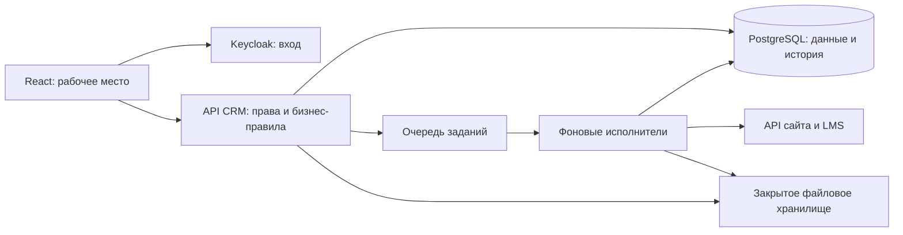

# Анализ проекта «ИТ Школа Ростелекома»

Дата анализа: 17 сентября 2026 года.

Основание: «6. ИТ Школа Ростелекома.pdf», 9 физических страниц. Ниже ссылки «стр.» означают физические страницы PDF; печатная нумерация на единицу меньше. Прочитан весь текст, визуально проверены все страницы.

Цель команды: победа на хакатоне и система для реального внедрения. По сообщению команды, времени достаточно; численность, опыт и занятость участников пока неизвестны. Поэтому оценки ниже предварительные, без обещания календарного срока.

Обозначения: **ТЗ** — явно задано документом; **предложение** — рекомендуемое проектное решение; **уточнение** — вопрос, который документ не разрешает. Этот анализ не является согласованным техническим проектом или заключением о нормативном соответствии.

## 1. Главный вывод и границы продукта

Нужно построить систему управления сотрудничеством ИТ Школы РТК с образовательными организациями. Её ядро — отдельные взаимодействия по программам и продуктам, настраиваемые процессы, контролируемые данные и отчётность. Пользователи — сотрудники ИТ Школы: около 20 менеджеров по вузам, их руководители и технические администраторы. Расчётная нагрузка — 50 одновременных пользователей.

Система решает две связанные задачи:

1. Операционную: видеть этап сотрудничества, ответственного, документы и действия по каждому взаимодействию; сокращать ручную работу.
2. Аналитическую: оценивать востребованность программ по заявкам, обучающимся и потокам, а также эффективность процесса взаимодействия.

Главный разрыв ТЗ: первая задача описана довольно подробно, а для второй не заданы структуры исходных показателей, правила подсчёта и формулы ранжирования. Количество карточек CRM не является заменой количества заявок на обучение.

Для победы и дальнейшего внедрения предлагается позиционирование: **управляемое сотрудничество с вузами с аналитикой, которую можно проверить до исходных данных**. Конкурсный эффект строится на законченных сценариях, понятной пользе и доказательствах корректности.

ТЗ не обязывает создавать новую LMS, встроенную электронную подпись, почтовый сервис, кабинет вуза, видеоконференции или универсальный BPMN-редактор. Фиксация подписания договора и хранение файла не равнозначны реализации подписания внутри CRM. ИИ разрешён, но не обязателен. Школы упомянуты в названии и цели, а детальные сценарии ориентированы на вузы: охват первой версии необходимо подтвердить.

## 2. Трассировка обязательного объёма

Идентификаторы ниже введены для будущего backlog и приёмки; они не взяты из PDF. Колонка «Как подтвердить выполнение» содержит предлагаемые критерии приёмки, а не дословные требования документа.

| ID | Требование ТЗ | Стр. | Как подтвердить выполнение |
|---|---|---:|---|
| R01 | Каталоги вузов, направлений, продуктов и ответственных в БД | 3–4 | Создание, чтение, связи и сохранность после перезапуска |
| R02 | Актуализация каталогов импортом XLS/XLSX по согласованному маппингу | 3–4 | Настоящие файлы обоих форматов, согласованное сопоставление полей, результат обновления |
| R03 | Данные о вендоре, ПО, договоре, лицензии, передаче, менеджере, ответственных вуза и комментарии | 4 | Все перечисленные поля проходят импорт и отображаются в подходящих сущностях |
| R04 | Фильтры по периоду, вузам, направлениям/программам, продуктам и ответственным; в сценарии также статус | 4–6 | Комбинации фильтров дают заранее рассчитанный результат |
| R05 | Визуализация процесса взаимодействия и переходы между статусами | 3–4 | Реальный переход сохраняется в БД и виден после повторного открытия |
| R06 | Создание/изменение workflow и именования статусов | 4–5 | Создан новый шаблон, изменён существующий, поведение действующих карточек определено |
| R07 | Комментирование при переходе статуса | 4 | Комментарий связан с нужным действием и автором |
| R08 | Вложения PNG, JPEG, PDF, ZIP, GZIP, RAR, DOC, DOCX, XLS, XLSX | 4 | Каждый тип загружается и скачивается с проверкой прав |
| R09 | Отчёты за период с фильтрами и выбранными колонками | 4–5 | Вуз, направление, продукт, статус и ответственный доступны как колонки |
| R10 | Выгрузка отчётов XLS, XLSX, PDF | 4–5 | Файлы открываются, формат соответствует расширению, данные совпадают |
| R11 | Статистические диаграммы/графики, выгрузка PNG/PDF | 4 | Подписаны показатели, период, единицы и источники; итоги сверены |
| R12 | Получение JSON по API LMS и сайта на Laravel | 4–6 | Два адаптера работают с согласованными реальными контрактами |
| R13 | Добавление данных API в существующий либо новый workflow | 4 | Корректное сопоставление, создание и обновление, предсказуемая повторная загрузка |
| R14 | Авторизация через Keycloak | 5 | Вход, выход, окончание сессии, отказ без действующей авторизации |
| R15 | Три роли и ограничения видимых данных; руководитель управляет назначениями | 5–6 | Матрица прав проверена через UI, API, вложения и экспорт |
| R16 | Веб-интерфейс без перезагрузки/сброса страницы при изменениях | 5 | Сохранение позиции, фильтров и контекста при действиях |
| R17 | «Кэш работы действий пользователя» | 5 | После уточнения — согласованные сценарии восстановления состояния |
| R18 | Отклик перечисленных интерфейсных действий не более 1 секунды | 5 | Измерения на согласованной среде, данных и профиле нагрузки |
| R19 | 50 параллельных пользователей и не менее 10 параллельных отчётов | 5 | Нагрузочный протокол с фактической одновременностью и результатами |
| R20 | Коды ошибок и понятный интерфейс | 5 | Стабильные коды, сообщения пользователю, диагностика по идентификатору запроса |
| R21 | Встроенные руководства пользователя/администратора со скриншотами | 5 | Раздел помощи внутри CRM, доступность по роли |
| R22 | Указан допустимый набор технологий: React; backend Java Spring Boot/Kotlin, Python или Node.js; PostgreSQL | 6 | Выбранный стек обоснован; трактовка допустимого набора и альтернативы согласованы |
| R23 | Swagger UI для всех необходимых методов, перечень библиотек и компонентов | 6 | Описаны схемы, авторизация, ответы и ошибки; состав зависимостей зафиксирован |
| R24 | Отдельный сервис, результирующий JSON-файл, возможность Docker-контейнеризации | 6 | Самостоятельный запуск и документированная выгрузка JSON |
| R25 | Linux; исходники без обфускации; комментарии к сложной логике | 7 | Воспроизводимая установка из репозитория |
| R26 | Описание обработки данных, ограничений, сборки/установки, архитектуры в Archi | 7 | Документы и редактируемая модель архитектуры |
| R27 | Требования ИБ по 152-ФЗ и приказу ФСТЭК №117; также указаны 149-ФЗ и государственные стандарты | 3–4, 7 | Согласованные границы, применимые меры и свидетельства их выполнения |
| R28 | Удобный десктопный и мобильный интерфейс, контраст, логичная группировка | 7, 9 | Проверка основных сценариев на обоих форм-факторах |
| R29 | Презентация PPTX/PDF и четыре ссылки для сдачи | 7, 9 | Репозиторий, презентация, работающая CRM с доступом, документация DOC/PDF |

Формулировки про форматы частично пересекаются. Практичное предложение: табличный отчёт выгружается в XLS/XLSX/PDF; диаграмма — в PNG/PDF; составной PDF содержит таблицы и диаграммы. Такой набор закрывает форматы, но состав каждого документа всё равно нужно согласовать.

## 3. Предметная модель: решения, от которых зависит вся система

### 3.1. Единица учёта

**Предложение:** центральная сущность `Interaction` — конкретный цикл сотрудничества с образовательной организацией по программе и продукту.

Пример: в одном вузе по DevOps согласовывают договор на продукт A, по QA уже обучают преподавателей работе с продуктом B, а по продукту A начинается повторный цикл следующего учебного года. Это независимые взаимодействия, а не один общий статус в карточке вуза.

У взаимодействия нужны собственный ID, организация, программа, продукт, цикл, ответственный, даты, текущий статус и версия процесса. Комбинация «вуз + программа + продукт» не должна быть безусловно уникальной: возможны повторные циклы. На этапе поиска контакта программа/продукт могут быть ещё не определены; обязательность полей разумно проверять при соответствующем переходе.

Если несколько продуктов проходят общий процесс, возможна связь многие-ко-многим. Если у них разные договоры, сроки или статусы, лучше отдельные взаимодействия. Выбор необходимо проверить на реальных примерах заказчика.

### 3.2. Сущности

| Группа | Сущности | Ключевое правило |
|---|---|---|
| Организации | Образовательная организация, контакт организации | Тип «вуз/школа» позволяет расширение; контакт не равен пользователю CRM |
| Образовательный каталог | Направление, программа, продукт, вендор | DevOps как направление, конкретная учебная программа и ПО — разные сущности |
| Сотрудники и доступ | Пользователь Keycloak, команда, назначение, область доступа | Роль не заменяет проверку конкретных доступных объектов |
| Работа | Взаимодействие, история назначений, заметки | Одно взаимодействие — один независимый процесс |
| Процессы | Шаблон, версия, статус, переход, история посещения статуса | История сохраняет смысл после изменения шаблона |
| Документы | Договор, лицензия, вложение | У одного вуза могут быть разные договоры и лицензии |
| Аналитика обучения | Заявка, поток, участие либо согласованные агрегаты | Набор определяется контрактами; идентифицирующие данные студентов без необходимости не копируются |
| Интеграции | Внешний идентификатор, пакет импорта, сообщение, курсор синхронизации | Повторы доставки и изменения объекта различаются |
| Эксплуатация | Аудит, задание отчёта, результат, состояние проверки файла | Правила доступа распространяются и на фоновые операции |

В Excel одна строка смешивает несколько сущностей. Её следует разобрать на связанные записи, а не сделать единственной таблицей базы данных. Нельзя сопоставлять менеджера только по ФИО, а вуз только по отображаемому названию.

Поля лицензий требуют расшифровки: «подписание» может означать дату или флаг; «срок действия (год)» — год окончания либо длительность; «статус передачи» — передачу разных объектов. До согласования нельзя подставлять выдуманные даты. Исходное значение импорта полезно сохранять вместе с результатом преобразования.

### 3.3. Workflow

**ТЗ:** описан базовый путь из 14 пунктов и разрешено его изменение. Эти пункты не являются готовой строгой машиной состояний: корректировка документов необязательна, актуализация материалов и повышение квалификации повторяются, а контроль всех этапов действует на протяжении всей работы.

**Предложение по смысловому отображению базового пути:**

| Пункты ТЗ | Отображение в системе |
|---|---|
| 1–3: поиск контакта, коммуникация, встреча | Подготовка сотрудничества с отдельными этапами и результатами |
| 4–6: обмен, опциональная корректировка, подписание | Документарная ветвь с возможностью возврата и пропуска корректировки |
| 7–8: передача материалов/лицензии, внедрение | Контроль комплектности и состояния внедрения |
| 9–11: обучение преподавателей, актуализация программы, занятия | Подготовка и проведение обучения |
| 12–13: актуализация документации, повышение квалификации | Повторяемые действия сопровождения |
| 14: контроль каждого этапа | Сквозная история, ответственные и контроль исполнения, а не только финальная колонка |

Это предложение нужно согласовать; нельзя молча удалить четырнадцатый пункт из покрытия требований.

Достаточный редактор первой версии: создание шаблона, этапов и разрешённых переходов, изменение названий, публикация версии. Графическая схема может быть удобным представлением, но сложный универсальный движок бизнес-процессов не требуется самим ТЗ.

Опубликованная версия процесса неизменяема. Новая редакция применяется к новым взаимодействиям; перенос текущих выполняется явно, с сопоставлением старых и новых статусов, предпросмотром и записью в историю. Название статуса отделено от стабильного ID. Для сравнения разных процессов можно добавить согласованную аналитическую категорию этапа.

Комментарий и файл привязываются к конкретному посещению статуса или событию: три возврата на согласование должны различаться. Возможность комментирования/вложения не означает их обязательность при каждом переходе. Такие условия — дополнительная настройка по согласованию.

Переход выполняется транзакционно: проверка прав → проверка текущей версии записи и разрешённости перехода → изменение состояния → запись истории. При одновременном редактировании второй пользователь получает понятный конфликт, а не затирает чужую работу.

## 4. Отчётность и бизнес-метрики

### 4.1. Смысл периода

«За сентябрь» может означать новые взаимодействия, события сентября, активные в сентябре процессы или состояние на 30 сентября. Эти выборки не равны. Фильтр по `updated_at` не покрывает все варианты.

**Предложение:** начать с двух явно названных отчётов — «Состояние взаимодействий на дату» и «Изменения за период». Отдельно при необходимости добавить новые взаимодействия и длительность этапов. Это проектное предложение; состав отчётов требует согласования.

История должна включать переходы и назначения ответственных. Если менеджер сменился сегодня, он не должен автоматически стать ответственным за прошлогоднюю работу. Для изменяемых аналитических атрибутов также нужна принятая политика истории.

У каждого отчёта фиксируются фильтры, выбранные колонки, часовой пояс, смысл периода, момент актуальности и версия методики. Для воспроизведения результата можно сохранять сформированный набор строк и итоговый файл с ограниченным сроком хранения. Поздние данные LMS требуют правила: исторический отчёт пересчитывается либо остаётся зафиксированным с отметкой момента среза.

### 4.2. Два вида аналитики

| Вид | Показатели-кандидаты | Что нужно определить |
|---|---|---|
| Работа CRM | Взаимодействия по статусам; уникальные организации; время этапа; завершённые внедрения; нагрузка менеджеров | События, единица счёта, завершение, история ответственных |
| Спрос на обучение | Заявки; обучающиеся; активные/параллельные потоки; динамика по программам | API-источники, уникальность, даты, состав статусов, правила агрегации |

Например, «обучающиеся» могут означать уникальных людей или регистрации на курсы. Один человек на двух программах даёт разные результаты в этих метриках. Число потоков, активных на дату, и максимум одновременно активных потоков за месяц тоже различаются.

Первоначально следует показывать заявки, обучение и потоки раздельно. Сводный рейтинг с весами допустим после согласования методики, нормализации и правил сравнения программ. Высокое число заявок само по себе не доказывает качество обучения.

Для каждой диаграммы нужны единицы измерения, период, фильтры, источник и дата обновления. Пропуск данных не превращается автоматически в ноль. Числа строятся тем же серверным расчётом, что таблица и выгрузка. Соединения «несколько продуктов × несколько ответственных × несколько событий» не должны размножать итоговые значения.

Конкурсное усиление: нажатие на столбец диаграммы открывает именно те взаимодействия/агрегаты, из которых получен показатель. Руководитель может проверить расчёт и понять причины, не доверяя непрозрачному числу.

### 4.3. Приёмочный набор

До реализации отчётов подготовить небольшой синтетический набор с вручную известными итогами: несколько организаций, два продукта одного вуза, повторный цикл, переход на границе периода, возврат на этап, смена менеджера, повторная доставка API-события, поздняя запись и запись вне доступа пользователя. Для каждого фильтра известны ID ожидаемых строк и значения метрик.

Большой нагрузочный набор нужен отдельно: маленький эталон доказывает корректность, а большой — производительность.

## 5. Интеграции и импорт

### 5.1. LMS и сайт

ТЗ требует забирать JSON из двух источников. Контракты обещаны позже; сейчас неизвестны схемы, методы авторизации, идентификаторы, объёмы, правила обновлений и удаления. Готовность адаптера на имитаторе не означает проверенную интеграцию с заказчиком.

**Предложение:** каждому источнику — адаптер к общей внутренней модели и журнал синхронизации. Получение данных выполняется по расписанию/запросу согласно возможностям API; webhooks можно добавить, если они поддержаны и нужны.

Последовательность: получить пакет → проверить схему → сопоставить внешние ID → проверить конфликты и область изменений → сохранить транзакционно → зафиксировать результат → обновить курсор. После сбоя обработка повторяется без случайного дублирования.

Ключ соответствия: `(источник, тип сущности, внешний ID)`. Отдельно нужны правила объединения одной бизнес-сущности, пришедшей с сайта и из LMS под разными ID. Неоднозначные совпадения направляются на ручную сверку. Сравнение названий и ФИО недостаточно для автоматического объединения.

Каждому полю назначается владелец: например, LMS отвечает за учебную статистику, CRM — за менеджера и этап договорной работы. Внешняя загрузка не должна безусловно затирать ручные решения. Сохраняются время события у источника и время получения системой, ошибки, число созданных/обновлённых/пропущенных записей.

### 5.2. XLS/XLSX

Рекомендуемый процесс: загрузка → выбор листа → сопоставление колонок → предпросмотр → проверка строк → подтверждение импорта → протокол результата.

Нужно определить обязательность полей, распознавание дат, множественных контактов, пустых значений, повторов и конфликтов. Пустая ячейка не должна автоматически удалять существующее значение без согласованного правила. Политика частичного импорта либо полного отказа должна быть явной. Полезно сохранять шаблоны маппинга.

XLS и XLSX — отдельные форматы. Переименованный CSV/XLSX не закрывает требование XLS. Обработчики и проверочные файлы обоих форматов необходимо выбрать и проверить в начале проекта.

### 5.3. Вложения

Файлы хранятся отдельно от основной БД; в БД — идентификатор, размер, тип, автор, контрольная сумма, связь с процессом и результат проверки. Скачивание проходит серверную проверку прав; постоянные публичные ссылки не подходят для закрытых документов.

Для эксплуатации нужны ограничения размера и суммарного объёма, проверка фактического типа и содержимого, карантин на время проверки, безопасные имена. Поддержка ZIP/GZIP/RAR как вложений не требует их автоматической распаковки. Сроки хранения и политика удаления согласуются отдельно.

## 6. Предлагаемая архитектура

Для 50 пользователей стартовая архитектура — модульный монолит с отдельными фоновыми исполнителями. Это одно предметное приложение с границами модулей; Keycloak, БД и файловое хранилище являются отдельными инфраструктурными компонентами. Масштаб нагрузки сам по себе не обосновывает дробление предметной логики на микросервисы.

Диаграмма — концепция для обсуждения, а не требуемая ТЗ модель Archi.

| Компонент | Предлагаемый выбор | Причина |
|---|---|---|
| Интерфейс | React + TypeScript | React включён в допустимый набор ТЗ; типизированные контракты снижают рассогласование UI и API |
| Backend | Python + FastAPI как исходный вариант | Удобное описание входных схем и OpenAPI/Swagger UI; выбор уточняется по опыту команды |
| БД | PostgreSQL | Связанные сущности, транзакции, история и аналитические выборки |
| Идентификация | Keycloak | Прямое требование ТЗ |
| Длительные операции | Надёжная очередь и отдельные workers | Импорт, синхронизация, проверка файлов, экспорт не блокируют интерактивные операции |
| Файлы | Закрытое файловое/S3-совместимое хранилище | Независимое хранение вложений и результатов отчётов |
| Развёртывание | Контейнеры на Linux, воспроизводимый стенд | Соответствует направлению требований к эксплуатации и передаче |

FastAPI действительно поддерживает OpenAPI и встроенный Swagger UI; это проверено по [официальной документации](https://fastapi.tiangolo.com/features/). Автогенерация схем не заменяет содержательные описания методов, ошибок и бизнес-ограничений. Если команда сильнее в Java/Kotlin или Node.js, backend допустимо заменить без изменения предметной архитектуры.

Вход через Keycloak предлагается строить на OpenID Connect Authorization Code с PKCE, без собственного хранения паролей. Эта возможность описана в [документации Keycloak](https://www.keycloak.org/securing-apps/javascript-adapter). API проверяет подпись, издателя, получателя и срок токена; роль и предметный доступ проверяются отдельно.

Предметные модули: каталоги; взаимодействия; workflow; доступ; импорт и интеграции; отчёты; файлы; аудит. Зависимости между модулями должны быть явными, а единые правила фильтрации и доступа использоваться также в экспорте и фоновых заданиях.

Кандидаты семейств API: `/organizations`, `/programs`, `/products`, `/interactions`, `/workflow-templates`, `/imports`, `/integrations`, `/reports`, `/attachments`, `/access`. Это предложение структуры, не готовый контракт. Для операций требуются схемы ошибок, пагинация, серверные фильтры и согласованная идемпотентность.

### Производительность

Типовые действия — переход, комментарий, изменение фильтра — проектируются короткими транзакциями с нужными индексами и пагинацией. Отчёты выполняются вне процесса обслуживания интерактивных запросов. Нужны ограничения потребления ресурсов и наблюдение за очередью, БД, памятью и длительностью операций.

Требование «не более 1 секунды» нельзя заменить средним или p95 без согласования. В протоколе измерять пользовательское время отклика, а дополнительно серверное время, медиану, p95/p99 и максимум. До испытаний зафиксировать объём базы, размеры файлов, сложность отчётов, оборудование, сеть и активность пользователей.

Быстрое принятие десяти заданий в очередь не доказывает десять одновременно строящихся отчётов. Проверить фактическую конкурентность, корректность файлов и влияние на интерактивную работу. Отдельно согласовать допустимое время полной генерации файла: ТЗ его явно не определяет.

«Кэш действий» предлагается конкретизировать как сохранение фильтров, настроек таблиц и черновиков с понятным сроком хранения. Полный офлайн-режим из фразы ТЗ не следует. Черновики, серверный кэш и журнал аудита решают разные задачи; они не заменяют друг друга.

## 7. Доступ и готовность к внедрению

### 7.1. Предлагаемая матрица прав

ТЗ задаёт роли, но не все границы. Ниже вариант для согласования.

| Операция | Пользователь | Руководитель | Администратор |
|---|---|---|---|
| Просмотр/изменение взаимодействий | В назначенной области | В области своей команды | Только если предоставлены предметные права |
| Комментарии, вложения, переходы | В разрешённых взаимодействиях | В разрешённой области | По отдельным предметным правам |
| Назначение менеджеров | Нет по умолчанию | В своей области | Настройка полномочий; бизнес-назначения — по принятой политике |
| Экспорт/диаграммы | В доступной области | В области команды | По принятой политике |
| Импорт каталогов | По отдельному разрешению | По отдельному разрешению | Настройка и запуск при наличии разрешения |
| Изменение шаблонов процессов | По отдельному разрешению | По отдельному разрешению | Управление настройками |
| Управление ролями и областями | Нет | Нет по умолчанию | Да |

Технический администратор не обязан автоматически читать всё содержимое. ТЗ требует управлять доступом, но не раскрывает эту границу. Все проверки выполняются на сервере и распространяются на поиск, счётчики, файлы, экспорт и фоновые задания. Для ранее созданного отчёта повторно проверяется право скачивания после смены назначения/прав.

### 7.2. Нормативная часть

Наличие Keycloak и HTTPS само по себе не подтверждает нормативное соответствие. Статья 19 152-ФЗ предусматривает правовые, организационные и технические меры защиты: [официальный текст закона](https://www.kremlin.ru/acts/bank/24154/print). Указанный в ТЗ приказ — приказ ФСТЭК России от 11.04.2025 №117 о защите информации в перечисленных государственных системах и системах государственных организаций: [официальная публикация](https://publication.pravo.gov.ru/document/0001202506170011).

Из одного PDF нельзя установить правовой статус будущей CRM, границы информационной системы, состав обрабатываемых данных, применимые классы/уровни защиты и требования к подтверждению соответствия. Ссылка ТЗ на приказ остаётся требованием заказчика; её нельзя игнорировать из предположения о статусе организации. Конкретный состав мероприятий необходимо определить с ИБ заказчика.

Практические работы для планирования внедрения: инвентаризация данных и целей обработки; определение размещения и границ; модель угроз и матрица мер; разграничение доступа; журналирование; защита каналов и секретов; обновления и учёт компонентов; резервное копирование и проверка восстановления; управление инцидентами; сроки хранения и удаления. Это направления проработки, а не заявление о достаточности конкретного набора мер.

Следует запросить существующие документы и инфраструктурные требования заказчика, а затем связать применимые меры с техническими решениями, ответственными и доказательствами проверки. Указание в ТЗ на государственные стандарты недостаточно конкретно: перечень и состав документации нужно уточнить.

Для демонстрационного стенда использовать синтетические данные; перед реальным пилотом отдельно подтвердить готовность среды и обработки реальных данных. Агрегированная статистика обучения может уменьшить объём персональных данных в CRM, если этого достаточно для задач и контрактов.

## 8. UX и преимущества для конкурсной защиты

Предлагаемые основные экраны:

1. Рабочее место менеджера: мои взаимодействия, следующий шаг, последние изменения, задачи с датами при включении планирования.
2. Реестр взаимодействий: таблица, фильтры, сохранённые представления и переход к карточке. Канбан — дополнительный вид для совместимых этапов одного шаблона.
3. Карточка: организация, программа и продукт, ответственные, текущий этап, документы и история; действие перехода находится рядом с состоянием.
4. Каталоги и мастер импорта: проверка данных и понятные ошибки до изменения базы.
5. Редактор workflow: версии, этапы, переходы, публикация и явный перенос текущих процессов.
6. Отчёты: фильтры, смысл периода, колонки, таблица и связанные диаграммы, статус генерации файлов.
7. Управление доступом, журнал интеграций и встроенная помощь для соответствующих ролей.

Для мобильного экрана приоритетны поиск, карточка, комментарий, вложение и переход. Большая таблица может переходить в список карточек; перегруженный канбан из 14 колонок не должен быть единственным способом работы. Ошибки не должны стирать введённый текст.

После обязательного контура целесообразны три усиления:

- **Проверяемость метрик:** переход от диаграммы к конкретным данным и отметка их свежести.
- **Обнаружение задержек:** сколько процесс находится на этапе, что требуется для следующего шага, кто отвечает. Для «просрочки» сначала нужны согласованные сроки/SLA.
- **Доказательство экономии труда:** замер времени одинаковых операций в исходном и новом процессе: поиск состояния, подготовка отчёта, повторный импорт. До пилотных замеров не обещать процент экономии.

ИИ можно добавить позже: краткое резюме истории с указанием событий-источников или предложение следующего действия. Смена статусов и прав остаётся управляемой бизнес-операцией. Эффект ИИ нужно оценивать отдельно; его наличие не компенсирует ошибки в расчётах.

## 9. План реализации с контрольными результатами

Первый сквозной сценарий нужен для проверки архитектуры, но конечная цель — полный контур, а не остановка на демонстрационной версии.

| Этап | Содержание | Условие завершения |
|---|---|---|
| 0. Уточнение и проектирование | Примеры каталогов/API, словарь, единица взаимодействия, метрики, периоды, права, ИБ-границы | Решения записаны; есть контрольные данные и ожидаемые результаты |
| 1. Основа | Репозиторий, сборка, Linux-стенд, миграции, Keycloak, базовые права, аудит | Система воспроизводимо запускается; чужие объекты недоступны |
| 2. Сквозной сценарий | Каталоги, импорт, карточка, базовый процесс, переход, комментарий, вложение, простой отчёт | Путь от исходной строки до проверенного файла проходит полностью |
| 3. Полнота процессов | Редактор и версии workflow, история, назначения, конфликты редактирования | Изменение процесса не повреждает действующие взаимодействия и прошлые отчёты |
| 4. Данные и аналитика | Реальные LMS/сайт, повторы и конфликты, все фильтры и форматы, метрики | Таблица, диаграмма и выгрузки совпадают с эталоном; источники проверены |
| 5. Эксплуатация | Файлы, восстановление, наблюдаемость, права, нагрузка, мобильные сценарии, ИБ-меры | Подтверждены согласованные критерии, список ограничений прозрачен |
| 6. Пилот и защита | Пользовательские прогоны, исправления, документы, Archi, презентация и доступ жюри | Независимый человек проходит установку и рабочий сценарий; комплект сдачи полон |

Документацию, модель Archi, проверочные данные и автоматические проверки вести параллельно разработке. Разработку адаптеров можно начинать на контролируемых примерах до появления доступа, но готовность реальных интеграций проверяется отдельно.

### Условная оценка трудоёмкости

Для опытной команды исходный инженерный ориентир на прикладной объём составлял **80–140 человеко-дней**, включая уточнение, разработку, основные проверки и документацию. Последующая детализация в `02-development-plan.md` дала **121–209 человеко-дней** по 40 задачам полного контура, включая эксплуатационную подготовку и ограниченный пилот. Для текущего планирования использовать подробный backlog; оба диапазона — экспертные оценки, не цифры из ТЗ и не обещание календарного срока. Их нужно уточнять по реальным данным, API и составу команды.

В эту оценку не включены неизвестный объём формальных процедур подтверждения ИБ, приобретение и подготовка инфраструктуры, массовая очистка/миграция реальных данных, ожидание доступов и внешних согласований. Календарный срок без состава команды определять рано. Ускорение за счёт участников ограничено зависимостями между моделью, процессами, интеграциями и отчётами.

Для распределения работ нужны компетенции backend/данных, frontend/UX, QA/аналитики, эксплуатации/ИБ. Это направления ответственности, а не требование нанять отдельного человека на каждое. При достаточном времени разумнее снижать риски и проводить пилот, чем наращивать число декоративных функций.

## 10. Проверки, которые доказывают качество

| Проверка | Ожидаемый результат |
|---|---|
| Один вуз, несколько программ/продуктов | Независимые состояния и документы, правильная агрегация |
| Повторный цикл того же сотрудничества | Новая карточка без уничтожения старой истории |
| Возврат на статус и новый файл | Различаются посещения этапа и относящиеся к ним материалы |
| Публикация новой версии процесса | Старые карточки сохраняют определённое поведение |
| Два параллельных изменения | Нет потерянного обновления; конфликт объяснён |
| Смена ответственного | Правильны текущий доступ и историческая отчётность |
| Повтор XLS/XLSX или API-события | Нет случайных дублей, результат обработки понятен |
| Ошибка посреди синхронизации | Повторный запуск безопасно продолжает обработку |
| Границы периода и поздние события | Соблюдается документированная временная семантика |
| Пустые данные, нули, несколько связанных записей | Нет фиктивных значений и двойного счёта |
| API/экспорт/файл вне области доступа | Отказ независимо от состояния интерфейса |
| Отзыв права после генерации отчёта | Скачивание повторно проверяет актуальные права |
| Настоящие XLS/XLSX/PDF/PNG/JSON | Файлы открываются, содержат правильные фильтры и данные |
| 50 активных пользователей + 10 отчётов | Выполнены согласованные пределы и фактическая конкурентность |
| Перезапуск и восстановление из резервной копии | Данные и файлы согласованы, восстановление документировано |
| Мобильный сценарий и сетевой сбой | Работа выполнима, введённые данные не теряются незаметно |
| Установка по руководству | Выполнима участником, не разрабатывавшим систему |

Приоритет автоматизации: расчёты метрик, переходы и версии workflow, разграничение данных, повторная обработка интеграций и импорта. Сквозные проверки охватывают реальные пользовательские действия. Нагрузочные результаты прикладываются с условиями запуска; измерений по этому анализу ещё не проводилось.

## 11. Риски и вопросы заказчику

| Приоритет | Неопределённость | Решение до зависимой разработки |
|---|---|---|
| Критический | Что является отдельным взаимодействием | Разобрать 3–5 реальных примеров, включая повторный цикл и несколько продуктов |
| Критический | Нет метрик и API-контрактов | Получить образцы JSON, владельцев полей, формулы и внешние ID |
| Критический | Неясен смысл периода | Утвердить образцы отчётов и правила истории |
| Высокий | Изменение активных workflow | Принять правила версий и миграции |
| Высокий | Не определены области доступа | Подписать матрицу ролей, команд и объектов |
| Высокий | Неизвестны контур и требования ИБ | Получить исходные документы и решения ИБ заказчика |
| Высокий | Грязные каталоги и смешанный импорт | Согласовать идентификаторы, правила конфликтов и обновления |
| Средний | Школы и вузы | Определить охват первой версии |
| Средний | Кэш действий и результирующий JSON | Утвердить сценарии восстановления и схему файла |
| Средний | Нагрузка без объёма и оборудования | Зафиксировать воспроизводимый профиль испытаний |
| Средний | Форматы и лимиты файлов | Определить размеры, хранение, проверку и ограничения экспорта |
| Средний | Неясные стандарты и формат Archi | Согласовать перечень документов и принимаемые файлы модели |

Пакет на ближайшее обсуждение: пример каталога; примеры ответов двух API; ожидаемый отчёт; 3–5 историй взаимодействий; список ролей/команд; описание предполагаемого размещения. Это позволяет превратить обсуждение в конкретные решения вместо общего перечня пожеланий.

## 12. Защита и передача результата

В критериях финальной экспертизы прямо выделены корректность отчётов и фильтров, создание/изменение workflow, достоверность диаграмм, скорость, удобство, техническая проработка и качество выступления. Весов критериев в PDF нет; их нельзя придумывать.

Предлагаемый сценарий защиты на 8–10 минут:

1. Показать проблему менеджера и руководителя на конкретном примере вуза с несколькими взаимодействиями.
2. Войти через Keycloak; показать область доступа менеджера.
3. Импортировать таблицу с контролируемой ошибкой, исправить её; повторить импорт без дублей.
4. Перевести взаимодействие на следующий этап с комментарием/файлом; открыть историю.
5. Изменить workflow и показать предсказуемое поведение старой и новой карточки.
6. Под руководителем переназначить менеджера и показать изменение доступа.
7. Получить данные обоих источников и повторить обработку; ясно обозначить статус реальных подключений.
8. Построить отчёт по заданному периоду, перейти от диаграммы к строкам, открыть требуемые форматы.
9. Показать протокол нагрузки, встроенную помощь, архитектуру и воспроизводимый запуск.
10. Завершить измеримым результатом пилота либо честно обозначенным планом его проверки.

Порядок и темп нужно отрепетировать. Каждый показатель на слайде должен иметь источник или пометку «цель/оценка», если он ещё не измерен. Отдельный вау-сценарий полезен только поверх стабильного основного маршрута.

Для сдачи нужны четыре ссылки: репозиторий исходников; презентация PPTX/PDF; работающая CRM с доступом; сопроводительная документация DOC/PDF. Дополнительно в составе результата — Swagger UI, список компонентов, инструкции, методы и ограничения обработки данных, встроенные руководства со скриншотами и архитектура в Archi. [Archi](https://www.archimatetool.com/) — конкретный инструмент моделирования; Mermaid-схема из этого анализа его не заменяет.

Открытые исходники в ТЗ не определяют однозначно лицензию и публичность репозитория. Способ доступа заказчика/жюри и лицензию необходимо согласовать; секреты и реальные данные в репозиторий не включаются.

## 13. Рекомендуемый следующий результат работы

Подготовить согласуемую спецификацию первой полноценной версии: словарь сущностей, модель взаимодействия, шаблон workflow с переходами, матрица доступа, формы и источники отчётов, контракты импорта/API, нагрузочный профиль и backlog с критериями готовности. Затем реализовать один сквозной сценарий и расширять его до полного покрытия R01–R29.

В рамках текущего запроса выполнен анализ документа и проектные предложения. Исходный код CRM, реальные интеграции, испытания, модель Archi и подтверждение нормативного соответствия ещё не созданы.
